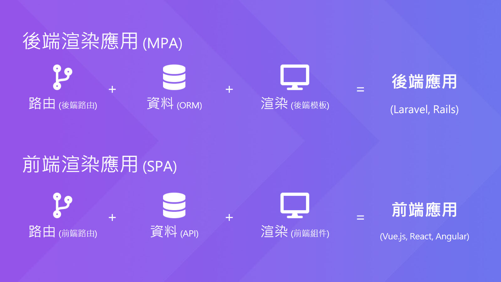
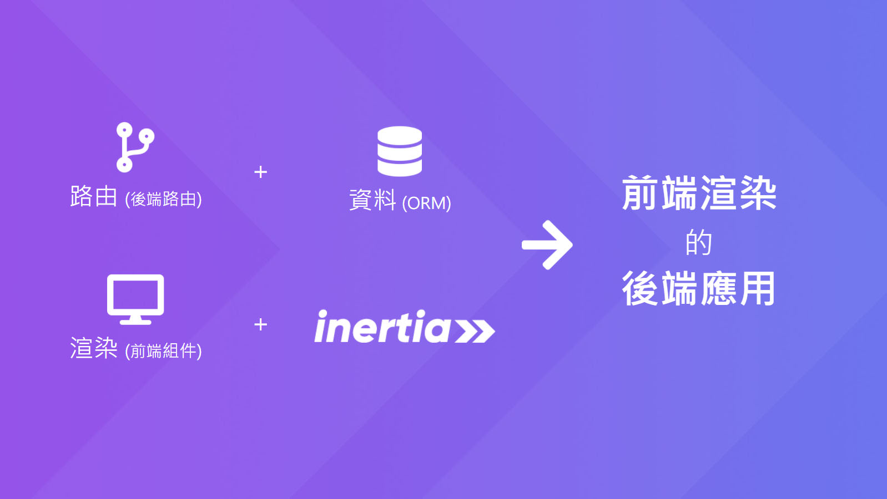

# Day 01 為什麼我用 Laravel 寫 SPA 卻可以不寫 API?

> 2021/03/19:
>
> ## 前言
>
> 必須得承認，這個系列真是頻繁出事，用了 Laravel 7，寫到一半升到 8；Vue.js 2.6 升到 3；Tailwind CSS 1.8 升到 2；Inertia.js 突然開始頻繁更新，且不兼容舊版；Depictr 套件作者不維護；所以在本系列中會看到各種鎖版號。再加上這個系列可以說是寫我想寫的東西，簡單來說就是放飛自我。在這裡建議讀者們在學習 Inertia.js 過程中可以佐以下方資料參考：
>
> * [Inertia.js 官網](https://inertiajs.com/)
> * [Ping CRM](https://demo.inertiajs.com/)
> * [Server-side apps with client-side rendering](https://reinink.ca/articles/server-side-apps-with-client-side-rendering)
> * [Introducing Inertia.js](https://reinink.ca/articles/introducing-inertia-js)
>
> 以及如果聽得懂英文的話，推薦看過 Laracasts 新上架的 [Learn Inertia With Jeffrey](https://laracasts.com/series/learn-inertia-with-jeffrey) 課程。
>
> 這個系列真心對全端新手十分不友好，這是無庸置疑的。但如果可以趁此機會，抓緊時間去學習新的技術，這些技術將會是你自己的。加油！

在回答這個問題之前，我們先回來看看網頁前後端的區別吧！

以後端為基礎的網頁應用，優點是天生SEO良好，缺點是載入速度較慢。後來以AJAX為基礎，誕生了前端的網頁應用，優點是有良好的使用者互動，缺點是SEO先天不佳（依賴後天補足）而且要寫API（重點在這）。以上大家都耳熟能詳，這裡只大概帶過，想要詳細了解前後端的差異請參考 [Rendering on the Web](https://developers.google.com/web/updates/2019/02/rendering-on-the-web) 這篇文章。

> 如果以上的部分你壓根兒都沒聽過，可能比較不適合閱讀本文。建議可以右上角點X，然後去 [Google 搜尋: SPA MPA](https://www.google.com/search?q=spa+mpa) 了解相關的知識。

接下來我們來了解一下前後端「架構」的差異，什麼？MVC？MVVM？那些都不是本文的重點。在這裡我用 Jonathan Reinink 的[文章](https://reinink.ca/articles/server-side-apps-with-client-side-rendering)裡談到的架構，以**路由**、**資料**、**視圖**區分，理解前後端架構差異：

為了要發揮前端和後端的優勢，有必要將以上兩種架構混和一下，結果就是接下來要介紹的這個有點古怪的架構，在**經典後端應用**中使用**前端渲染**，又稱 **「前端渲染的後端應用」**：

> 其實這個名稱是根據我的獨斷與偏見翻譯出來的。嘻~
>
> 提出這個架構的 Reinink 在[原文](https://reinink.ca/articles/server-side-apps-with-client-side-rendering)裡是寫「Server-side apps with client-side rendering」。其中的 Server-side 和 Client-side 中文本來應該是「服務端」和「用戶端」，但我比較想用「前端」和「後端」，因為比較簡短、更直覺而且都通用，在本系列中都會使用此名稱。

「蛤？這看起來不就是 SPA 嘛！我也會！」

別急，這可不完全是 SPA。剛才有說道這是「後端應用」，不只後端管路由 (Router)，後端還管除了視圖 (View) 以外的所有東西。然後視圖 (View) 才交給前端，使用「前端組件」來舒服地刻前端頁面。

意思就是，使用這種架構我可以前端用 Vue.js 刻版面，和後端用 Laravel 的 Controller、Middleware、Auth、Eloquent ORM...既有功能——來做 SPA 應用。(爽不爽？)

要使這種架構得以運行，就必須要有一個東西來做前後端的溝通橋樑。這就是這個系列的主題——[Inertia.js](https://inertiajs.com/)，同時也是**我用 Laravel 寫 SPA 卻可以不寫 API** 的關鍵。那 Inertia.js 是什麼？他只是個 Javascript 套件嗎？這些我會在下篇來詳細介紹。

## 關於此系列

這個系列會觸及到前後端，會使用到的框架有以下：

* [Laravel](https://laravel.com/) v7
* [Vue.js](https://cn.vuejs.org/) v2.6
* [Tailwind CSS](https://tailwindcss.com/) v1.8

Laravel 和 Vue.js 都是非常熱門的框架，放眼網路世界都可以找到許多學習資源，在鐵人賽中也有不少以此為主題的文章，因此我不會從入門開始講起。如果你想要繼續往下看，會基本的 Laravel 和 Vue.js 會比較適合。而要會到哪種程度？Laravel 至少會 Controller、Model，Vue.js 至少會基本的組件，有以上知識應該可以跟得上吧！(再不行就單純複製貼上...)

以前刻板大多都使用 Bootstrap，但樣式看起來都長得很「Bootstrap」，且少了高度客製化的靈活度。這裡我用 [Tailwind CSS](https://tailwindcss.com/) 來代替它，Tailwind CSS 是一個 Utility-First 的 CSS 框架，沒聽過？沒關係，後面我會介紹，然後跟者入坑就對了。

> 如果你想深度了解和學習使用 Tailwind CSS 刻板，可以看六角學院校長的鐵人賽影片教學 [CSS 優良部份](https://ithelp.ithome.com.tw/users/20040221/ironman/3567)，有詳細介紹 Tailwind CSS 的使用方式。

在這個系列文章我將使用以上框架，建構一個簡易的部落格平台 **Lightning**，來帶大家了解 Inertia.js。用實際的專案來了解在開發時會遇到的各種問題。主要會實作以下功能：

* 用戶登入/註冊 *(放心可以登出)*
* 撰寫文章/編輯/刪除 *(只能用 Markdown 寫文章)*
* 文章留言/刪除 *(不做回覆留言)*
* 部屬到 Heroku *(zzz...)*
* Server Side Rendering 功能 *(只對機器人做渲染，解決 SEO 問題)* (2021/03/19: Depictr 套件目前已停止維護，不建議使用)

**準 備 好 了 嗎？**

要開始這趟 Inertia.js 之旅囉~~

## 參考資料

* [Server-side apps with client-side rendering](https://reinink.ca/articles/server-side-apps-with-client-side-rendering)
* [Who is Inertia.js for? - Inertia.js](https://inertiajs.com/who-is-it-for)
