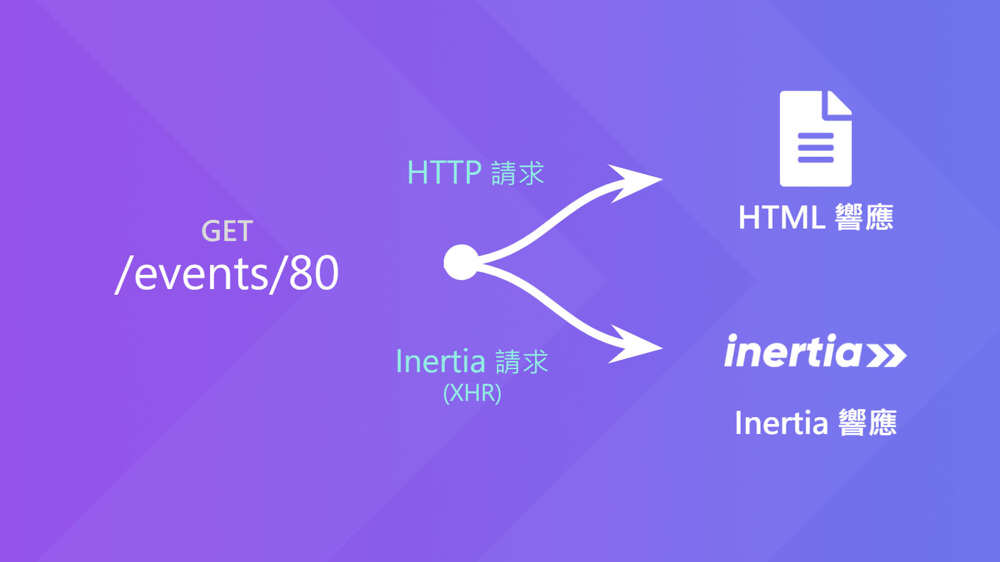

# Day 02 Inertia.js 的運作方式 (協議)

在上一篇解釋那麼多，那 Inertia.js 到底是什麼？

就直說了吧！其實它本質是個前端的路由套件，透過銜接既有的「前端框架」和「後端框架」，來達到用「後端框架」建立 Web 應用，卻可以輕鬆使用「前端框架」建構整個前端的部分 (不用 API 了，放置在一旁...)。那中間勢必要有溝通的規則，沒錯，那就是接下來要來介紹的——**Inertia 協議**。

> 看到這裡你會發現，現在有 **Inertia.js** 和 **Inertia** 兩種名稱，簡單區分的方式：**Inertia** 是一套新新的網頁架構，其中包含 HTTP 協議和需要遵守的規則；**Inertia.js** 是實現其功能的前端套件。但官方的界線似乎也很模糊，大概了解不同之處就可以了。

## Inertia 協議

還記得原本網頁最基本的 HTTP 請求(Request)/響應(Response) 是如何運作的？

如果是後端應用，基本上都是發正常的 HTTP 請求，然後回一個 HTML 的響應。而前端應用除了第一次請求當作進入點的 HTML 後，其他次都是發 XHR (XMLHttpRequest) 請求打 API，並回一個 JSON 格式的響應。


然後你會發現在同一個應用中，兩種請求方式是不能共用路由的。不過那混合版的 Inertia 則會「見人說人話，見○說○話」。

Inertia 定義一個路由，可以同時收 HTTP 請求，也可以收 XHR 請求。但這個 XHR 請求有特殊規則 (等下會解釋)，我們先管叫它 **Inertia 請求**。



### HTTP 請求

如果是第一次、也就是正常的 HTTP 請求，就回傳 SPA 進入點的 HTML (別忘了 Inertia 的前端部分是 SPA 模式)，並加載需要的 CSS、JS、Fonts 等資源。還會把當前頁面的 **Inertia Page 物件** (目標頁面的資料) 塞進根元素的 `data-page` 屬性，交由前端渲染該頁面：

> 這些 HTTP 範例是參考(~~複製~~)自 Inertia 官網

請求：
```http
GET: http://example.com/events/80
Accept: text/html, application/xhtml+xml
```

響應：
```http
HTTP/1.1 200 OK
Content-Type: text/html; charset=utf-8

<html>
<head>
    <title>My app</title>
    <link href="/css/app.css" rel="stylesheet">
    <script src="/js/app.js" defer></script>
</head>
<body>

<div id="app" data-page='{"component":"Event","props":{"event":{"id":80,"title":"Birthday party","start_date":"2019-06-02","description":"Come out and celebrate Jonathan&apos;s 36th birthday party!"}},"url":"/events/80","version":"c32b8e4965f418ad16eaebba1d4e960f"}'></div>

</body>
</html>
```

### Inertia 請求

然後要瀏覽其他頁面時，點擊頁面中的 `<inertia-link>` 組件，會送出 **Inertia 請求** 取得 **Inertia Page 物件**，Inertia 就可以不刷新頁面，自動替換出新的頁面內容，達到 SPA 般舒適的瀏覽體驗。

要如何發送「正規」的 **Inertia 請求** 呢？首先必須要將 `X-Inertia` Header 設為 `true`，其次是必須響應 **Inertia Page 物件**，這就是 Inertia 的規則。

> 同時也可以設定其他 `X-Inertia` 開頭的 Header，例如像下面的 `X-Inertia-Version`，在後面的篇章會慢慢提到。

請求：
```http
GET: http://example.com/events/80
Accept: text/html, application/xhtml+xml
X-Requested-With: XMLHttpRequest
X-Inertia: true
X-Inertia-Version: 6b16b94d7c51cbe5b1fa42aac98241d5
```

響應：
```http
HTTP/1.1 200 OK
Content-Type: application/json

{
  "component": "Event",
  "props": {
    "event": {
      "id": 80,
      "title": "Birthday party",
      "start_date": "2019-06-02",
      "description": "Come out and celebrate Jonathan's 36th birthday party!"
    }
  },
  "url": "/events/80",
  "version": "c32b8e4965f418ad16eaebba1d4e960f"
}
```

### Inertia Page 物件

剛才講了那麼多次的 `Inertia Page 物件`，其實就是上面的那個↑JSON物件。顧名思義，`Inertia Page 物件` 裝的就是頁面的資料。在 Inertia 的規則中，必須要有以下屬性：

* component：前端組件名稱
* props：前端組件 props (資料)
* url：頁面 URL
* version：當前資產版本

`Inertia Page 物件` 也就是可以用兩種發送請求並渲染頁面的關鍵，在 Inertia 中扮演著非常重要的角色。

## Inertia 套件 (Adapters)

即使有了這些規則，但如果沒有實作，那也只是紙上談兵罷了。因此 Inertia 官方提供了數套適用前端框架和後端框架的套件：

* [React](https://github.com/inertiajs/inertia/tree/master/packages/inertia-react)
* [Vue.js](https://github.com/inertiajs/inertia/tree/master/packages/inertia-vue)
* [Svelte](https://github.com/inertiajs/inertia/tree/master/packages/inertia-svelte)
* [Laravel](https://github.com/inertiajs/inertia-laravel)
* [Rails](https://github.com/inertiajs/inertia-rails)

> ㄝ...那個 Inertia.js 怎麼消失了呢？其實它還在，是被前端的 Inertia 套件包裝在內的。

看到這裡，應該懂了吧？只要一個前端和一個後端，隨你怎麼搭，都可以建構 Inertia 架構的 Web 應用！如果你想要用其他框架，可以參考[社區維護的 Inertia 套件](https://inertiajs.com/installation#community-adapters)。

## 總結

到此基本上就講完了 Inertia.js 的架構、概念了，如果還是不懂沒關係，之後實作完之後再回來看本篇會更清楚。下一篇開始正式進入開發網站了，請先準備好可以運行 Laravel 的環境吧！

## 參考資料

* [How it works - Inertia.js](https://inertiajs.com/how-it-works)
* [The protocol - Inertia.js](https://inertiajs.com/the-protocol)
* [Installation - Inertia.js](https://inertiajs.com/installation)
