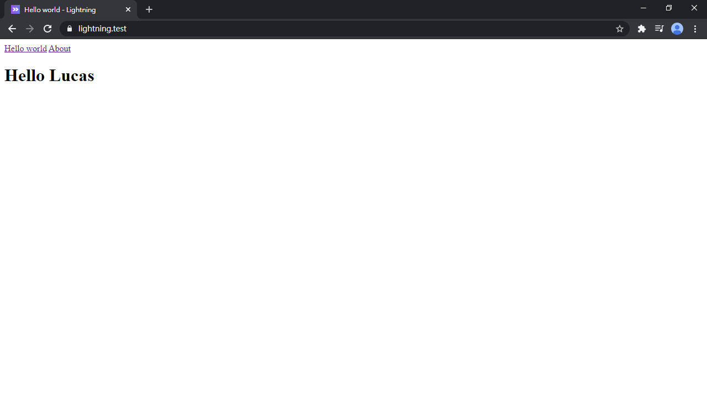

# Day 04 Inertia.js 的 Hello world

裝完 Laravel 後，我們就要開開心心地開始開發啦！首先第一步就是熟悉的 Laravel Router，把預設的 `Welcome` 視圖換成 Inertia 的視圖：

*routes/web.php*
```php
use Illuminate\Support\Facades\Route;
use Inertia\Inertia;

Route::get('/', function () {
    return Inertia::render('HelloWorld');
});
```

PHP 7.4 後可以用 Arrow Functions (箭頭函數)，原本 3 行程式碼變 1 行。如果你偏好喜歡 Helper functions 也可以使用：

```php
Route::get('/', fn() => Inertia::render('HelloWorld'));
// 或
Route::get('/', fn() => inertia('HelloWorld'));
```

還是嫌太長？沒關係，Laravel 可以定義直接輸出視圖的路由 `Route::view()`，Inertia 自然也可以：

```php
Route::inertia('/', 'HelloWorld');
```

這個 `HelloWorld` 就是視圖名稱。前面 `app.js` 裡有用 ``import(`@/Pages/${name}`)`` 動態引入 (Dynamic import)，編譯時 Webpack 會先把 `Pages` 資料夾下所有頁面包好，在瀏覽器執行時根據傳入的頁面名稱 (`HelloWorld`) 渲染對應的頁面。所以現在需要新增 `resources/js/Pages` 資料夾和 `HelloWorld.vue`：

*resources/js/Pages/HelloWorld.vue*
```vue
<template>
  <h1>Hello world</h1>
</template>

<script>
export default {
  metaInfo: {
    title: 'Page 1'
  }
}
</script>
```

然後編譯前端資源：

```bash
yarn watch
```

開瀏覽器看一下結果：


看起來...沒什麼 SPA 的感覺，再加一個頁面還有導覽連結好了：

*routes/web.php*
```php
Route::inertia('about', 'About');
```

*resources/js/Pages/HelloWorld.vue*
```vue
<template>
  <div>
    <div>
      <inertia-link href="/">Hello world</inertia-link>
      <inertia-link href="/about">About</inertia-link>
    </div>
    <h1>Hello world</h1>
  </div>
</template>

<script>
export default {
  metaInfo: {
    title: 'Hello world'
  }
}
</script>
```

*resources/js/Pages/About.vue*
```vue
<template>
  <div>
    <div>
      <inertia-link href="/">Hello world</inertia-link>
      <inertia-link href="/about">About</inertia-link>
    </div>
    <h1>About</h1>
  </div>
</template>

<script>
export default {
  metaInfo: {
    title: 'About'
  }
}
</script>
```

點擊 `<inertia-link>` 組件來切換頁面，不會重新整理頁面，他會在背後送出 `Inertia 請求` 後自動切換頁面 (Vue 組件)。宛如 SPA 應用般...不對！這就是 SPA 應用：


打開瀏覽器的 DevTools 檢查會發現，後端會回傳 **Inertia Page 物件** 給前端。

當然後端一定也要可以傳資料給前端，跟 Laravel 原本的用法一樣，傳個陣列過去就可以了：

*routes/web.php*
```php
Route::get('/', fn() => Inertia::render('HelloWorld', [
    'name' => 'Lucas',
]));
// 或
Route::inertia('/', 'HelloWorld', [
    'name' => 'Lucas',
]);
```

Vue 組件可以用 `props` 接收：

*resources/js/Pages/HelloWorld.vue*
```vue
<template>
  <div>
    ...
    <h1>Hello {{ name }}</h1>
  </div>
</template>

<script>
export default {
  ...
  props: {
    name: String
  }
}
</script>
```



看！Inertia.js 開發 SPA 就是如此舒服！

## 資產版本 (Assets version)

Inertia 資產版本可以讓前端資源更新後，前端切換頁面時自動重新整理頁面，載入新的前端資源。原理很簡單，如果在後端有設定資產版本，Inertia Page 物件就會包含資產版本，發送 Inertia 請求時也會一併帶上 `X-Inertia-Version` Header。如果前端發送請求時，後端檢測到資產版本已經更新，便會回傳一個 409 響應，通知前端需要強制重新整理頁面：

請求：
```http
GET: http://example.com/events/80
Accept: text/html, application/xhtml+xml
X-Requested-With: XMLHttpRequest
X-Inertia: true
X-Inertia-Version: 6b16b94d7c51cbe5b1fa42aac98241d5
```

響應：
```http
409: Conflict
X-Inertia-Location: http://example.com/events/80
```

在 Laravel Mix 要產生資產版本很簡單，有開啟 Laravel Mix 的 Version 功能後，`mix-manifest.json` 每次更新都會紀錄每個資源檔產生的 Hash 值，因此只要把 `mix-manifest.json` 丟給 PHP 的 `md5_file()` 函數產生 MD5 散列值，資產版本就出來了：

*app/Providers/AppServiceProvider.php*
```php
use Inertia\Inertia;

public function register()
{
    Inertia::version(fn() => md5_file(public_path('mix-manifest.json')));
}
```

然後到 `HelloWorld.vue` 隨便加幾個字，回到瀏覽器點 `<inertia-link>` 切換頁面，就會強制重新整理。

## 錯誤處理

在完整的 SPA 中最常見的 Debug 方式，就是開瀏覽器 DevTools 的 Network 裡查 API 響應的結果，Debug 很不舒服。在 Inertia 如果有錯誤時會包裝在一個視窗內，而且還有原本後端提供漂亮的 Debug 介面。我們先回傳一個不存在的變數：

*routes/web.php*
```php
Route::get('about', fn() => $fail);
```

然後從首頁點連結切換到 About 頁面：


看到沒？可以用 Laravel 漂亮的 Debug 頁面，果然還是習慣的最爽。但在線上環境 (production) 就不能暴露這些 Debug 資訊，現在來自訂 Inertia 專用的錯誤頁面：

*app/Exceptions/Handler.php*
```php
use Illuminate\Support\Facades\App;
use Inertia\Inertia;
use Throwable;

public function render($request, Throwable $exception)
{
    $response = parent::render($request, $exception);
    $status = $response->getStatusCode();
    $errorCodes = [
        401 => 'Unauthorized',
        403 => $exception->getMessage() ?: 'Forbidden',
        404 => 'Not Found',
        419 => 'Page Expired',
        429 => 'Too Many Requests',
        500 => 'Server Error',
        503 => $exception->getMessage() ?: 'Service Unavailable',
    ];

    if (App::environment('production')
        && in_array($status, array_keys($errorCodes))) {
        return Inertia::render('Error', [
            'code' => $status,
            'message' => __($errorCodes[$status]),
        ])
            ->toResponse($request)
            ->setStatusCode($status);
    }

    return $response;
}
```

這段是判斷應用是不是在線上環境，和錯誤的 HTTP 狀態碼是不是上面其中之一，若皆是就回傳自訂的錯誤頁面。

*resources/js/Pages/Error.vue*
```php
<template>
  <div>
    <div>{{ code }}</div>
    <div>{{ message }}</div>
  </div>
</template>

<script>
export default {
  metaInfo() {
    return {
      title: this.message
    }
  },
  props: {
    code: Number,
    message: String
  }
}
</script>
```

然後把 `APP_ENV` 暫時改成 `production` 和開啟剛才的 `$fail` 頁面，來看看自訂的錯誤頁面：


搞定！

最後記得瀏覽器要安裝 [Vue.js devtools](https://github.com/vuejs/vue-devtools)，因為前端依然還是用 Vue.js 開發，devtools 的使用方式依然不變，而且有優秀的 Debug 工具才能加速解決問題。

## 總結

見識到了極度舒適的 SPA 開發流程後，下一步就是要讓頁面變漂亮啦！Tailwind CSS 登場！顛覆你以前使用 CSS 的方式！

> Lightning 範例程式碼：https://github.com/ycs77/lightning

## 參考資料

* [The protocol - Inertia.js](https://inertiajs.com/the-protocol)
* [Asset versioning - Inertia.js](https://inertiajs.com/asset-versioning)
* [Error handling - Inertia.js](https://inertiajs.com/error-handling)
