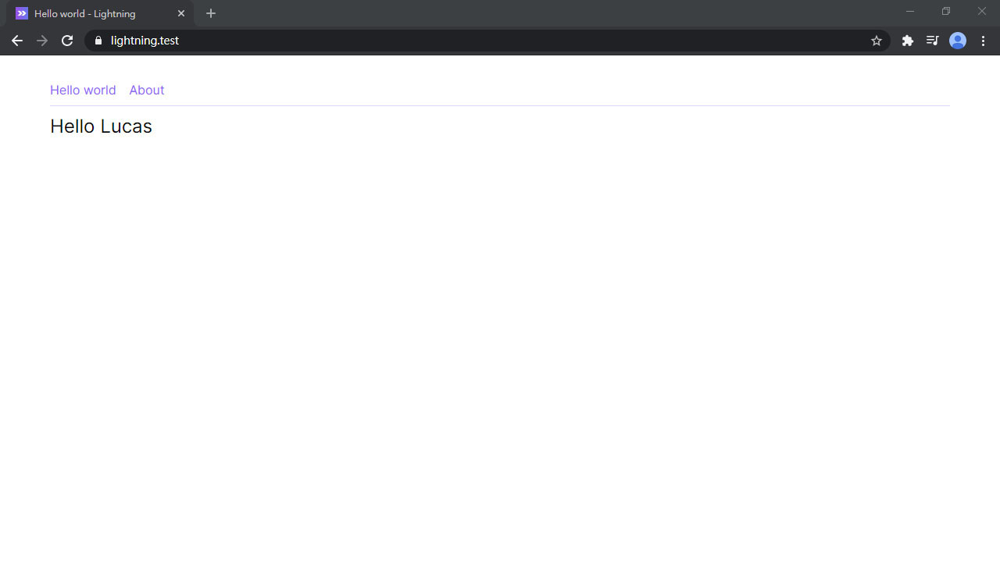

# Day 05 安裝 Tailwind CSS

上一篇的範例因為沒有用 CSS 調教過，還不大能見人。本篇將來簡單介紹 Tailwind CSS 這個 Utility-First 的 CSS 框架。

Tailwind CSS 預先把大部分常用的 CSS 屬性包裝成 class，像 `.px-6` 對應 `padding-left: 1.5rem; padding-right: 1.5rem`，這就是 Utility class。很多人聽到這裡就會說，「這不就是寫 Inline CSS 嘛！」，ㄝ... 完全不一樣喔！

Tailwind CSS 可以在 HTML 完成 RWD、Hover、Focus 等功能，而且 class 名稱短很多且有規範，比 Inline CSS 強大多了。Tailwind CSS 最強大之處，莫過於完整的自訂系統。更詳細的介紹請務必看過這篇文章 [還在跟複雜的 CSS 的設定奮鬥嗎？用 Tailwind 來幫你實現真正的高效整潔！](https://5xruby.tw/posts/tailwind-css-plugin/) 和 Tailwind CSS 的 [官方文檔](https://tailwindcss.com/)。

## 安裝 Tailwind CSS

先執行：

```bash
yarn add tailwindcss @tailwindcss/ui @tailwindcss/custom-forms \
  autoprefixer postcss-import postcss-nested
```

看到要裝這麼多東西會被嚇到，讓我們來一個一個解釋：

* `tailwindcss`：Tailwind CSS 本體，同時也是 PostCSS 的套件
* `@tailwindcss/ui`：Tailwind CSS 官方推出的 Tailwind UI 的免費版，提供更多功能
* `@tailwindcss/custom-forms`：管表單輸入框樣式的套件
* `autoprefixer`：自動增加 CSS 前綴詞
* `postcss-import`：在 CSS 裡可以 import 其他 CSS
* `postcss-nested`：在 CSS 用嵌套的寫法

然後初始化，其實也就是新增 `tailwind.config.js`：

```bash
npx tailwindcss init
```

這個檔案是 Tailwind CSS 的設定檔，所有客製化都是在這裡設定，初始化完成會看到這樣：

*tailwind.config.js*
```js
module.exports = {
  purge: [],
  theme: {
    extend: {},
  },
  variants: {},
  plugins: [],
}
```

我們先改成這樣：

```js
const { fontFamily } = require('tailwindcss/defaultTheme')

module.exports = {
  purge: {
    mode: 'layers',
    layers: ['base', 'components', 'utilities'],
    content: [
      './resources/**/*.blade.php',
      './resources/**/*.vue',
    ],
  },
  theme: {
    container: {
      center: true,
      padding: {
        default: '1rem',
        sm: '2rem',
        lg: '3rem',
        xl: '4rem',
      },
    },
    extend: {
      fontFamily: {
        sans: ['Inter var', 'Noto Sans TC', ...fontFamily.sans],
        mono: [...fontFamily.mono, 'Inter var', 'Noto Sans TC'],
      },
    },
  },
  variants: {},
  plugins: [
    require('@tailwindcss/ui'),
    require('@tailwindcss/custom-forms'),
  ],
}
```

太複雜看不懂，解釋一下：

* `purge` 是過濾 class 的設定，Tailwind CSS 產生了超無敵多的 class，絕大部分都不會用到，因此在 build production 版的 CSS 時，會自動過濾掉沒使用到的 class。
* `theme` 是 Tailwind CSS 的樣式設定，可以自由調整產生出的顏色、尺寸、字型等。上面有增加了 `container` 和 `fontFamily` 兩個設定。`fontFamily` 是設定在 `extend` 裡面，其他未列出的部分會繼承預設設定。詳細的調整方式可以參考官網的 [Container](https://tailwindcss.com/docs/container) 和 [Font Family](https://tailwindcss.com/docs/font-family)。
* `variants` 可以設定像 `hover`、`focus` 等，用法會像 `hover:text-red-500`、`focus:bg-purple-700`
* `plugins` 註冊 Tailwind CSS 套件

上面增加了兩個新字型，還需要在 `app.blade.php` 裡引入字型檔：

*resources/views/app.blade.php*
```html
<title>{{ config('app.name') }}</title>
<link rel="preconnect" href="https://fonts.gstatic.com/" crossorigin />
<link href="https://rsms.me/inter/inter.css" rel="stylesheet" />
<link href="https://fonts.googleapis.com/css2?family=Noto+Sans+TC:wght@100;300;400;500;700;900&display=swap" rel="stylesheet">
```

然後新增 CSS 的主要檔案。裡面會有 Tailwind CSS 的三個區塊 `base`、`components`、`utilities`。之後要增加 CSS 都必須放在對應的區塊內：

*resources/css/app.css*
```css
@import 'tailwindcss/base';

@import 'tailwindcss/components';

@import 'tailwindcss/utilities';
```

* **Base**: 基本 HTML 樣式。裡面包含調整過的 Normalize.css，把 HTML 原始的樣式重新初始化，排版時比較不會有副作用
* **Components**: 組件區塊
* **Utilities**: Utiity class 區塊

> 原本是可以用 `@tailwind` 來引入，但因為使用 `postcss-import` 的關係，需要改 `@import`。

Tailwind CSS 除了在 HTML 寫 class 之外，也可以搬到 CSS 包成 class，現在我們來新增可以自己寫 CSS 的檔案 `base.css` 和 `components.css`。在 CSS 裡要使用 `@apply` 來調用 Tailwind CSS 的類別。

這裡可以自訂的基本 HTML 樣式。：

*resources/css/base.css*
```css
button:focus {
  @apply outline-none;
}
```

這裡可以自訂組件。之後有比較多的 class 會單獨抽到個別 CSS 檔案裡。這裡新增了 `link` class，套用就會有連結的樣子。`text-purple-500` 是設定文字顏色，使用方式在 [Text Color](https://tailwindcss.com/docs/text-color)，但因為我們這次使用 Tailwind UI 的色板，新的色板需要參考 [Tailwind UI Updated color palette](https://tailwindui.com/documentation#how-tailwindcss-ui-extends-tailwind) (增加了 50 深淺值)。每個色板都有 50(淺) 到 900 (深)。`transition` 設定鼠標移過的過渡動畫：

*resources/css/components.css*
```css
/* Link */
.link {
  @apply text-purple-500 transition-colors duration-100;
  &:hover {
    @apply text-purple-700;
  }
}
```

記得在 `app.css` 裡引入 CSS：

*resources/css/app.css*
```css
@import 'tailwindcss/base';
@import 'base';

@import 'tailwindcss/components';
@import 'components';

@import 'tailwindcss/utilities';
```

再來就是編譯的部分，上面有說到 `tailwindcss` 是 PostCSS 的套件，要用 `postCss()` 來編譯：

*webpack.mix.js*
```js
mix
  .js('resources/js/app.js', 'public/js')
  .postCss('resources/css/app.css', 'public/css', [
    require('postcss-import'),
    require('tailwindcss'),
    require('postcss-nested'),
    require('autoprefixer')
  ])
```

> Tailwind CSS 也可以用 CSS 預處理器，但有要注意的地方，請參考 [Using with Preprocessors - Tailwind CSS](https://tailwindcss.com/docs/using-with-preprocessors)。

執行編譯：

```bash
yarn watch
```

最後我們來調整 Hello world 範例的樣式，增加一些 class 看看：

*resources/js/Pages/HelloWorld.vue*
```vue
<template>
  <div class="container py-8">
    <div class="space-x-3 pb-2 border-b border-purple-200">
      <inertia-link href="/" class="link">Hello world</inertia-link>
      <inertia-link href="/about" class="link">About</inertia-link>
    </div>
    <h1 class="text-2xl mt-2">Hello {{ name }}</h1>
  </div>
</template>
```

*resources/js/Pages/About.vue*
```vue
<template>
  <div class="container py-8">
    <div class="space-x-3 pb-2 border-b border-purple-200">
      <inertia-link href="/" class="link">Hello world</inertia-link>
      <inertia-link href="/about" class="link">About</inertia-link>
    </div>
    <h1 class="text-2xl mt-2">About</h1>
  </div>
</template>
```

神奇似的好看多了：



## VSCode 套件


Tailwind CSS 官方有維護一個 VSCode 的 [Tailwind CSS IntelliSense](https://marketplace.visualstudio.com/items?itemName=bradlc.vscode-tailwindcss) 套件，如果你也用 VSCode 可以安裝。裝完開 HTML 測試可能沒有反應，必須要有安裝 `tailwindcss`、有 `tailwind.config.js` 設定檔、最後重新開啟 VSCode 後就可以使用了。

但是開啟 CSS 檔時卻會報錯，這時需要安裝另一個套件來接管 CSS 驗證 [stylelint](https://marketplace.visualstudio.com/items?itemName=stylelint.vscode-stylelint)，然後增加以下 VSCode 設定：

*.vscode/settings.json*
```json
{
  "css.validate": false,
  "stylelint.config": {
    "rules": {
      "at-rule-no-unknown": [true, {
        "ignoreAtRules": [
          "tailwind",
          "apply",
          "layer",
          "variants",
          "responsive",
          "screen"
        ]
      }],
      "declaration-block-trailing-semicolon": null,
      "no-descending-specificity": null
    }
  }
}
```

## 調整錯誤頁面

最後我們來調整一下錯誤頁面的樣式 (記得 `APP_ENV` 要暫時改成 `production`)：

*resources/js/Pages/Error.vue*
```vue
<template>
  <div class="bg-white text-gray-600 h-screen flex justify-center items-center relative">
    <div class="text-center text-5xl font-thin px-4 border-r-2 border-current">
      {{ code }}
    </div>
    <div class="text-center text-lg font-light tracking-wider p-3">
      {{ message }}
    </div>
  </div>
</template>
```


(別忘了把 `APP_ENV` 改回 `local`！)

## 總結

恭喜你今天認識一個優秀的 CSS 框架 Tailwind CSS。如果你是前端 CSS 工程師或者你喜歡花時間刻 CSS，這套框架絕對可以用得很爽！同時也會是本系列使用的 CSS 框架，之後會了解到 Tailwind CSS 更多的用法。接下來我們要安裝 Icon 到 Lightning，距離正式開始開發功能不遠囉！下一篇再見！

> Lightning 範例程式碼：https://github.com/ycs77/lightning

## 參考資料

* [Tailwind CSS 官網](https://tailwindcss.com/)
* [還在跟複雜的 CSS 的設定奮鬥嗎？用 Tailwind 來幫你實現真正的高效整潔！](https://5xruby.tw/posts/tailwind-css-plugin/)
