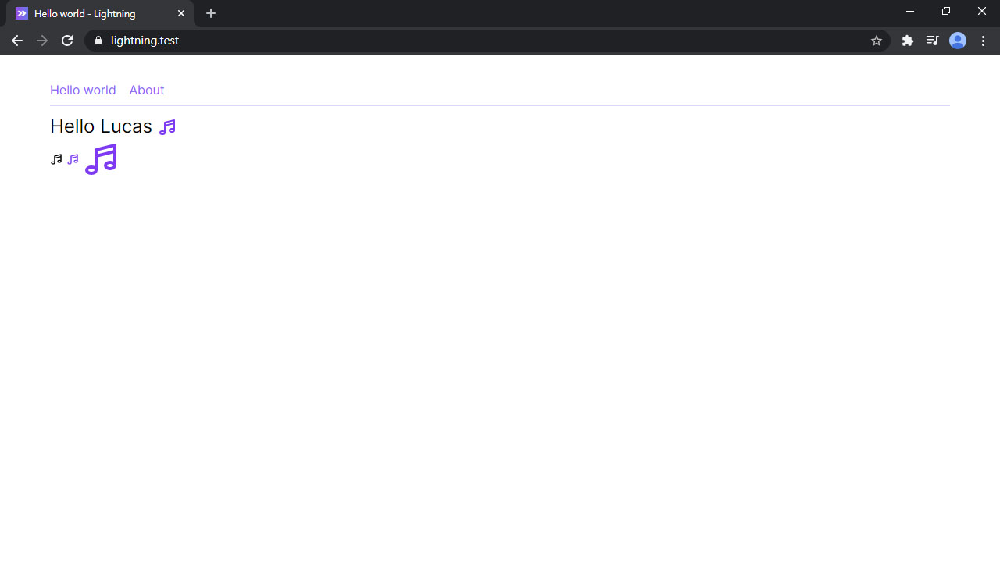
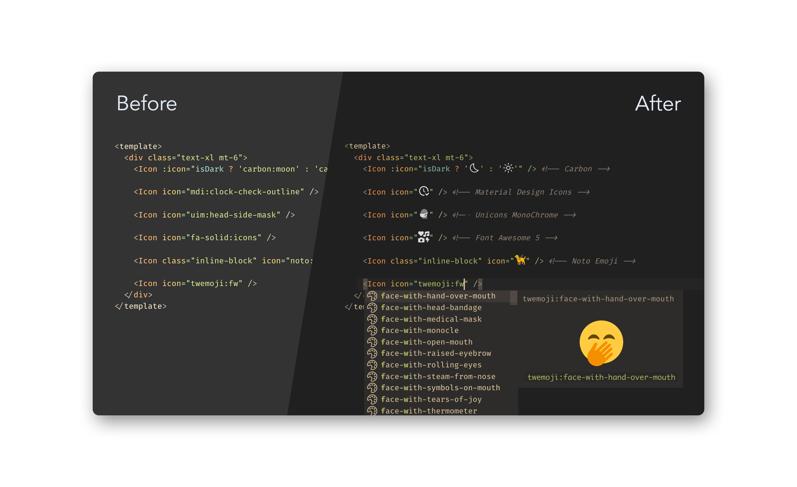

# Day 06 Iconify 和 Heroicons

本篇要來講在網頁很常見的元素 icon。常見的 icon 套件包括 Material Design Icons、Font Awesome、Octicon，而且每一種的安裝方式都不盡相同。所幸我們有 [Iconify](https://iconify.design/) 這套 icon 框架，只需用一種使用方式，就可以隨心所欲使用那些跟天上星星一樣多的 icon。在 [Icônes](https://icones.netlify.app/) 可以搜尋所有能用的 icon。在這一個系列我會使用的是由 Tailwind CSS 團隊開發的 [Heroicons](https://heroicons.com/) icon 框架。

但我不會直接裝 Iconify，而是會使用 [PurgeIcons](https://github.com/antfu/purge-icons)。PurgeIcons 只會打包你的專案有使用到的 Iconify 裡的 icon。大大減少 JS 檔案的體積。

## 安裝 PurgeIcons

我們在用的 Laravel Mix 是基於 Webpack 運作的，所以就安裝 PurgeIcons 的 [Webpack 套件](https://github.com/antfu/purge-icons/tree/main/packages/purge-icons-webpack-plugin)：

```bash
yarn add purge-icons-webpack-plugin -D
```

然後在 Mix 裡註冊這個 Webpack 套件：

*webpack.mix.js*
```js
const mix = require('laravel-mix')
const PurgeIconsPlugin = require('purge-icons-webpack-plugin').default
...
  .webpackConfig({
    ...
    plugins: [
      new PurgeIconsPlugin()
    ]
  })
```

再來安裝 Vue 的 icon 組件：

```bash
yarn add purge-icons-vue
```

註冊套件：

*resources/js/app.js*
```js
...
import PurgeIconsVue from 'purge-icons-vue'

Vue.use(PurgeIconsVue)
```

引入樣式，記住要在 `tailwindcss/components` 之後、`tailwindcss/utilities` 之前：

```css
@import 'tailwindcss/components';
...
@import 'purge-icons-vue';

@import 'tailwindcss/utilities';
```

## 使用 Icon

Heroicons 的 Icônes 傳送門：[Heroicons Solid](https://icones.netlify.app/collection/heroicons-solid)、[Heroicons Outline](https://icones.netlify.app/collection/heroicons-outline)，可以在這裡查看 Heroicons 的 icon。如果你想要換其他的 icon 都可以在 [Icônes](https://icones.netlify.app/) 裡找到。

然後就可以使用 icon 組件了：

```html
<icon icon="heroicons-outline:music-note" />
```

或者改變顏色：

```html
<icon class="text-purple-600" icon="heroicons-outline:music-note" />
```

或者改變大小：

```html
<icon class="text-purple-600 w-12 h-12" icon="heroicons-outline:music-note" />
```

用 Tailwind CSS 就可以快速隨心所欲地調整 icon 的樣式。



## VSCode 套件

Iconify 也有 VSCode 的提示套件 [Iconify IntelliSens](https://marketplace.visualstudio.com/items?itemName=antfu.iconify)，例如輸入 `heroicons-outline:` 會提示 HeroIcons Outline 可以用的 icon。



## 總結

雖然本篇比較短，但 icon 也是我們網站中十分重要的一個元素，讓網頁畫面變得比較鮮活。Icônes 這個工具也讓使用 icon 變的十分簡單。下一篇會來講 Layout 和組件，正篇終於要開始囉！

> Lightning 範例程式碼：https://github.com/ycs77/lightning

## 參考資料

* [Iconify](https://iconify.design/)
* [PurgeIcons](https://github.com/antfu/purge-icons)
* [Icônes](https://icones.netlify.app/)
* [Heroicons](https://heroicons.com/)
