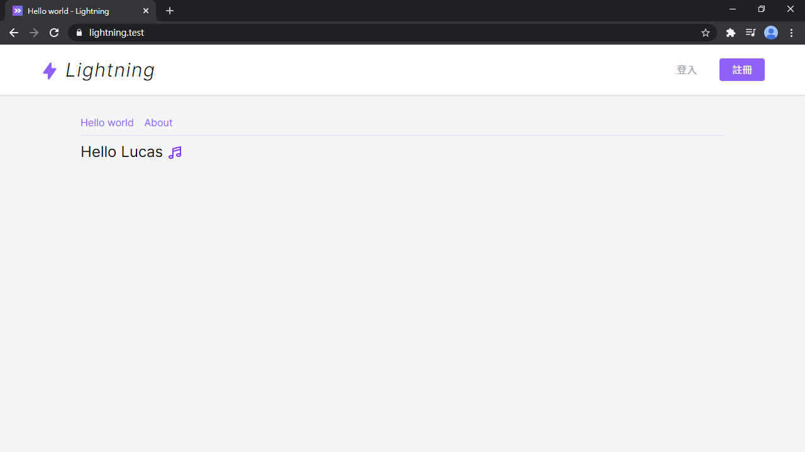
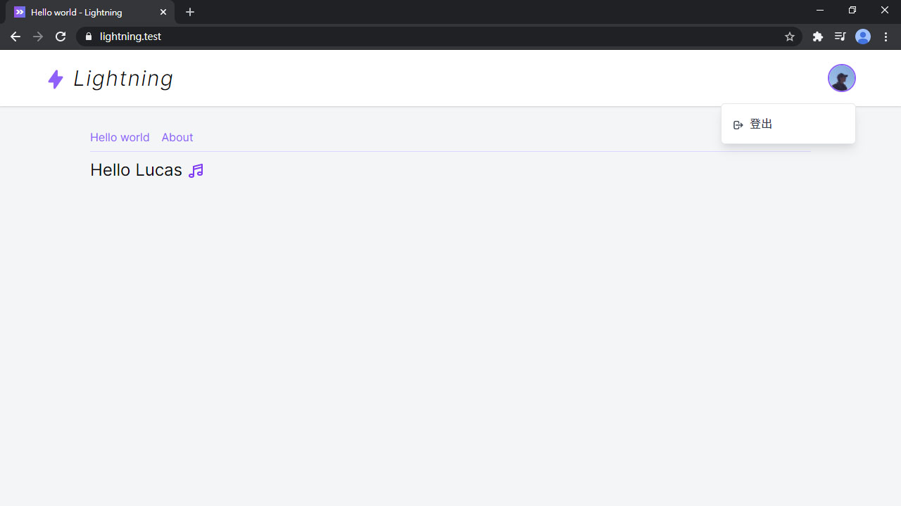

# Day 07 Layout 和組件

只要是同一個網站，就會有同樣的部分，例如導覽列、頁尾、側邊欄等，需要有 **Layout** 來統一管理整個網頁的佈局。

網頁內元素開始多了起來，總不可能一直都要複製 HTML 吧！這時可以包裝成**組件**，之後就能很容易的重複使用。

這兩個東西就是今天的主角，話不多說，馬上開始！

## 共享資料

導覽列中的標題需要由後端提供，但如果都在每個頁面注入標題那也太難管理。鏘鏘！此時 **共享資料** 派上用場！使用 `Inertia::share()` 分享資料給所有的 Inertia 視圖 (類似 Laravel 的 `View::share()`)，然後用 `this.$page.{variable}` 讀取。

之後會在 `AppServiceProvider` 加比較多東西，為了可以好管理，我們先把 Inertia 相關的東西抽出到 `registerInertia()` 裡：

*app/Providers/AppServiceProvider.php*
```php
public function register()
{
    $this->registerInertia();
}

protected function registerInertia()
{
    Inertia::version(fn() => md5_file(public_path('mix-manifest.json')));

    Inertia::share([
        'title' => config('app.name'),
    ]);
}
```

> 前面在設定 `.env` 檔時有把 `APP_NAME` 設為 Lightning，`config('app.name')` 會讀到這個變數。

然後前端就可以用 `this.$page.title` 取得標題了。馬上去刻板囉！

## Layout

首先先新增 `Layouts` 資料夾，和 `AppLayout.vue` 這個 Layout：

> 在 Template 不用加 `this.`，所以可以直接用 `$page.title`

*resources/js/Layouts/AppLayout.vue*
```vue
<template>
  <div class="bg-gray-100 min-h-screen">
    <header class="bg-white shadow">
      <div class="container flex items-center justify-between h-16 md:h-20">
        <h1>
          <inertia-link href="/" class="block text-2xl font-light italic md:text-3xl">
            <icon class="text-purple-500 w-6 h-6 md:w-8 md:h-8" icon="heroicons-solid:lightning-bolt" />
            <span>{{ $page.title }}</span>
          </inertia-link>
        </h1>

        <nav>
          <ul class="flex text-sm md:text-base space-x-1 md:space-x-4 items-center">
            <li>
              <inertia-link href="/login" class="px-3 py-2 md:px-5 rounded text-gray-400 hover:text-gray-900 transition-colors duration-150">
                登入
              </inertia-link>
            </li>
            <li>
              <inertia-link href="/register" class="px-3 py-2 md:px-5 rounded bg-purple-500 text-white hover:bg-purple-700 transition-colors duration-150">
                註冊
              </inertia-link>
            </li>
          </ul>
        </nav>
      </div>
    </header>

    <div class="container">
      <slot />
    </div>
  </div>
</template>

<script>
export default {

}
</script>
```

回到之前的 `HelloWorld.vue`，在 `layout` 屬性設定要套用的 Layout：

*resources/js/Pages/HelloWorld.vue*
```vue
<script>
import AppLayout from '@/Layouts/AppLayout'

export default {
  layout: AppLayout,
  ...
}
</script>
```



一個簡單的佈局就出來啦~~

## 建立下拉選單組件

剛才那個是還沒登入的樣子，登入後在導覽列右上角我想要有用戶的頭像按鈕，點擊後跳出下拉式選單，有文章、設定、登出等按鈕，所以先做一個拉式選單組件。一樣先開 `Components` 資料夾和 `Dropdown.vue`：

*resources/js/Components/Dropdown.vue*
```vue
<template>
  <div class="relative z-50">
    <slot name="button" :open="open" />
    <button v-if="isOpen" @click="close" tabindex="-1" class="fixed z-40 inset-0 h-full w-full cursor-default"></button>
    <transition
      enter-class="opacity-0 scale-90"
      enter-active-class="transition duration-150 ease-out origin-top-right"
      enter-to-class="opacity-1 scale-100"
      leave-class="opacity-1 scale-100"
      leave-active-class="transition duration-150 ease-in origin-top-right"
      leave-to-class="opacity-0 scale-90"
    >
      <div v-if="isOpen" class="absolute z-50 right-0 mt-4 py-2 w-48 bg-white border border-gray-200 rounded-md shadow-lg transform">
        <slot name="menu" :close="close" />
      </div>
    </transition>
  </div>
</template>

<script>
export default {
  data() {
    return {
      isOpen: false
    }
  },
  methods: {
    open() {
      this.isOpen = true
    },
    close() {
      this.isOpen = false
    }
  },
  created() {
    const handleEscape = e => {
      if (['Esc', 'Escape'].includes(e.key)) {
        this.isOpen = false
      }
    }

    document.addEventListener('keydown', handleEscape)
    this.$once('hook:beforeDestroy', () => {
      document.removeEventListener('keydown', handleEscape)
    })
  }
}
</script>
```

這個組件有用到 slot (插槽)，上面的 button slot 可以自訂下拉式選單上方的按鈕，下面 menu slot 是選單的按鈕區塊。包了一層 `<transition>` 讓選單有個簡單的過渡動畫。中間的 `<button>` 其實是一個全屏的透明層，在下拉式選單出現時墊在下面，選單開啟時只要點擊背景空白處(透明層)就可以關閉選單，於是一個簡單的下拉式選單組件就完成了！

> 了解 [插槽 — Vue.js 文檔](https://cn.vuejs.org/v2/guide/components-slots.html)

但選單的按鈕也需要包裝一下，新增一個 `DropdownItem.vue`，可以傳網址和 icon 進來：

*resources/js/Components/DropdownItem.vue*
```vue
<template>
  <inertia-link :href="href" class="flex items-center px-4 py-2 text-gray-700 hover:bg-gray-100 focus:bg-gray-100" v-on="$listeners">
    <template v-if="icon">
      <icon class="mr-2" :icon="icon" />
      <slot />
    </template>
    <slot v-else />
  </inertia-link>
</template>

<script>
export default {
  props: {
    href: {
      type: String,
      required: true
    },
    icon: String
  }
}
</script>
```

組件好了之後就可以引進 `AppLayout`，這樣外部我們只需要關注頭像按鈕，和設定需要的選單按鈕就可以了。把剛才的登入/註冊按鈕先註解起來，模擬已登入狀態：

> `#` 是 `v-slot` 的別名，參考：[具名插槽的缩写](https://cn.vuejs.org/v2/guide/components-slots.html#%E5%85%B7%E5%90%8D%E6%8F%92%E6%A7%BD%E7%9A%84%E7%BC%A9%E5%86%99)

> 實際開發組件流程不會是這麼簡單。我個人的作法是在頁面先刻好，根據複雜度/使用頻繁度來決定，是否將其抽成組件或 CSS class。如果要有系統的開發完整的組件庫，建議試試看 [Storybook](https://storybook.js.org/)。

*resources/js/Layouts/AppLayout.vue*
```vue
<template>
  <div class="bg-gray-100 min-h-screen">
    <header class="bg-white shadow">
      <div class="container flex items-center justify-between h-16 md:h-20">
        ...
        <nav>
          <ul class="flex text-sm md:text-base space-x-1 md:space-x-4 items-center">
            <!-- ... -->
            <li>
              <dropdown class="text-base">
                <template #button="{ open }">
                  <button @click="open" class="relative z-10 block h-10 w-10 rounded-full overflow-hidden border-2 border-transparent focus:outline-none focus:border-purple-500">
                    
                  </button>
                </template>
                <template #menu="{ close }">
                  <dropdown-item href="/" icon="heroicons-outline:logout" @click="close">
                    登出
                  </dropdown-item>
                </template>
              </dropdown>
            </li>
          </ul>
        </nav>
      </div>
    </header>
    ...
  </div>
</template>

<script>
import Dropdown from '@/Components/Dropdown'
import DropdownItem from '@/Components/DropdownItem'

export default {
  components: {
    Dropdown,
    DropdownItem
  },
  data() {
    return {
      user: {
        name: 'Lucas',
        avatar: 'https://secure.gravatar.com/avatar/5d4a86f77c616178756fc10ad9344315'
      }
    }
  }
}
</script>
```

但總不能都用註解來切換吧...，這裡將兩組登入前後需要的元件，個別用 `<template>` 包起來，然後就可以根據變數來切換顯示內容：

*resources/js/Layouts/AppLayout.vue*
```html
<nav>
  <ul class="flex text-sm md:text-base space-x-1 md:space-x-4 items-center">
    <template v-if="false">
      ...
    </template>
    <template v-else>
      ...
    </template>
  </ul>
</nav>
```



前端 Layout 讓網頁至少有點樣子了 (哈哈)。

## 總結

從本篇正式開始開發 Lightning (~~和用程式碼灌水~~)。下一篇開始就是用戶的部分，整個應用中最基本的功能，繼續加油！

> Lightning 範例程式碼：https://github.com/ycs77/lightning

## 參考資料

* [Pages - Inertia.js](https://inertiajs.com/pages)
* [Shared data - Inertia.js](https://inertiajs.com/shared-data)
* [插槽 — Vue.js](https://cn.vuejs.org/v2/guide/components-slots.html)
