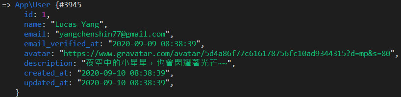

# Day 08 Lightning 用戶功能

熬了好久，終於要開始做用戶相關的功能啦！雖然 Laravel 預設有幫我們做了一些相關的功能，但沒有完全滿足這個 Lightning 的需求，先來做一些調整。

## User Migration & Model

基本的用戶名稱、E-mail、密碼等都有了，不過我還想要增加用戶簡介、頭像兩個欄位。首先是 Migration，在 `password` 後面增加兩個欄位。用戶簡介不是必填，所以後面要串 `nullable()`，即允許值為 `null`：

*database/migrations/2014_10_12_000000_create_users_table.php*
```php
Schema::create('users', function (Blueprint $table) {
    ...
    $table->string('password');
    $table->string('avatar');
    $table->string('description', 100)->nullable();
    $table->rememberToken();
    $table->timestamps();
});
```

然後跑 Migrate：

```bash
php artisan migrate
```

在 `User` Model 的 `$fillable` 裡要加上兩個欄位：

*app/User.php*
```php
protected $fillable = [
    'name', 'email', 'password', 'description', 'avatar',
];
```

## 用戶頭像

用戶頭像的預設值會使用 [Gravatar](https://en.gravatar.com/) 取得，[Gravatar](https://en.gravatar.com/) 是一個用戶頭像服務，只要你在 Gravatar 上傳你的頭像，在任何支援 Gravatar 的平台可以根據 E-mail 使用它。根據 Gravatar 的 [PHP 使用方式](https://en.gravatar.com/site/implement/images/php/)，我們可以在 `User` Model 裡增加取得頭像的網址。而且如果找不到頭像時，還可以設定 Gravatar 回傳的預設圖片：

*app/User.php*
```php
public function getAvatarUrl(string $default = 'mp', int $size = 80)
{
    return sprintf(
        'https://www.gravatar.com/avatar/%s?d=%s&s=%s',
        md5(strtolower(trim($this->email))), urlencode($default), $size
    );
}
```

然後要監聽當新增 Model 時，自動設定預設頭像：

*app/User.php*
```php
protected static function booted()
{
    static::creating(function (self $user) {
        if (! $user->avatar) {
            $user->avatar = $user->getAvatarUrl();
        }
    });
}
```

這樣用戶頭像的基本功能就搞定了！

## 假用戶資料

產生假用戶資料的 `UserFactory` 也要改一下：

*database/factories/UserFactory.php*
```php
$factory->define(User::class, function (Faker $faker) {
    return [
        ...
        'password' => '$2y$10$92IXUNpkjO0rOQ5byMi.Ye4oKoEa3Ro9llC/.og/at2.uheWG/igi', // password
        'description' => $faker->realText(10),
        'remember_token' => Str::random(10),
    ];
});
```

還有需要新增 `UserSeeder`：

```bash
php artisan make:seeder UserSeeder
```

為了方便我測試，先新增兩個我指定名稱的用戶，其他隨便產生：

*database/seeds/UserSeeder.php*
```php
use App\User;

public function run()
{
    factory(User::class)->create([
        'name' => 'Lucas Yang',
        'email' => 'yangchenshin77@gmail.com',
        'description' => '夜空中的小星星，也會閃耀著光芒~~',
    ]);

    factory(User::class)->create([
        'name' => '測試',
        'email' => 'test@email.com',
        'description' => '關於我轉生用 Inertia.js 這檔事',
    ]);

    factory(User::class, 8)->create();
}
```

再來把 `DatabaseSeeder` 裡的 `UserSeeder` 去掉註解就行了：

*database/seeds/DatabaseSeeder.php*
```php
public function run()
{
    $this->call(UserSeeder::class);
}
```

最後執行假資料產生器：

```bash
php artisan db:seed
```

把 Tinker 打開，查一下剛才產生的用戶帳號：

```bash
php artisan tinker
>>> App\User::where('email', 'yangchenshin77@gmail.com')->first()
```



之後我就要用這隻帳號~~闖蕩異世界~~登入 Lightning 囉！

## 總結

上面都是 Laravel 相關，大家應該都很熟悉。再來就是用戶登入的部分了，Inertia.js 要準備開始發威囉！

> Lightning 範例程式碼：https://github.com/ycs77/lightning
