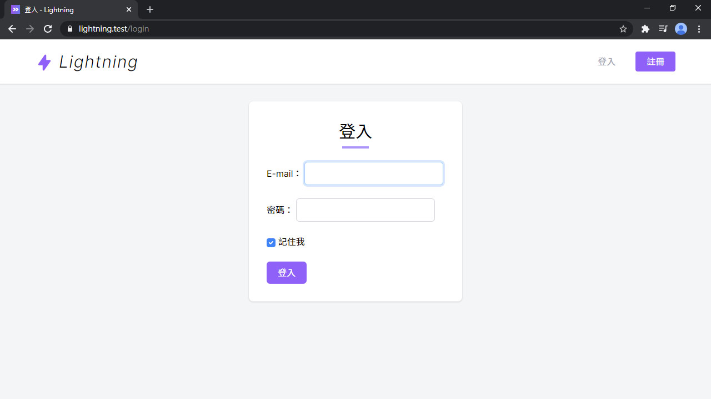
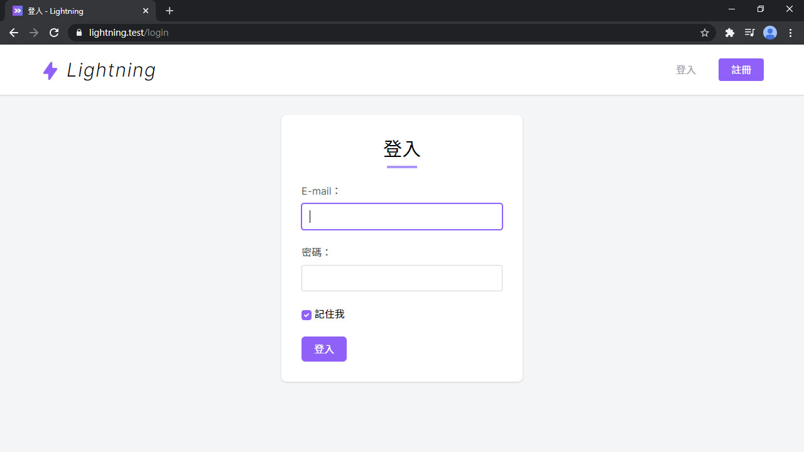
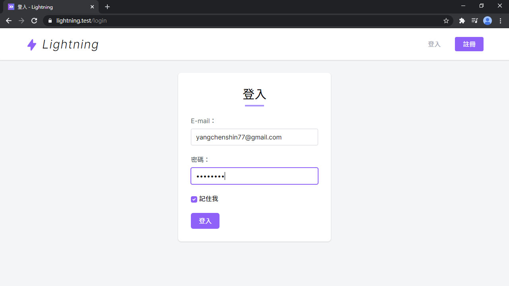
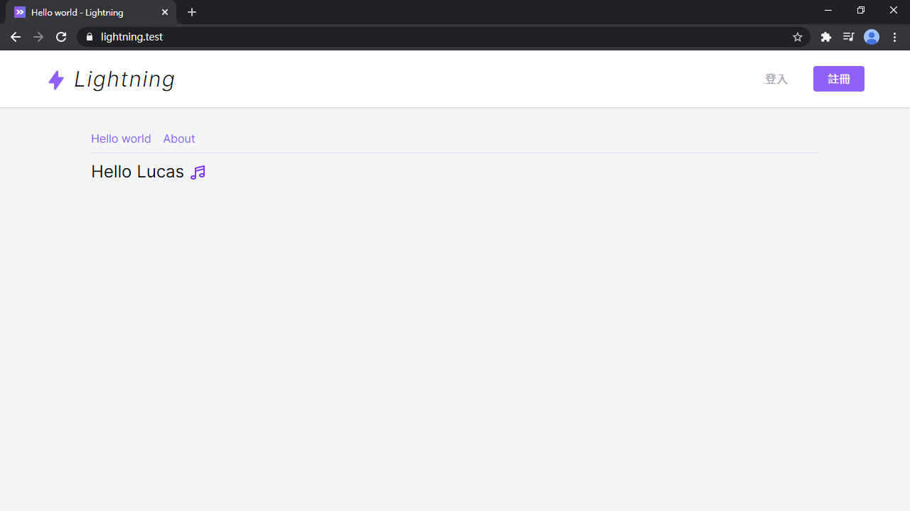
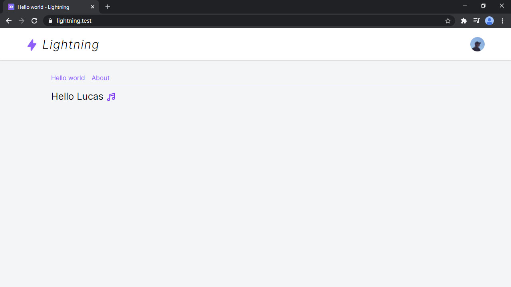
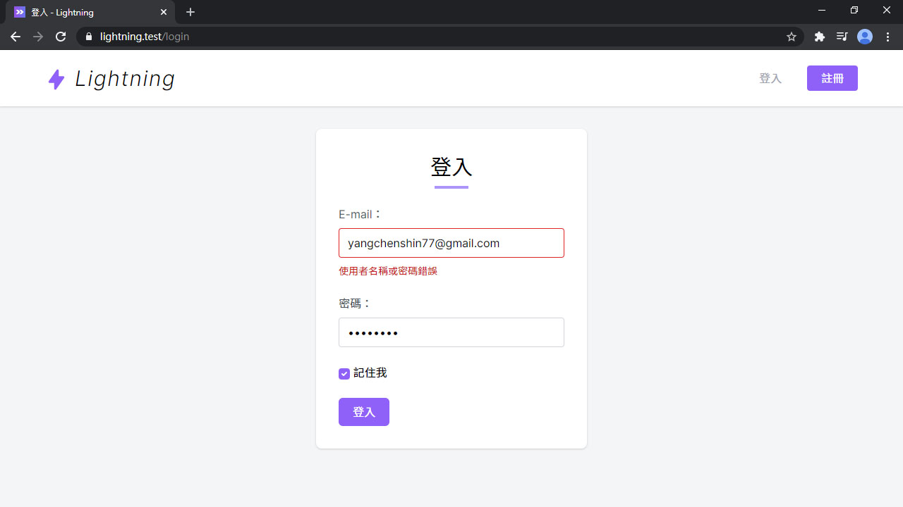
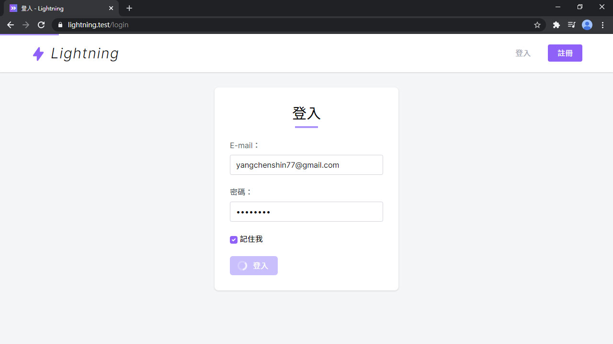

# Day 09 Lightning 用戶登入

調好了用戶 Model，現在可以來做登入/登出了。上篇已經在後端安裝 Laravel UI 有了現成的登入邏輯，但前端就需要做比較多事情...，像用 Tailwind CSS 調表單樣式、增加組件等。不管，先上再說！

## 登入頁面

先是登入頁面 `Auth/Login`：

*resources/js/Pages/Auth/Login.vue*
```vue
<template>
  <div class="py-6 md:py-8">
    <form @submit.prevent="submit" class="bg-white rounded-lg shadow max-w-sm p-6 md:p-8 mx-auto">
      <h1 class="text-3xl text-center">登入</h1>
      <div class="w-12 mt-1 mx-auto border-b-4 border-purple-400"></div>

      <div class="grid gap-6 mt-6">
        <text-input v-model="form.email" label="E-mail" autocomplete="email" ref="emailInput" />
        <text-input v-model="form.password" type="password" label="密碼" />
        <div>
          <label>
            <input type="checkbox" class="form-checkbox" v-model="form.remember"> 記住我
          </label>
        </div>
        <div>
          <loading-button :loading="loading" class="inline-flex items-center px-5 py-2 rounded-md transition-colors duration-150 bg-purple-500 text-white hover:bg-purple-700 disabled:bg-purple-300">登入</loading-button>
        </div>
      </div>
    </form>
  </div>
</template>

<script>
import AppLayout from '@/Layouts/AppLayout'
import TextInput from '@/Components/TextInput'
import LoadingButton from '@/Components/LoadingButton'

export default {
  layout: AppLayout,
  metaInfo: {
    title: '登入'
  },
  components: {
    TextInput,
    LoadingButton
  },
  data() {
    return {
      form: {
        email: '',
        password: '',
        remember: true
      },
      loading: false
    }
  },
  methods: {
    submit() {
      //
    }
  },
  mounted() {
    this.$refs.emailInput.focus()
  }
}
</script>
```

上面 `<loading-button>` 的 class 裡有 `disabled:bg-purple-300`，但預設是關閉，要用它需要開 `disabled` 的 variants：

*tailwind.config.js*
```js
module.exports = {
  variants: {
    ...
    backgroundColor: ['responsive', 'hover', 'focus', 'disabled'],
  }
}
```

`Login` 裡面已經先引入了 `TextInput` 和 `LoadingButton` 兩個組件，卻都不存在，所以會報錯。這兩個組件都是我從 Inertia.js 官方 Demo [PingCRM](https://github.com/inertiajs/pingcrm) 拿的，稍微調整後變成下方這樣。文字輸入框：

*resources/js/Components/TextInput.vue*
```vue
<template>
  <div>
    <label v-if="label" class="form-label" :for="id">{{ label }}：</label>
    <input :id="id" ref="input" v-bind="$attrs" class="form-input" :type="type" :value="value" @input="$emit('input', $event.target.value)">
  </div>
</template>

<script>
export default {
  inheritAttrs: false,
  props: {
    id: {
      type: String,
      default() {
        return `text-input-${this._uid}`
      }
    },
    type: {
      type: String,
      default: 'text'
    },
    value: String,
    label: String
  },
  methods: {
    focus() {
      this.$refs.input.focus()
    },
    select() {
      this.$refs.input.select()
    },
    setSelectionRange(start, end) {
      this.$refs.input.setSelectionRange(start, end)
    }
  }
}
</script>
```

附有載入圖示的按鈕：

*resources/js/Components/LoadingButton.vue*
```vue
<template>
  <button :disabled="loading" class="inline-flex items-center">
    <svg v-if="loading" class="animate-spin -ml-1 mr-3 h-5 w-5 text-white" xmlns="http://www.w3.org/2000/svg" fill="none" viewBox="0 0 24 24">
      <circle class="opacity-25" cx="12" cy="12" r="10" stroke="currentColor" stroke-width="4"></circle>
      <path class="opacity-75" fill="currentColor" d="M4 12a8 8 0 018-8V0C5.373 0 0 5.373 0 12h4zm2 5.291A7.962 7.962 0 014 12H0c0 3.042 1.135 5.824 3 7.938l3-2.647z"></path>
    </svg>
    <slot />
  </button>
</template>

<script>
export default {
  props: {
    loading: Boolean
  }
}
</script>
```



嗯...再調一下 CSS。先改 Tailwind CSS Custom Forms 的設定，把輸入框變寬、顏色改成紫色、把半透明陰影改掉：

*tailwind.config.js*
```js
module.exports = {
  theme: {
    ...
    customForms: theme => ({
      default: {
        'input, textarea, select': {
          width: theme('width.full'),
          borderColor: theme('colors.gray.300'),
          '&:focus': {
            borderColor: theme('colors.purple.500'),
            boxShadow: `0 0 0 1px ${theme('colors.purple.500')}`,
          },
        },
        'checkbox, radio': {
          color: theme('colors.purple.500'),
          borderColor: theme('colors.gray.300'),
          '&:focus': {
            borderColor: theme('colors.purple.500'),
            boxShadow: `0 0 0 1px ${theme('colors.purple.500')}`,
          },
        },
      },
    }),
    ...
  },
}
```

還有輸入框的 Label，要在 CSS 檔裡修改。表單的部分要獨立出來，新增一個 `form.css`：

*resources/css/form.css*
```css
.form-label {
  @apply mb-2 block text-gray-600 select-none;
}
```

記得註冊對位置：

*resources/css/app.css*
```css
...

@import 'tailwindcss/components';
@import 'form';
...
```

看看改得如何~~：



剛才的按鈕 class 滿長的，按鈕也是個很常用的元素，把它抽出來變成 class：

*resources/js/Pages/Auth/Login.vue*
```html
<loading-button :loading="loading" class="btn btn-purple">登入</loading-button>
```

新增 `button.css`：

*resources/css/button.css*
```css
.btn {
  @apply inline-flex items-center px-5 py-2 rounded-md transition-colors duration-150;
}

.btn-purple {
  @apply bg-purple-500 text-white;
  &:hover {
    @apply bg-purple-700;
  }
  &:disabled {
    @apply bg-purple-300 !important;
  }
}
```

*resources/css/app.css*
```css
...

@import 'tailwindcss/components';
@import 'button';
...
```

`.card` 也抽出來：

*resources/js/Pages/Auth/Login.vue*
```html
<form @submit.prevent="submit" class="card max-w-sm p-6 md:p-8 mx-auto">
  ...
</form>
```

*resources/css/components.css*
```css
/* Card */
.card {
  @apply bg-white rounded-lg shadow;
}
```

CSS 搞定後要傳帳號資料給後端驗證和登入。

Inertia.js 傳資料很簡單，呼叫 `this.$inertia.post('/path/to', data)`，用法跟 Axios 差不多，也可以用 `put`、`patch`、`delete` 等方法：

> 詳細用法：[Requests - Inertia.js](https://inertiajs.com/requests)

```vue
<script>
export default {
  data() {
    return {
      form: { ... }
    }
  },
  methods: {
    submit() {
      this.$inertia.post('/path/to', this.form)
    }
  }
}
</script>
```

套用到登入就是這樣：

*resources/js/Pages/Auth/Login.vue*
```vue
<script>
export default {
  ...
  methods: {
    submit() {
      this.loading = true
      this.$inertia.post('/login', this.form).then(() => this.loading = false)
    }
  },
  ...
}
</script>
```

基本這樣就可以登入了，把前面新增的帳密輸入進去並送出：





## 顯示登入用戶資訊

當然登入後看起來沒啥變化，因為前端還不知道目前有登入用戶，回到 `AppServiceProvider` 補上登入用戶的資料：

*app/Providers/AppServiceProvider.php*
```php
use Inertia\Inertia;

public function registerInertia()
{
    Inertia::share([
        ...
        'auth' => fn () => [
            'user' => Auth::user(),
        ],
    ]);
}
```

> `auth` 裡面有包一層 Function，這個是 [延遲載入 (Lazy evaluation)](https://inertiajs.com/responses#lazy-evaluation) 功能，之後的篇章會解釋。

然後前端就可以取得用戶資料了，把 `user` 替換成後端傳的資料，打掉 `data`，用 `computed` 確保可以取得最新的用戶資料。這裡看不懂的應該有 `this.$page.auth?.user` 裡的 `?.` 這個用法，這是 JavaScript 的一個新特性 [Optional chaining](https://developer.mozilla.org/en-US/docs/Web/JavaScript/Reference/Operators/Optional_chaining)，等同 `this.$page.auth && this.$page.auth.user`：

*resources/js/Layouts/AppLayout.vue*
```vue
<template>
  ...
            <template v-if="!user">
              ...
            </template>
  ...
</template>

<script>
export default {
  ...
  computed: {
    user() {
      return this.$page.auth?.user
    }
  }
}
</script>
```

現在前端就可以正常顯示當前用戶的資料了：



## 登出

後端登出的路由是 post 到 `/logout`，這時候第一個想到用剛才的 `this.$inertia.post()` 做登出。其實這裡可以直接用 `<inertia-link>`，`method` 改成 `post` 就可以了。

要先增加 `DropdownItem` 的 `method` Prop (把 `method` 傳給裡面 `<inertia-link>` 的 `method`)：

*resources/js/Components/DropdownItem.vue*
```vue
<template>
  <inertia-link :href="href" :method="method" class="flex items-center px-4 py-2 text-gray-700 hover:bg-gray-100 focus:bg-gray-100" v-on="$listeners">
    ...
  </inertia-link>
</template>

<script>
export default {
  props: {
    ...
    method: String,
    ...
  }
}
</script>
```

然後 Layout 裡就可以傳 `method="post"` 了 (還有路徑是 `/logout`)：

*resources/js/Layouts/AppLayout.vue*
```html
<dropdown-item href="/logout" method="post" icon="heroicons-outline:logout" @click="close">
  登出
</dropdown-item>
```

登出功能完成~~ 開瀏覽器試試。

## 登入失敗提示

現在如果打錯帳密它不會跟你講，但其實 Laravel 背後都已經產好訊息了，只是前端還沒看到。

在 `inertia-laravel` 的 `0.2.9` 版增加自動處裡表單驗證錯誤訊息的功能，如果 `inertia-laravel` 低於 `0.2.9` 要先升級：

```bash
composer require inertiajs/inertia-laravel:^0.2.9
```

然後可以使用 `$page.errors.email` 取得 E-mail 的驗證錯誤訊息：

*resources/js/Pages/Auth/Login.vue*
```html
<text-input v-model="form.email" :error="$page.errors.email" label="E-mail" autocomplete="email" ref="emailInput" />
```

在文字輸入框裡增加錯誤訊息：

*resources/js/Components/TextInput.vue*
```vue
<template>
  <div>
    ...
    <input :id="id" ref="input" v-bind="$attrs" class="form-input" :class="{ error }" :type="type" :value="value" @input="$emit('input', $event.target.value)">
    <div v-if="error" class="form-error">{{ error }}</div>
  </div>
</template>

<script>
export default {
  ...
  props: {
    ...
    error: String
  },
  ...
}
</script>
```

還有錯誤時的紅字紅框：

*resources/css/form.css*
```css
.form-error {
  @apply text-red-700 mt-2 text-sm;
}

.form-input.error,
.form-textarea.error,
.form-select.error {
  @apply .border-red-600;

  &:focus {
    box-shadow: 0 0 0 1px theme('colors.red.600');
  }
}
```



## 解決「記住我」始終為 True 問題

原本後端在讀「記住我」的值是用 `$request->filled('remember')`，判斷存在且不為空，可是用 XHR 傳過去是 Boolean 值，不管 `true` 或 `false` 都會回傳 `true` (存在)，需要修正一下此問題：

*app/Http/Controllers/Auth/LoginController.php*
```php
use Illuminate\Http\Request;

protected function attemptLogin(Request $request)
{
    return $this->guard()->attempt(
        $this->credentials($request), $request->input('remember')
    );
}
```

## 載入進度條

Inertia.js 整合了 [NProgress](https://ricostacruz.com/nprogress/)，頁面載入時頂部有那條細長的進度條。Inertia.js 還設定讓它在頁面載入超過 250 毫秒時才顯示。但預設不載入 CSS，所以才看不到。那就讓我們自己來調吧：

*resources/css/components.css*
```css
/* NProgress */
#nprogress {
  @apply pointer-events-none;
  .bar {
    @apply fixed top-0 inset-x-0 w-screen bg-purple-400;
    height: 3px;
    z-index: 9999;
  }
}
```



進度條出現~~

如果你電腦太好、本地跑太快都看不到進度條，但又很想看進度條跑過去的樣子，可以新增 `Middleware`，裡面加一個 `sleep(1)` 就可以囉！

## 總結

跟之前比，本篇真的......很長，不過也表示 Lightning 多了一些功能，離部署之日也進了一步。下一篇會增加 Presenter 層，自己的資料自己掌控！

> Lightning 範例程式碼：https://github.com/ycs77/lightning

## 參考資料

* [Requests - Inertia.js](https://inertiajs.com/requests)
* [PingCRM](https://github.com/inertiajs/pingcrm)
