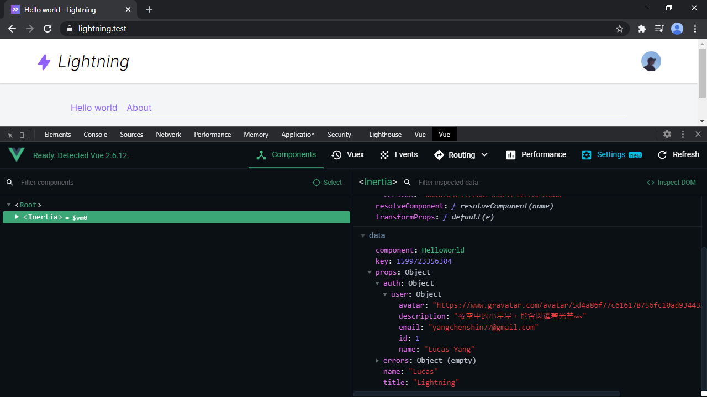

# Day 10 Inertia.js 和 Presenter - Flexible Presenter

有做過 API 應該都知道，要有 Presenter 層管資料呈現。Laravel 其實已經內建有 [Resource](https://laravel.com/docs/eloquent-resources) 了。不過有個更適合 (我認為) Inertia.js 的 Presenter 套件 - [Flexible Presenter](https://github.com/AdditionApps/flexible-presenter)，本系列會用它來做 Eloquent 的資料轉換，管理前端可以接收的資料。

## 安裝

```bash
composer require additionapps/flexible-presenter
```

## 定義 Presenter

先新增一個 `UserPresenter`：

```bash
php artisan make:presenter UserPresenter
```

然後定義以下欄位，前端就只能使用以下資料，無關的其他欄位不會出現：

*app/Presenters/UserPresenter.php*
```php
class UserPresenter extends FlexiblePresenter
{
    public function values(): array
    {
        return [
            'id' => $this->id,
            'name' => $this->name,
            'email' => $this->email,
            'description' => $this->description,
            'avatar' => $this->avatar,
        ];
    }
}
```

## 套用 Presenter

如果是單個 Model 可以用 `UserPresenter::make()`，集合 (Collection) 則用 `UserPresenter::collection()`，分頁也可以丟進去：

```php
use App\Presenters\UserPresenter;

// Model
UserPresenter::make(User::first())->get();

// 集合 (Collection)
UserPresenter::collection(User::all())->get();

// 分頁集合 (Paginator)
UserPresenter::collection(User::paginate())->get();
```

然後就可以套用在要輸出 `user` 的地方：

*app/Providers/AppServiceProvider.php*
```php
use App\Presenters\UserPresenter;

protected function registerInertia()
{
    Inertia::share([
        ...
        'auth' => fn() => [
            'user' => UserPresenter::make(Auth::user())->get(),
        ],
    ]);
}
```

打開 Vue 的 DevTools 看看，只有上面指定的那幾個欄位出現，沒有定義的 `created_at` 等不會出現：



## 總結

Presenter 是前後端溝通的樞紐，資料的轉換層，不可忽視。之後會用到一些 Flexible Presenter 的進階功能，敬請期待～～下一篇要做註冊用戶啦！

> Lightning 範例程式碼：https://github.com/ycs77/lightning

## 參考資料

* [Flexible Presenter](https://github.com/AdditionApps/flexible-presenter)
