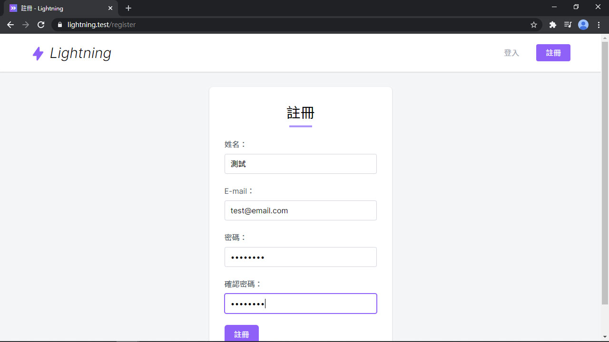

# Day 11 Lightning 用戶註冊

## 註冊頁面

跟登入一樣，到 `RegisterController` 中替換掉註冊頁面：

*app/Http/Controllers/Auth/RegisterController.php*
```php
use Inertia\Inertia;

public function showRegistrationForm()
{
    return Inertia::render('Auth/Register');
}
```

還有用 `Login.vue` 修改過的 `Register.vue`：

*resources/js/Pages/Auth/Register.vue*
```vue
<template>
  <div class="py-6 md:py-8">
    <form @submit.prevent="submit" class="card max-w-sm p-6 md:p-8 mx-auto">
      <h1 class="text-3xl text-center">註冊</h1>
      <div class="w-12 mt-1 mx-auto border-b-4 border-purple-400"></div>

      <div class="grid gap-6 mt-6">
        <text-input v-model="form.name" :error="$page.errors.name" label="姓名" autocomplete="name" ref="nameInput" />
        <text-input v-model="form.email" :error="$page.errors.email" label="E-mail" autocomplete="email" />
        <text-input v-model="form.password" :error="$page.errors.password" type="password" label="密碼" />
        <text-input v-model="form.password_confirmation" type="password" label="確認密碼" />
        <div>
          <loading-button :loading="loading" class="btn btn-purple">註冊</loading-button>
        </div>
      </div>
    </form>
  </div>
</template>

<script>
import AppLayout from '@/Layouts/AppLayout'
import TextInput from '@/Components/TextInput'
import LoadingButton from '@/Components/LoadingButton'

export default {
  layout: AppLayout,
  metaInfo: {
    title: '註冊'
  },
  components: {
    TextInput,
    LoadingButton
  },
  data() {
    return {
      form: {
        name: '',
        email: '',
        password: '',
        password_confirmation: ''
      },
      loading: false
    }
  },
  methods: {
    submit() {
      this.loading = true
      this.$inertia.post('/register', this.form).then(() => this.loading = false)
    }
  },
  mounted() {
    this.$refs.nameInput.focus()
  }
}
</script>
```



ㄝ...沒了？對，就這樣。

## 總結

前面已經先做好了相關工作，後端邏輯 & 路由由 Laravel UI 提供、頂部導覽列的「註冊」按鈕也有、需要的組件都跟登入頁面一樣，註冊才可以這麼簡單。下回要實作編輯個人資料 & 刪除帳號，跟註冊不同是，還有個人簡介跟用戶頭像，排版。

> Lightning 範例程式碼：https://github.com/ycs77/lightning
