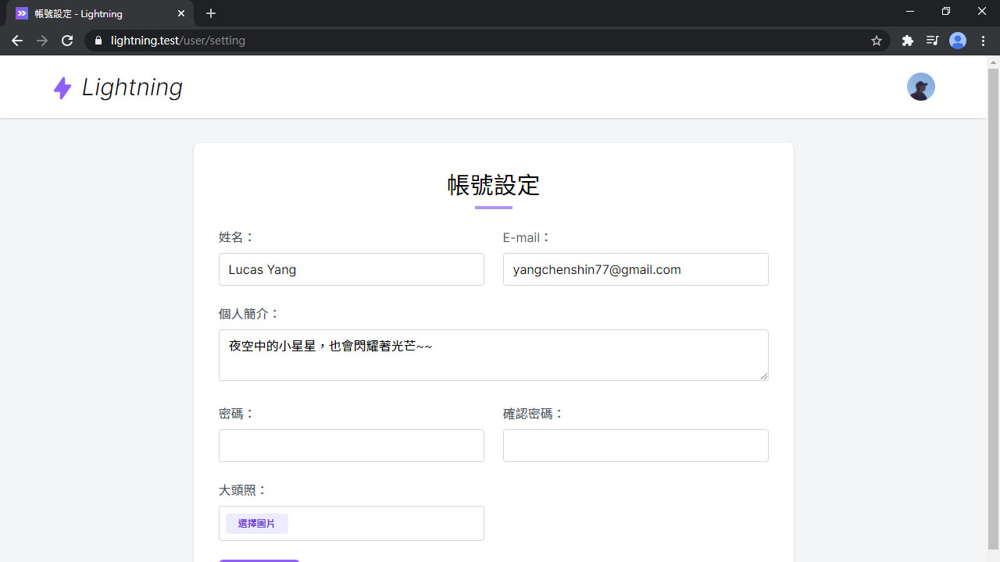
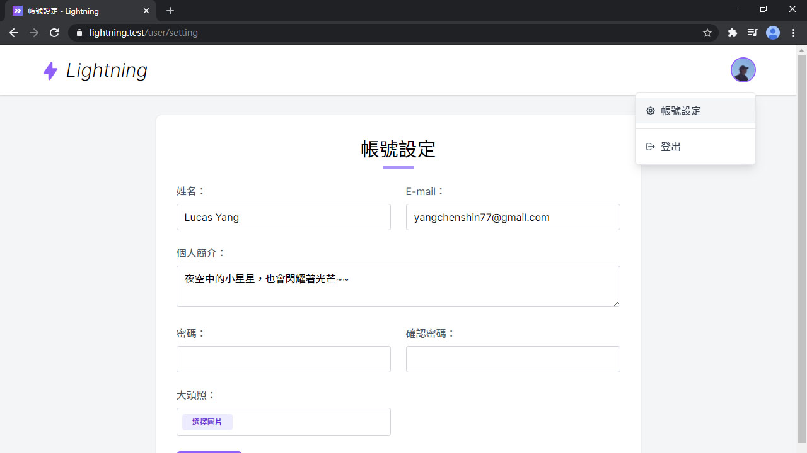
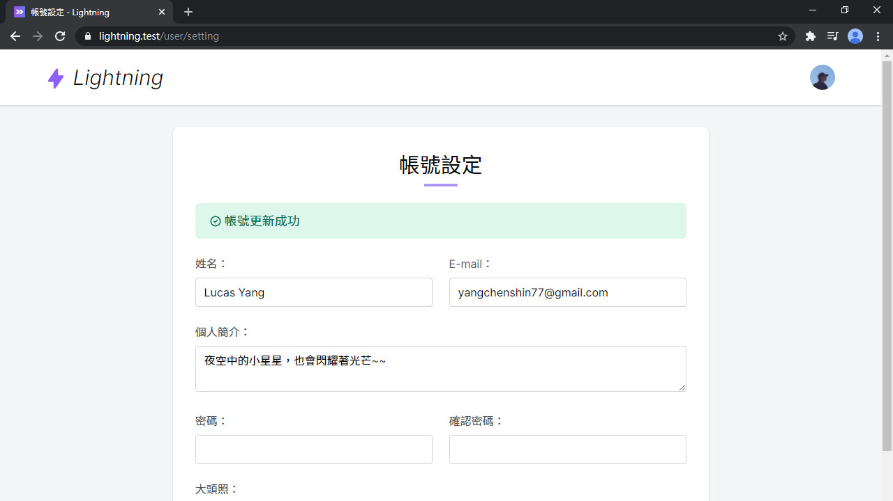

# Day 12 Lightning 編輯個人資料

註冊完帳號後，本篇要來更新資料和上傳大頭照。

## 路由

首先先開2個路由，顯示頁面和更新用戶：

*routes/web.php*
```php
// User
Route::get('user/setting', 'User\UserController@edit');
Route::put('user', 'User\UserController@update');
```

## 帳號設定頁面

再來新增 Controller：

```bash
php artisan make:controller User/UserController
```

為了方便在 Controller 裡呼叫 已登入用戶，到 `Controller` 增加一個 `user()`：

*app/Http/Controllers/Controller.php*
```php
use App\User;
use Illuminate\Support\Facades\Auth;

protected function user(): ?User
{
    return Auth::user();
}
```

輸出編輯用戶的頁面，還有這些都是已登入用戶才能操作的路由，在 `__construct()` 裡加一個 `auth` Middleware：

*app/Http/Controllers/User/UserController.php*
```php
use App\Presenters\UserPresenter;

public function __construct()
{
    $this->middleware('auth');
}

public function edit()
{
    return Inertia::render('User/Edit', [
        'user' => UserPresenter::make($this->user())->get(),
    ]);
}
```

還有頁面：

*resources/js/Pages/User/Edit.vue*
```vue
<template>
  <div class="py-6 md:py-8">
    <form @submit.prevent="submit" class="card card-main">
      <h1 class="text-3xl font-semibold text-center">帳號設定</h1>
      <div class="w-12 mt-1 mx-auto border-b-4 border-purple-400"></div>

      <div class="grid gap-6 mt-6 md:grid-cols-2">
        <text-input v-model="form.name" :error="$page.errors.name" label="姓名" autocomplete="name" />
        <text-input v-model="form.email" :error="$page.errors.email" label="E-mail" autocomplete="email" />
        <textarea-input v-model="form.description" :error="$page.errors.description" class="md:col-span-2" label="個人簡介" />
        <text-input v-model="form.password" :error="$page.errors.password" type="password" label="密碼" />
        <text-input v-model="form.password_confirmation" type="password" label="確認密碼" />
        <file-input v-model="form.avatar" :error="$page.errors.avatar" type="file" accept="image/*" label="大頭照" browseText="選擇圖片" />
        <div class="md:col-span-2">
          <loading-button :loading="loading" class="btn btn-purple">更新帳號</loading-button>
        </div>
      </div>
    </form>
  </div>
</template>

<script>
import AppLayout from '@/Layouts/AppLayout'
import TextInput from '@/Components/TextInput'
import TextareaInput from '@/Components/TextareaInput'
import FileInput from '@/Components/FileInput'
import LoadingButton from '@/Components/LoadingButton'

export default {
  layout: AppLayout,
  metaInfo: {
    title: '帳號設定'
  },
  components: {
    TextInput,
    TextareaInput,
    FileInput,
    LoadingButton
  },
  props: {
    user: Object
  },
  data() {
    return {
      form: {
        name: this.user.name,
        email: this.user.email,
        description: this.user.description,
        password: '',
        password_confirmation: '',
        avatar: null
      },
      loading: false
    }
  },
  methods: {
    submit() {
      this.loading = true

      const data = new FormData()
      for (const key in this.form) {
        data.append(key, this.form[key] || '')
      }
      data.append('_method', 'put')

      this.$inertia.post('/user', data).then(() => {
        this.loading = false
        if (! Object.keys(this.$page.errors).length) {
          this.form.password = ''
          this.form.password_confirmation = ''
          this.form.avatar = null
        }
      })
    }
  }
}
</script>
```

這次多了 `TextareaInput` 和 `FileInput`，為了不佔版面，可以直接去我的 Lightning [GitHub 倉庫的 Components](https://github.com/ycs77/lightning/tree/master/resources/js/Components) 裡拿。

再來要注意的是，雖然 Inertia 可以直接呼叫 `this.$inertia.put()`，但這裡有用 `FormData` 傳大頭照過去，不能用 `put` 方法傳送。只能跟 Laravel 一樣，要用 `post` 加 `_method=put`。

還有這次用到的 CSS。`@screen` 是設定斷點，算是 `@media ...` 的 Tailwind CSS 縮寫：

*resources/css/components.css*
```css
/* Card */
...
.card-main {
  @apply max-w-screen-md p-6 mx-auto;
  @screen md {
    @apply p-8;
  }
}
```

*resources/css/button.css*
```css
/* Card */
...
.btn-purple-light {
  @apply bg-purple-100 text-purple-700;
  &:hover {
    @apply bg-purple-200;
  }
}

.btn-red {
  @apply bg-red-500 text-white;
  &:hover {
    @apply bg-red-700;
  }
  &:disabled {
    @apply bg-red-300 !important;
  }
}
.btn-red-light {
  @apply bg-red-100 text-red-700;
  &:hover {
    @apply bg-red-200;
  }
}
```

然後瀏覽 `/user/setting`：



最後在右上選單裡增加連結：

*resources/js/Layouts/AppLayout.vue*
```html
<template #menu="{ close }">
  <dropdown-item href="/user/setting" icon="heroicons-outline:cog" @click="close">
    帳號設定
  </dropdown-item>
  <hr class="border-gray-200 my-2">
  ...
</template>
```



## 更新資料

表單頁面好了之後，再來是處裡後端表單驗證和儲存資料的部分。新增一個 UpdateUserRequest，把驗證表單的規則都寫在裡面：

```bash
php artisan make:request UpdateUserRequest
```

預設的 `authorize()` 不會用到，直接刪掉沒關係。然後在 `rules()` 裡寫驗證規則：

*app/Http/Requests/UpdateUserRequest.php*
```php
use Illuminate\Validation\Rule;

public function rules()
{
    return [
        'name' => 'required|string|max:255',
        'email' => [
            'required', 'string', 'email', 'max:255',
            Rule::unique('users')->ignore($this->user()->id),
        ],
        'description' => 'nullable|string|max:100',
        'password' => 'nullable|string|min:8|confirmed',
        'avatar' => 'nullable|image|max:5120',
    ];
}
```

把 `password` 和 `avatar` 增加 `nullable` 是因為希望有輸入(上傳)才更新，否則為 `null`。但如果直接設 `null` 進資料庫會有問題，還要在 UpdateUserRequest 裡增加 `validationData()`，調整已驗證的輸入資料：

*app/Http/Requests/UpdateUserRequest.php*
```php
public function validationData()
{
    $data = parent::validationData();

    if (! $data['password']) {
        unset($data['password']);
    }

    if (! $data['avatar']) {
        unset($data['avatar']);
    }

    return $data;
}
```

然後把 Hash 密碼和儲存上傳圖片的動作放在 User Model 裡：

*app/User.php*
```php
use Illuminate\Http\UploadedFile;
use Illuminate\Support\Facades\Hash;
use Illuminate\Support\Facades\Storage;

public function setPasswordAttribute($value)
{
    $this->attributes['password'] = Hash::needsRehash($value) ? Hash::make($value) : $value;
}

public function setAvatarAttribute($avatar)
{
    $this->attributes['avatar'] = $avatar instanceof UploadedFile
        ? Storage::url($avatar->store('avatars'))
        : $avatar;
}
```

回到 UserController 更新用戶資料。除了可以回傳 **Inertia 響應** 也可以重新導向。更新後還要返回表單頁 (上一頁)，只要使用 `back()` 即可：

*app/Http/Controllers/User/UserController.php*
```php
use App\Http\Requests\UpdateUserRequest;

public function update(UpdateUserRequest $request)
{
    $this->user()->update($request->validated());

    return back();
}
```

現在可以去修改看看用戶資料囉！但更新後沒有任何回應訊息，有點沒安全感。這裡可以用 Flash Session 功能 (只會出現一次的 Session)，在 redirect 物件後串上 `with()`：

*app/Http/Controllers/User/UserController.php*
```php
public function update(UpdateUserRequest $request)
{
    ...
    return back()->with('success', '帳號更新成功');
}
```

然後新增成功/錯誤訊息的共享資料：

*app/Providers/AppServiceProvider.php*
```php
protected function registerInertia()
{
    Inertia::share([
        ...
        'flash' => fn () => [
            'success' => session('success'),
            'error' => session('error'),
        ],
    ]);
}
```

新增一個 `Alert` 組件，這就是提示訊息用的組件：

*resources/js/Components/Alert.vue*
```vue
<template>
  <div v-if="type === 'success'" class="alert alert-success">
    <icon class="mr-1" icon="heroicons-outline:check-circle" />
    <slot />
  </div>
  <div v-else-if="type === 'error'" class="alert alert-error">
    <icon class="mr-1" icon="heroicons-outline:x-circle" />
    <slot />
  </div>
</template>

<script>
export default {
  props: {
    type: {
      type: String,
      default: 'success'
    }
  }
}
</script>
```

*resources/css/components.css*
```css
/* Alert */
.alert {
  @apply flex items-center px-5 py-3 text-lg rounded-md;
}
.alert-success {
  @apply bg-green-100 text-green-700;
}
.alert-error {
  @apply bg-red-100 text-red-700;
}
```

引入 `Alert` 組件，成功訊息可以在 `$page.flash.success` 讀取：

*resources/js/Pages/User/Edit.vue*
```vue
<template>
  <div class="py-6 md:py-8">
    <form @submit.prevent="submit" class="card card-main">
      <h1 class="text-3xl font-semibold text-center">帳號設定</h1>
      <div class="w-12 mt-1 mx-auto border-b-4 border-purple-400"></div>

      <alert v-if="$page.flash.success" class="mt-6">{{ $page.flash.success }}</alert>
      ...
    </form>
    ...
  </div>
</template>

<script>
import Alert from '@/Components/Alert'

export default {
  components: {
    Alert,
    ...
  }
}
</script>
```



## 總結

雖然我本來想要加上刪除帳號的篇章，但無奈...實在是太長了，只能移到下次。下篇是刪除帳號和用戶頁面，用戶功能的最後一篇。

> Lightning 範例程式碼：https://github.com/ycs77/lightning
