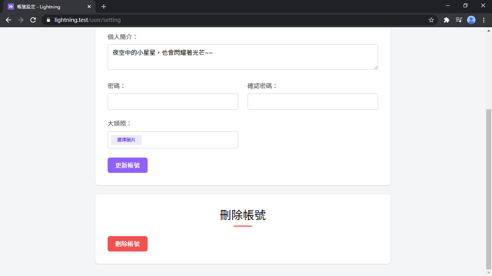
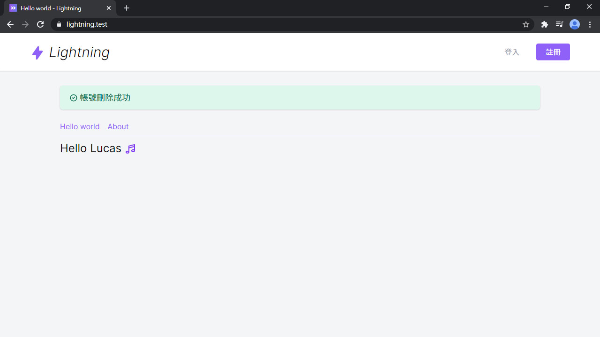
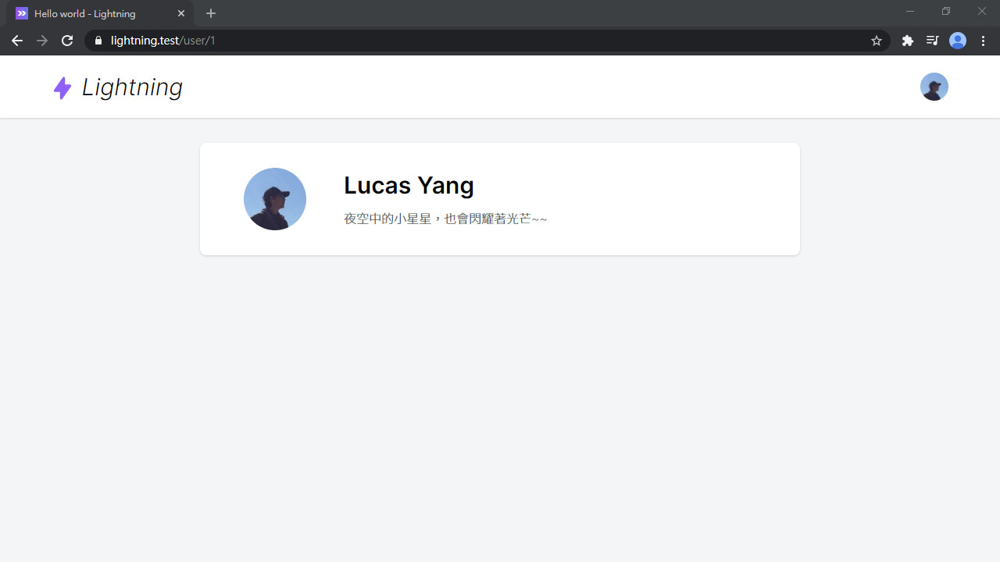

# Day 13 Lightning 刪除帳號 & 用戶頁面

接續上篇，做刪除帳號和用戶頁面，一口氣完成用戶的功能！

## 刪除帳號

新增刪除帳號的路由：

*routes/web.php*
```php
// User
...
Route::delete('user', 'User\UserController@destroy');
```

和刪除帳號的操作：

*app/Http/Controllers/User/UserController.php*
```php
use Illuminate\Support\Facades\Auth;

public function destroy()
{
    $user = $this->user();
    Auth::logout();
    $user->delete();

    return redirect('/')->with('success', '帳號刪除成功');
}
```

還有刪除的按鈕：

*resources/js/Pages/User/Edit.vue*
```vue
<template>
  <div class="py-6 md:py-8">
    ...
    <form @submit.prevent="destroy" class="card card-main mt-6">
      <h1 class="text-3xl font-semibold text-center">刪除帳號</h1>
      <div class="w-12 mt-1 mx-auto border-b-4 border-red-400"></div>

      <div class="grid gap-6 mt-6 md:grid-cols-2">
        <div class="md:col-span-2">
          <loading-button :loading="destroyLoading" class="btn btn-red">刪除帳號</loading-button>
        </div>
      </div>
    </form>
  </div>
</template>

<script>
export default {
  data() {
    return {
      ...
      destroyLoading: false
    }
  },
  methods: {
    ...
    destroy() {
      if (confirm('確定要刪除當前帳號? 所有文章將會被刪除，且此操作不可恢復!')) {
        this.destroyLoading = true
        this.$inertia.delete('/user').then(() => this.destroyLoading = false)
      }
    }
  }
}
</script>
```

在首頁掛上刪除成功的訊息：

*resources/js/Pages/HelloWorld.vue*
```vue
<template>
  <div class="container py-8">
    <alert v-if="$page.flash.success" class="mb-4">{{ $page.flash.success }}</alert>
    ...
  </div>
</template>

<script>
import Alert from '@/Components/Alert'

export default {
  components: {
    Alert
  }
}
</script>
```





雖然刪除了帳號，不過只要呼叫 `db:seed` 復活帳號，又可以繼續登入囉：

```bash
php artisan db:seed --class=UserSeeder
```

## 用戶頁面

再來是用戶頁面的路由：

*routes/web.php*
```php
// User
...
Route::get('user/{user}', 'User\ProfileController@index');
```

每個用戶都會有不同的網址，我們來新增一個 `ProfileController` 管用戶頁面：

```bash
php artisan make:controller User/ProfileController
```

`ProfileController` 內容：

*app/Http/Controllers/User/ProfileController.php*
```php
use App\Presenters\UserPresenter;
use App\User;
use Inertia\Inertia;

public function index(User $user)
{
    return Inertia::render('User/Profile', [
        'user' => UserPresenter::make($user)->get(),
    ]);
}
```

用戶頁面本體：

*resources/js/Pages/User/Profile.vue*
```vue
<template>
  <div class="py-6 md:py-8">
    <div class="card card-main">
      <div class="md:flex">
        <div class="md:w-32">
          
        </div>
        <div class="mt-4 md:mt-0 md:ml-6 text-center md:text-left">
          <h1 class="text-3xl font-semibold">{{ user.name }}</h1>
          <div v-if="user.description" class="mt-2 text-gray-600 font-light">{{ user.description }}</div>
        </div>
      </div>
    </div>
  </div>
</template>

<script>
import AppLayout from '@/Layouts/AppLayout'

export default {
  layout: AppLayout,
  metaInfo() {
    return {
      title: `用戶 ${user.name}`
    }
  },
  props: {
    user: Object
  }
}
</script>
```

最後在右上選單裡增加我的主頁連結：

*resources/js/Layouts/AppLayout.vue*
```vue
<template #menu="{ close }">
  <dropdown-item :href="`/user/${user.id}`" icon="heroicons-outline:home" @click="close">
    我的主頁
  </dropdown-item>
  ...
</template>
```

然後進去就可以看到帳號頁面。看起來有點空，之後下面會放文章列表：



## 總結

用戶的部分告一段落，該有的登入/註冊/編輯個人資料/刪除帳號都有了。從下篇起將會開始做 Lightning 的核心功能，文章功能即將登場！

> Lightning 範例程式碼：https://github.com/ycs77/lightning
