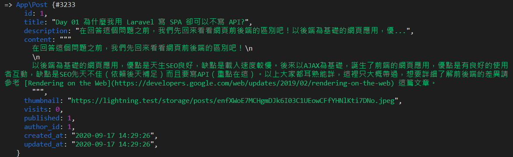

# Day 15 Lightning 新增文章

## 撰寫文章頁面

在上篇中，新增 Model 附贈了 Resource Controller，這裡也要新增 Resource 路由：

*routes/web.php*
```php
// Posts
Route::resource('posts', 'Post\PostController');
```

還有把 `PostController.php` 搬移到 `Post` 資料夾下，`namespace` 也要更新。然後還有最重要的撰寫文章頁面，這個表單頁面會和修改文章共用，所以要塞一個空的 Post Model 進去：

*app/Http/Controllers/Post/PostController.php*
```php
<?php

namespace App\Http\Controllers\Post;

use App\Http\Controllers\Controller;
use App\Post;
use App\Presenters\PostPresenter;
use Illuminate\Http\Request;
use Inertia\Inertia;

class PostController extends Controller
{
    public function __construct()
    {
        $this->middleware('auth');
    }
    ...
    public function create()
    {
        return Inertia::render('Post/Form', [
            'post' => PostPresenter::make(Post::make())->get(),
        ]);
    }
    ...
}
```

內容的輸入框先放單純的文字輸入框，之後會改成 Markdown 編輯器：

*resources/js/Pages/Post/Form.vue*
```vue
<template>
  <div class="py-6 md:py-8">
    <form @submit.prevent="submit" class="card card-main">
      <h1 class="text-3xl text-center">{{ pageTitle }}</h1>
      <div class="w-12 mt-1 mx-auto border-b-4 border-purple-400"></div>

      <div class="grid gap-6 mt-6">
        <text-input v-model="form.title" :error="$page.errors.title" label="標題" ref="titleInput" autocomplete="off" />
        <textarea-input v-model="form.content" :error="$page.errors.content" label="內容" />
        <file-input v-model="form.thumbnail" :error="$page.errors.thumbnail" type="file" accept="image/*" label="分享預覽圖片" browseText="選擇圖片" />
        
        <div class="font-light mb-4">
          <label>
            <input type="checkbox" class="form-checkbox" v-model="form.published"> 發布文章
          </label>
        </div>
        <div class="flex items-center space-x-4">
          <loading-button :loading="loading" class="btn btn-purple">{{ btnText }}</loading-button>
        </div>
      </div>
    </form>
  </div>
</template>

<script>
import AppLayout from '@/Layouts/AppLayout'
import TextInput from '@/Components/TextInput'
import TextareaInput from '@/Components/TextareaInput'
import FileInput from '@/Components/FileInput'
import LoadingButton from '@/Components/LoadingButton'

export default {
  layout: AppLayout,
  metaInfo() {
    return {
      title: this.pageTitle
    }
  },
  components: {
    TextInput,
    TextareaInput,
    FileInput,
    LoadingButton
  },
  props: {
    post: Object
  },
  data() {
    return {
      form: {
        title: this.post.title,
        content: this.post.content,
        thumbnail: null,
        published: this.post.published
      },
      loading: false
    }
  },
  computed: {
    pageTitle() {
      return '撰寫文章'
    },
    btnText() {
      return '儲存文章'
    }
  },
  methods: {
    submit() {
      this.loading = true

      const data = new FormData()
      for (const key in this.form) {
        data.append(key, this.form[key] || '')
      }

      return this.$inertia.post('/posts', data).then(() => {
        this.loading = false
        if (! Object.keys(this.$page.errors).length) {
          this.form.thumbnail = null
        }
      })
    }
  },
  mounted() {
    this.$refs.titleInput.focus()
  }
}
</script>
```

和右上選單增加撰寫文章連結：

*resources/js/Layouts/AppLayout.vue*
```html
<template #menu="{ close }">
  <dropdown-item :href="`/user/${user.id}`" icon="heroicons-outline:home" @click="close">
    我的主頁
  </dropdown-item>
  <dropdown-item href="/posts/create" icon="heroicons-outline:pencil" @click="close">
    撰寫文章
  </dropdown-item>
  ...
</template>
```

現在可以瀏覽 `/posts/create` 了，這時他會報 `"Call to a member function format() on null"` 錯誤。上面我們塞了一個空的 Post Model 進去，PostPresenter 裡又讓 `created_at` (這時是 `null`) 呼叫 `format()`，當然會有問題，解決方法是套一個 `optional()` (Laravel 的眾多輔助函數之一)，確保該物件是 `null` 時也不會報錯：

*app/Presenters/PostPresenter.php*
```php
public function values(): array
{
    return [
        ...
        'created_at' => optional($this->created_at)->format('Y-m-d H:i:s'),
        'created_ago' => optional($this->created_at)->diffForHumans(),
        ...
    ];
}
```

然後就正常了：


## 緩存資料

假設你輸入到一半，在當前分頁瀏覽別的頁面，突然想到又點瀏覽器的回上一頁回來，很遺憾，輸入的資料都不見了。這時要介紹一個 Inertia.js 的緩存資料功能。用 `remember` 指定要緩存的 key，Inertia.js 會自動將該資料儲存到瀏覽器的歷史紀錄中：

```js
export default {
  ...
  remember: 'form',
  data() {
  ...
}
```

這時在表單隨便打上幾個字，去別的網站，然後再回上一頁，輸入的資料依然還在。

## 更新文章

PostRequest 也是新增/修改共用：

```bash
php artisan make:request PostRequest
```

*app/Http/Requests/PostRequest.php*
```php
public function rules()
{
    return [
        'title' => 'required|max:80',
        'content' => 'required',
        'thumbnail' => 'nullable|image|max:5120',
        'published' => 'boolean',
    ];
}
```

`thumbnail` 分享的預覽圖片也是可選的，也要在 `validationData()` 裡調整。前面傳資料是用 FormData，`published` 的型別是文字，要轉換成 Boolean 型別：

*app/Http/Requests/PostRequest.php*
```php
public function validationData()
{
    $data = parent::validationData();

    $data['published'] = $data['published'] === 'true';

    if (! $data['thumbnail']) {
        unset($data['thumbnail']);
    }

    return $data;
}
```

還要讓 Post Model 自動儲存圖片：

*app/Post.php*
```php
use Illuminate\Http\UploadedFile;
use Illuminate\Support\Facades\Storage;

public function setThumbnailAttribute($thumbnail)
{
    $this->attributes['thumbnail'] = $thumbnail instanceof UploadedFile
        ? Storage::url($thumbnail->store('posts'))
        : $thumbnail;
}
```

最後就可以新增文章：

*app/Http/Controllers/Post/PostController.php*
```php
public function store(PostRequest $request)
{
    $post = $this->user()
        ->posts()
        ->create($request->validated());

    return redirect("/posts/{$post->id}")->with('success', '文章新增成功');
}
```


啊！空的？對，現在是空的。因為文章的頁面還沒有任何東西，如果回傳的頁面沒有 `X-Inertia: true`，他就會塞到彈出視窗裡。頁面會在下篇做，現在可以用 Tinker 確認剛才有新增成功：

```bash
php artisan tinker
>>> App\Post::first()
```



## 總結

一個簡易的新增文章頁面出來了。下篇要做文章的頁面，繼續加油吧！

> Lightning 範例程式碼：https://github.com/ycs77/lightning

## 參考資料

* [Local state caching - Inertia.js](https://inertiajs.com/local-state-caching)
