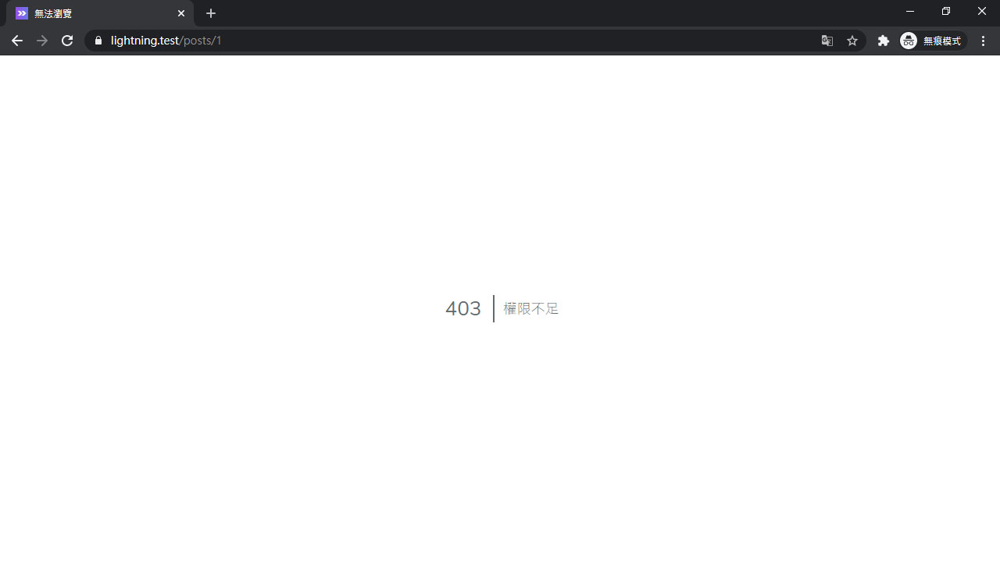
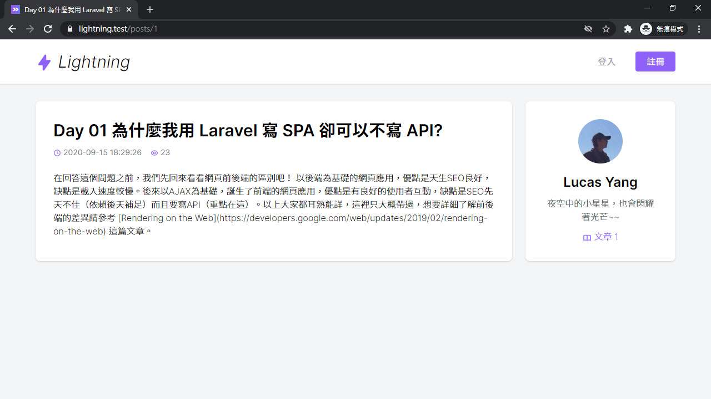
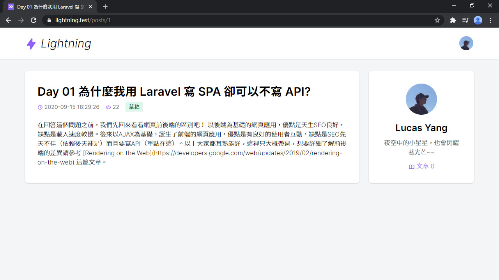

# Day 16 Lightning 文章頁面

再來要來做 Lightning 的文章頁面了，上篇新增的文章終於可以看到了。

## 文章頁面

文章頁面比較複雜一點點，我們把它抽出一個單獨的 Controller ShowPost。新增路由和排除 Resource 裡的 `show` 路由：

*routes/web.php*
```php
Route::resource('posts', 'Post\PostController')->except('show');
Route::get('posts/{post}', 'Post\ShowPost');
```

新增這個 Controller，加上 `-i` 會幫你新增一個 `__invoke()` 方法，這就是 [Single Action Controller](https://laravel.com/docs/8.x/controllers#single-action-controllers)：

```bash
php artisan make:controller Post/ShowPost -i
```

Post 裡有個紀錄瀏覽次數的欄位 `visits`，每次瀏覽都會使用 `increment()` 自動加1：

*app/Http/Controllers/Post/ShowPost.php*
```php
public function __invoke(Post $post)
{
    $post->increment('visits');

    return Inertia::render('Post/Show', [
        'post' => PostPresenter::make($post)->get(),
    ]);
}
```

可是 PostPresenter 裡的欄位沒有文章內容 `content` 和文章作者欄位，這裡要介紹一個 Flexible Presenter 的功能 `preset()`，例如在 `PostPresenter` 定義一個 `presetShow()` 方法，在呼叫處就可以用 `->preset('show')` 呼叫此方法，串接自訂的 preset：

*app/Http/Controllers/Post/ShowPost.php*
```php
PostPresenter::make($post)
    ->preset('show')
    ->get()
```

而這個自訂的 preset 可以做些什麼呢？可以串 `only()`、`except()` 或 `with()`，前兩個就是指定欄位和排除欄位，不過現在要用的是 `with()`。`with()` 可以增加自訂欄位，接收一個閉包函數，函數的參數是在 `Presenter::make()` 丟進去的 Model (Post)。

然後我們就可以增加缺失的 `content` (文章內容) & `author` (文章作者)，作者即關聯的 User Model，同樣可以套 UserPresenter：

*app/Presenters/PostPresenter.php*
```php
public function presetShow()
{
    return $this->with(fn (Post $post) => [
        'content' => $post->content,
        'author' => fn () => UserPresenter::make($post->author)
            ->preset('withCount')
            ->get(),
    ]);
}
```

這裡的 UserPresenter 也套用了 preset，同樣也要定義 `presetWithCount()`，`postsCount` 欄位是作者全部文章的數量：

*app/Presenters/UserPresenter.php*
```php
public function presetWithCount()
{
    return $this->with(fn (User $user) => [
        'postsCount' => $user->posts()->count(),
    ]);
}
```

然後前端文章頁面：

> 這裡說一下文字太長會破版的坑，通常有些英文單字太長時，可以使用 `overflow-wrap: break-word` (Tailwind CSS 對應 `.break-words`) 來強制段行。但這裡做完之後，開手機板的寬度還是破版，因為這裡用 Grid 排版，踩到了 Grid 的坑 (Flex 也會遇到此問題)，解決方案之一是在 Grid 的元素的子元素，加上 `min-width: 0` (Tailwind CSS 對應 `.min-w-0`)。參考：[Preventing a Grid Blowout](https://css-tricks.com/preventing-a-grid-blowout/)。

*resources/js/Pages/Post/Show.vue*
```vue
<template>
  <div class="py-6 md:py-8">
    <alert v-if="$page.flash.success" class="shadow mb-6">{{ $page.flash.success }}</alert>

    <div class="grid gap-6 xl:grid-cols-4">
      <div class="card p-6 md:p-8 min-w-0 xl:col-span-3">
        <h1 class="text-3xl font-semibold leading-snug">{{ post.title }}</h1>
        <div class="flex space-x-4 mt-2 text-sm">
          <div>
            <icon class="text-purple-500" icon="heroicons-outline:clock" />
            <span class="text-gray-500">{{ post.created_at }}</span>
          </div>
          <div>
            <icon class="text-purple-500" icon="heroicons-outline:eye" />
            <span class="text-gray-500">{{ post.visits }}</span>
          </div>
        </div>

        <div class="mt-6 font-light break-words">{{ post.content }}</div>
      </div>

      <div>
        <div class="card p-6 md:p-8 sticky top-8">
          <inertia-link :href="`/user/${post.author.id}`">
            
          </inertia-link>
          <div class="mt-4 text-center">
            <div class="text-2xl font-semibold">
              <inertia-link :href="`/user/${post.author.id}`" class="hover:text-purple-500">
                {{ post.author.name }}
              </inertia-link>
            </div>
            <div v-if="post.author.description" class="mt-2 text-gray-600 font-light">
              {{ post.author.description }}
            </div>
            <div class="flex justify-center items-center space-x-6 mt-3">
              <inertia-link :href="`/user/${post.author.id}`" class="link font-light">
                <icon icon="heroicons-outline:book-open" />
                文章 {{ post.author.postsCount }}
              </inertia-link>
            </div>
          </div>
        </div>
      </div>
    </div>
  </div>
</template>

<script>
import AppLayout from '@/Layouts/AppLayout'
import Alert from '@/Components/Alert'

export default {
  layout: AppLayout,
  metaInfo() {
    this.addMeta('description', this.post.description)
    this.addMetaWithProperty('og:type', 'website')
    this.addMetaWithProperty('og:title', this.post.title)
    this.addMetaWithProperty('og:description', this.post.description)
    this.addMetaWithProperty('og:image', this.post.thumbnail)
    this.addMetaWithProperty('og:url', location.href)
    this.addMeta('twitter:title', this.post.title)
    this.addMeta('twitter:description', this.post.description)
    this.addMeta('twitter:url', location.href)
    this.addMeta('twitter:card', 'summary_large_image')
    this.addMeta('twitter:image', this.post.thumbnail)

    return {
      title: this.post.title,
      meta: this.meta
    }
  },
  components: {
    Alert
  },
  props: {
    post: Object
  },
  data() {
    return {
      meta: []
    }
  },
  methods: {
    addMeta(name, content) {
      if (content) this.meta.push({ name, content })
    },
    addMetaWithProperty(property, content) {
      if (content) this.meta.push({ property, content })
    }
  }
}
</script>
```

開 `/posts/1` 就可以看到新增的第1篇文章了：


文章要分享，SEO 自然不能少，Meta 交給 Vue Meta 了。可是 Vue Meta 只會在前端渲染啊！沒關係，之後會解決。

## 文章頁面顯示授權 - Policy

文章還有個欄位叫 `published` (發布)，可以讓文章作者決定要不要發布文章，如果未發布(草稿)時，除了作者的其他人就不能看該文章。所以現在要來新增 PostPolicy：

```bash
php artisan make:policy PostPolicy --model=Post
```

`view()` 方法就是管顯示單個資源的授權，為了兼容未登入要用 `?User` 標示為可選，`$user` 也要包 `optional()`。若此用戶有登入且為作者，就可以正常瀏覽，不管是不是草稿。若不是就只能瀏覽已發布的文章：

*app/Policies/PostPolicy.php*
```php
public function view(?User $user, Post $post)
{
    return optional($user)->id === $post->author_id
        ? true
        : $post->published === true;
}
```

還有在 ShowPost Controller 裡增加 `authorize()` 來驗證用戶：

*app/Http/Controllers/Post/ShowPost.php*
```php
public function __invoke(Post $post)
{
    $this->authorize('view', $post);
    ...
}
```

## 文章發布狀態

剛才的文章數量是直接拿作者所有文章的數量，包括草稿，但草稿數不需要讓其他用戶知道，所以要改一下：

*app/Presenters/UserPresenter.php*
```php
public function presetWithCount()
{
    return $this->with(fn (User $user) => [
        'postsCount' => $user->publishedPosts()->count(),
    ]);
}
```

阿這 `publishedPosts()` 是不存在的ㄝ，要去 User Model 裡增加：

*app/User.php*
```php
/**
 * @return \Illuminate\Database\Eloquent\Relations\HasMany
 */
public function publishedPosts()
{
    return $this->posts()->published();
}
```

這 `published()` 也不存在，去 Post Model 定義 `scope`，在組 Query Builder 時就可以呼叫，順帶連 `unpublished()` 也一起加上：

*app/Post.php*
```php
public function scopePublished($query)
{
    return $query->where('published', true);
}

public function scopeUnpublished($query)
{
    return $query->where('published', false);
}
```

然後開 Tinker 把文章設定成未發布：

```bash
php artisan tinker
>>> App\Post::find(1)->update(['published' => false])
```

用無痕模式開 `/posts/1` 看看：



嗯！正常。改成發布狀態：

```bash
>>> App\Post::find(1)->update(['published' => true])
```

再用無痕模式打開：



現在我們就可以在頁面裡增加一個草稿的標示，讓作者知道這篇文章尚未發布：

*resources/js/Pages/Post/Show.vue*
```html
<h1 class="text-3xl font-semibold leading-snug">{{ post.title }}</h1>
<div class="flex space-x-4 mt-2 text-sm">
  ...
  <div v-if="!post.published">
    <span class="px-2 py-1 bg-green-100 text-green-700">草稿</span>
  </div>
</div>
```



完成。

## 優化瀏覽人次

本篇最後要講的是優化瀏覽人次，現在如果你一直重新整理頁面，瀏覽次數就會一直飆升，但瀏覽次數就容易被灌水。這裡我們可以增加一些條件。需要是非作者的其他讀者，且沒有瀏覽過的 Session 紀錄，才會增加瀏覽次數：

```php
public function __invoke(Post $post)
{
    ...
    $this->incrementVisit($post);
    ...
}

protected function incrementVisit(Post $post)
{
    if (! optional($this->user())->can('view', $post) &&
        ! session("posts:visits:{$post->id}")
    ) {
        $post->increment('visits');
        session()->put("posts:visits:{$post->id}", true);
    }
}
```

現在重新整理就不會一直增加瀏覽人次囉！

## 總結

現在至少有個簡單的文章頁面，新增的文章終於可以看了。當然我們還不滿足，下篇我們改成用 Markdown，大家很熟悉的語法，敬請期待~~

> Lightning 範例程式碼：https://github.com/ycs77/lightning

## 參考資料

* [Preventing a Grid Blowout](https://css-tricks.com/preventing-a-grid-blowout/)
* [Configuring presenters - Flexible Presenter](https://github.com/AdditionApps/flexible-presenter#configuring-presenters)
