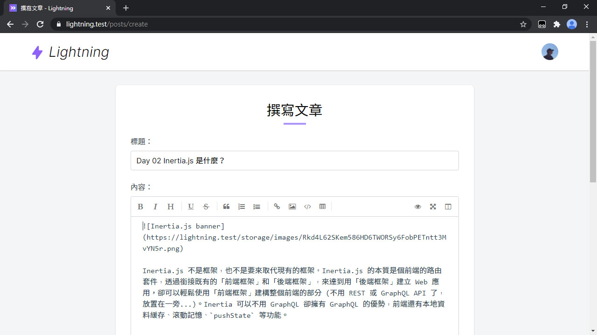
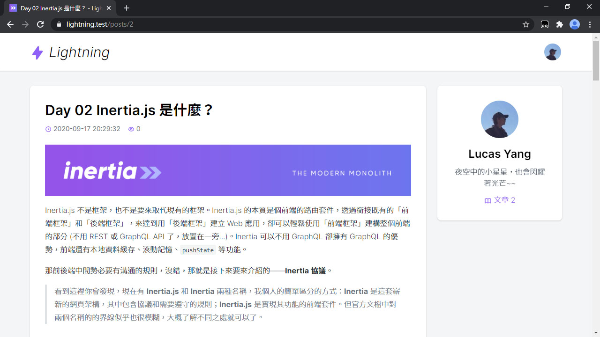

# Day 17 配置 Markdown

說到寫文章，易讀易寫的 Markdown 怎麼可以少？本篇就來配置 Markdown 功能到 Lightning。

## Markdown 編輯器

我們這回要使用一個 Vue 版的 Markdown 編輯器 - mavonEditor，先安裝起來：

```bash
yarn add mavon-editor
```

註冊 mavonEditor，這裡我選用 `atom-one-dark` 這個 highlight 程式碼主題：

*resources/js/app.js*
```js
import mavonEditor from 'mavon-editor'
import 'mavon-editor/dist/css/index.css'
import 'mavon-editor/dist/markdown/github-markdown.min.css'
import 'mavon-editor/dist/highlightjs/styles/atom-one-dark.min.css'

Vue.use(mavonEditor)
```

然後新增一個 Markdown 編輯器組件，可以根據需求自行調整 mavonEditor 的設定 (參考 [mavonEditor API](https://github.com/hinesboy/mavonEditor#api-%E6%96%87%E6%A1%A3))：

> 因為 mavonEditor 的 highlight.js 相關設定比較難覆蓋，在預覽時某些語言沒有 highlight 樣式，不過在正式顯示文章處不會有此問題，因為 highlight 都是自訂的。

*resources/js/Components/MarkdownInput.vue*
```vue
<template>
  <div>
    <label v-if="label" class="form-label" :for="id">{{ label }}：</label>
    <mavon-editor
      ref="editor"
      :value="value"
      :class="editorClass"
      :language="lang"
      font-size="16px"
      :box-shadow="false"
      :subfield="false"
      :placeholder="placeholder"
      :editable="editable"
      code-style="atom-one-dark"
      :autofocus="autofocus"
      :tab-size="2"
      :toolbars="toolbars"
      @input="value => $emit('input', value)"
      @imgAdd="uploadImage"
      v-bind="$attrs"
      v-on="$listeners"
    />
    <div v-if="error" class="form-error">{{ error }}</div>
  </div>
</template>

<script>
import axios from 'axios'

export default {
  inheritAttrs: false,
  props: {
    id: {
      type: String,
      default() {
        return `markdown-input-${this._uid}`
      }
    },
    value: String,
    label: String,
    placeholder: {
      type: String,
      default: '輸入 Markdown...'
    },
    short: {
      type: Boolean,
      default: false
    },
    editable: {
      type: Boolean,
      default: true
    },
    autofocus: {
      type: Boolean,
      default: false
    },
    short: {
      type: Boolean,
      default: false
    },
    error: String
  },
  computed: {
    toolbars() {
      return {
        bold: true, // 粗體
        italic: true, // 斜體
        header: true, // 標題
        underline: true, // 下劃線
        strikethrough: true, // 中劃線
        mark: false, // 標記
        superscript: false, // 上角標
        subscript: false, // 下角標
        quote: true, // 引用
        ol: true, // 有序列表
        ul: true, // 無序列表
        link: true, // 連結
        imagelink: true, // 圖片連結
        code: true, // code
        table: true, // 表格
        fullscreen: true, // 全螢幕編輯
        readmodel: false, // 沉浸式閱讀
        htmlcode: false, // HTML 原始碼
        help: false, // 幫助
        /* 1.3.5 */
        undo: false, // 上一步
        redo: false, // 下一步
        trash: false, // 清空
        save: false, // 儲存（觸發 events 中的 save 事件）
        /* 1.4.2 */
        navigation: false, // 導航目錄
        /* 2.1.8 */
        alignleft: false, // 左對齊
        aligncenter: false, // 居中
        alignright: false, // 右對齊
        /* 2.2.1 */
        subfield: true, // 單雙欄模式
        preview: true, // 預覽
      }
    },
    editorClass() {
      return {
        'disabled': !this.editable,
        'v-note-short': this.short
      }
    },
    lang() {
      return document.documentElement.lang
    }
  },
  methods: {
    uploadImage(pos, file) {
      const formdata = new FormData()
      formdata.append('image', file)
      axios.post('/upload/mavon-editor-image', formdata, {
        headers: { 'Content-Type': 'multipart/form-data' }
      }).then(({ data: url }) => {
        this.$refs.editor.$img2Url(pos, url)
      })
    }
  }
}
</script>
```

剛才有定義了上傳圖片的路徑，現在來新增上傳圖片路由：

*routes/web.php*
```php
// Upload files
Route::post('upload/mavon-editor-image', 'UploadController@mavonEditorImage');
```

和 Controller：

```bash
php artisan make:controller UploadController
```

*app/Http/Controllers/UploadController.php*
```php
use Illuminate\Support\Facades\Storage;

public function __construct()
{
    $this->middleware('auth');
}

public function mavonEditorImage(Request $request)
{
    $request->validate([
        'image' => 'required|image|max:5120',
    ]);

    return Storage::url($request->file('image')->store('images'));
}
```

最後替換掉原本的 `<textarea-input>` 組件：

*resources/js/Pages/Post/Form.vue*
```html
<template>
  ...
  <div class="grid gap-6 mt-6">
    <text-input v-model="form.title" :error="$page.errors.title" label="標題" ref="titleInput" autocomplete="off" />
    <markdown-input v-model="form.content" :error="$page.errors.content" label="內容" class="min-w-0" />
    ...
  </div>
  ...
</template>

<script>
import MarkdownInput from '@/Components/MarkdownInput'

export default {
  components: {
    MarkdownInput
  }
}
</script>
```

看！Markdown 編輯器出現了：



## 更新 Description 時編譯 Markdown

為了讓生成文章的簡述 (Description) 去掉 Markdown 保留純文字，可以在 Laravel 這邊解析完 Markdown，並去掉 HTML 後，再擷取文章的簡述。安裝 Laravel 版 Parsedown (PHP Markdown 解析器)：

```bash
composer require parsedown/laravel
```

抽出 `generateDescription()` 方法：

*app/Post.php*
```php
public function updateDescription()
{
    $this->description = $this->generateDescription($this->content, 80);
}

public function generateDescription(string $markdown, int $limit): string
{
    $text = strip_tags(app('parsedown')->parse($markdown));
    $text = preg_replace('/\r|\n/', '', $text);

    return Str::limit($text, $limit);
}
```

## 渲染 Markdown 文章內容

安裝 `markdown-it` 等套件：

```bash
yarn add markdown-it markdown-it-ins markdown-it-task-lists highlight.js
```

新增 `Markdown` 組件來渲染 Markdown 內容：

*resources/js/Components/Markdown.vue*
```vue
<template>
  <div class="markdown-body" v-html="renderedContent"></div>
</template>

<script>
import MarkdownIt from 'markdown-it'
import insert from 'markdown-it-ins'
import taskLists from 'markdown-it-task-lists'
import hljs from 'highlight.js'

export default {
  props: {
    value: {
      type: String,
      required: true
    }
  },
  computed: {
    renderedContent() {
      const markdown = new MarkdownIt({
        breaks: true,
        linkify: true,
        highlight(code, lang) {
          if (lang && hljs.getLanguage(lang)) {
            try {
              return `<pre class="hljs"><code>${hljs.highlight(lang, code, true).value}</code></pre>`
            } catch (_) {}
          }
          return `<pre class="hljs"><code>${markdown.utils.escapeHtml(code)}</code></pre>`
        }
      })

      markdown
        .use(insert)
        .use(taskLists)

      return markdown.render(this.value)
    }
  }
}
</script>
```

替換原本的 `<div>`：

*resources/js/Pages/Post/Show.vue*
```vue
<template>
  ...
  <div class="card p-6 md:p-8 min-w-0 xl:col-span-3">
    ...
    <markdown class="mt-6" :value="post.content" />
  </div>
  ...
</template>

<script>
import Markdown from '@/Components/Markdown'

export default {
  components: {
    Markdown
  }
}
</script>
```

最後覆寫預設的 mavonEditor 編輯器和 Markdown 樣式，這邊有針對手機版做些微的調整：

> 勉強能看，但不是到很好，因為 mavonEditor 原本只是做給電腦版用的。

*resources/css/mavonEditor.css*
```css
.v-note-wrapper {
  @apply min-w-0 border border-gray-300 !important;
  .v-note-op {
    @apply border-gray-300 flex-col !important;
    @screen md {
      @apply flex-row !important;
    }
  }
  .v-right-item {
    @apply flex-1 max-w-none !important;
    @screen md {
      max-width: 30% !important;
    }
  }
  .op-btn {
    @apply rounded-md transition-colors duration-150 !important;
    &.sure {
      @apply bg-purple-500 text-white !important;
      &:hover {
        @apply bg-purple-700 !important;
      }
    }
  }
  .auto-textarea-wrapper .auto-textarea-input {
    @apply font-mono !important;
  }
  pre.auto-textarea-block {
    @apply break-words !important;
  }
  .v-show-content {
    @apply bg-white !important;
  }
  &.v-note-short {
    min-height: 220px !important;
  }
  &.disabled {
    &.v-note-short {
      min-height: 100px !important;
    }
    .v-note-edit {
      @apply cursor-default !important;
    }
  }
}

.markdown-body {
  @apply font-sans font-light break-words !important;
  a {
    @apply text-purple-500 transition-colors duration-100 !important;
    &:hover {
      @apply text-purple-700 !important;
    }
  }
  p {
    @apply text-base leading-7 !important;
  }
  strong {
    @apply font-bold !important;
  }
  ul {
    @apply list-disc !important;
  }
  ol {
    @apply list-decimal !important;
  }
  pre {
    @apply text-base !important;
  }
  .hljs {
    background-color: #1d1f21 !important;
  }
}
```

註冊 CSS：

*resources/css/app.css*
```css
@import 'tailwindcss/components';
...
@import 'mavonEditor';
```

WOW~~ 終於有文章的樣子了！



## 總結

用 Markdown 寫文章可以很快速地使用文章內常見的元素 (標題、超連結等)，上手難度不高，在 Lightning 裡自然也要有此等方便的東西才說得過去啊！下篇要做作者的文章、草稿列表，文章列表要出現了，會不會有什麼奇怪的坑呢？

> Lightning 範例程式碼：https://github.com/ycs77/lightning

## 參考資料

* [mavonEditor](https://github.com/hinesboy/mavonEditor)
