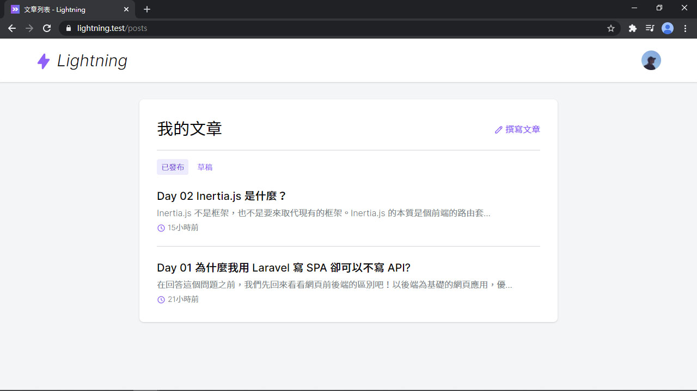
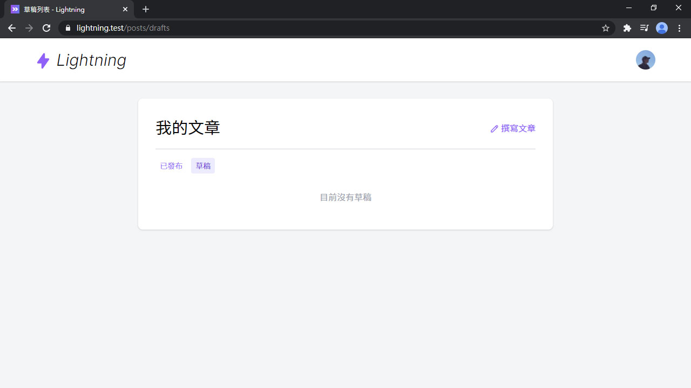

# Day 18 Lightning 文章、草稿列表

## 文章列表

文章列表的路由有了 (在 Resource 裡)，再加一個草稿列表的路由，一定要放在 ShowPost 上面：

*routes/web.php*
```php
// Posts
Route::resource('posts', 'Post\PostController')->except('show');
Route::get('posts/drafts', 'Post\PostController@index');
Route::get('posts/{post}', 'Post\ShowPost');
```

然後是文章/草稿列表的 Controller：

*app/Http/Controllers/Post/PostController.php*
```php
public function index(Request $request)
{
    $type = $request->path() === 'posts' ? 'published' : 'drafts';

    $pageTitles = [
        'published' => '文章列表',
        'drafts' => '草稿列表',
    ];

    $posts = $this->user()
        ->posts()
        ->where('published', $type === 'published')
        ->latest()
        ->get();

    return Inertia::render('Post/List', [
        'pageTitle' => $pageTitles[$type],
        'type' => $type,
        'posts' => PostPresenter::collection($posts)
            ->preset('list')
            ->get(),
    ]);
}
```

還有屬於列表的 preset，裡面要放文章作者，需要的欄位不用那麼多，可以用 `only()` 指定：

*app/Presenters/PostPresenter.php*
```php
public function presetList()
{
    return $this->with(fn (Post $post) => [
        'author' => fn () => UserPresenter::make($post->author)
            ->only('id', 'name', 'avatar')
            ->get(),
    ]);
}
```

跟文章列表頁面：

*resources/js/Pages/Post/List.vue*
```vue
<template>
  <div class="py-6 md:py-8">
    <alert v-if="$page.flash.success" class="shadow mb-6">{{ $page.flash.success }}</alert>

    <div class="card card-main">
      <div>
        <div class="flex justify-between items-center">
          <h2 class="text-3xl">我的文章</h2>
          <div>
            <inertia-link href="/posts/create" class="link">
              <icon icon="heroicons-outline:pencil" />
              撰寫文章
            </inertia-link>
          </div>
        </div>
        <hr class="mt-4">

        <tabs class="mt-4" :active="type">
          <tab name="published" url="/posts">已發布</tab>
          <tab name="drafts" url="/posts/drafts">草稿</tab>
        </tabs>
      </div>

      <div class="mt-6">
        <post-list :posts="posts" hide-author :empty="emptyText" />
      </div>
    </div>
  </div>
</template>

<script>
import AppLayout from '@/Layouts/AppLayout'
import Alert from '@/Components/Alert'
import Tabs from '@/Components/Tabs'
import Tab from '@/Components/Tab'
import PostList from '@/Lightning/PostList'

export default {
  layout: AppLayout,
  metaInfo() {
    return {
      title: this.pageTitle
    }
  },
  components: {
    Alert,
    Tabs,
    Tab,
    PostList
  },
  props: {
    pageTitle: String,
    type: String,
    posts: Array
  },
  computed: {
    emptyText() {
      return this.type === 'drafts' ? '目前沒有草稿' : '目前沒有文章'
    }
  }
}
</script>
```

還有用到的組件們，有真正的文章列表組件。只要是文章列表都可以用這個組件渲染：

*resources/js/Lightning/PostList.vue*
```vue
<template>
  <div>
    <ul v-if="posts.length" class="divide-y -my-6">
      <li v-for="post in posts" class="py-6">
        <h2>
          <inertia-link :href="`/posts/${post.id}`" class="text-xl font-medium hover:text-purple-500 transition-colors duration-100">{{ post.title }}</inertia-link>
        </h2>
        <div class="text-gray-500 font-light mt-1">{{ post.description }}</div>
        <div class="flex items-center space-x-4 text-gray-500 text-sm font-light" :class="hideAuthor ? 'mt-1' : 'mt-3'">
          <inertia-link v-if="!hideAuthor" :href="`/user/${post.author.id}`" class="inline-flex items-center hover:text-purple-500 font-normal">
            
            <span class="ml-2">{{ post.author.name }}</span>
          </inertia-link>
          <div>
            <icon class="w-4 h-4 text-purple-500" icon="heroicons-outline:clock" />
            {{ post.created_ago }}
          </div>
          <slot name="info-after" :post="post" />
        </div>
      </li>
    </ul>

    <div v-else class="text-center text-gray-400 mt-8 mb-4">{{ empty }}</div>
  </div>
</template>

<script>
export default {
  props: {
    posts: {
      type: Array,
      required: true
    },
    hideAuthor: {
      type: Boolean,
      default: false
    },
    empty: {
      type: String,
      default: '目前沒有文章'
    }
  }
}
</script>
```

跟 Tab 組件：

*resources/js/Components/Tabs.vue*
```vue
<template>
  <div class="flex space-x-2">
    <slot />
  </div>
</template>

<script>
export default {
  props: {
    active: String
  }
}
</script>
```

*resources/js/Components/Tab.vue*
```vue
<template>
  <div v-if="name === active" class="tab tab-active">
    <slot />
  </div>
  <inertia-link v-else :href="url" class="tab tab-link">
    <slot />
  </inertia-link>
</template>

<script>
export default {
  props: {
    name: {
      type: String,
      required: true
    },
    url: String
  },
  computed: {
    active() {
      return this.$parent.$options._componentTag === 'tabs'
        ? this.$parent.active
        : null
    }
  }
}
</script>
```

Tab 組件的樣式：

*resources/css/components.css*
```css
/* Tab */
.tab {
  @apply px-2 py-1 text-sm font-light rounded select-none;
}
.tab-link {
  @apply text-purple-500 transition-colors duration-100;
  &:hover {
    @apply text-purple-700;
  }
}
.tab-active {
  @apply bg-purple-100 text-purple-700;
}
```

然後就可以看到列表頁面，可以切換草稿頁面：





## 總結

列表做好了，但如果文章多了起來，頁面就會很長，載入會很久，因此，下回將要來做列表分頁了。

> Lightning 範例程式碼：https://github.com/ycs77/lightning
