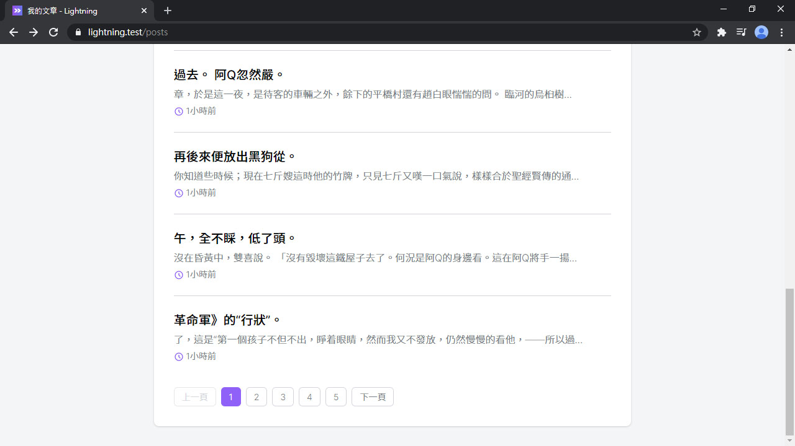

# Day 19 Lightning 分頁功能

在原本 Laravel Blade 裡要使用分頁是非常簡單的，但現在我們前端是 Vue，需要做一(~~億~~)些些調整才能使用分頁功能。

## 調整 Laravel 分頁器

只要把 `get()` 改成 `paginate()` 就可以使用 Laravel 預設的分頁器功能：

*app/Http/Controllers/Post/PostController.php*
```php
public function index()
{
    $posts = $this->user()
        ->posts()
        ->where('published', true)
        ->latest()
        ->paginate();

    return Inertia::render('Post/List', [
        'type' => 'published',
        'typeText' => '文章',
        'posts' => PostPresenter::collection($posts)
            ->preset('list')
            ->get(),
    ]);
}

public function drafts()
{
    $posts = $this->user()
        ->posts()
        ->where('published', false)
        ->latest()
        ->paginate();

    return Inertia::render('Post/List', [
        'type' => 'drafts',
        'typeText' => '草稿',
        'posts' => PostPresenter::collection($posts)
            ->preset('list')
            ->get(),
    ]);
}
```

設定 Post Model 分頁都是一頁顯示 10 筆資料：

*app/Post.php*
```php
protected $perPage = 10;
```

但預設的分頁器輸出的資料不完全是我們要的，現在要新增一個繼承自 `LengthAwarePaginator` 的分頁器，然後稍微調整一下。首先要改 `url()`，增加判斷當前輸出連結是不是第一頁，如果是就會把後面的 `?page=1` 自動減掉；`linkCollection()` 會輸出使適用於 Inertia 的分頁資料；最後在 `toArray()` 裡指定需要輸出的完整分頁器的資料，多一個 `showPaginator` 決定前端需不需要渲染分頁組件：

> Laravel 8 以上 `linkCollection()` 方法預設已經存在，不需要自訂。

*app/Pagination/Paginator.php*
```php
<?php

namespace App\Pagination;

use Illuminate\Pagination\LengthAwarePaginator;
use Illuminate\Support\Arr;
use Illuminate\Support\Str;

class Paginator extends LengthAwarePaginator
{
    public function url($page)
    {
        if ($page <= 0) {
            $page = 1;
        }

        $parameters = $page === 1 ? [] : [$this->pageName => $page];

        if (count($this->query) > 0) {
            $parameters = array_merge($this->query, $parameters);
        }

        $divide = Str::contains($this->path(), '?') ? '&' : '?';

        $queryString = count($parameters)
            ? ($divide.Arr::query($parameters))
            : '';

        return $this->path().$queryString.$this->buildFragment();
    }

    public function linkCollection()
    {
        return collect($this->elements())
            ->flatMap(fn ($item) => is_array($item)
                ? collect($item)->map(fn ($url, $page) => [
                    'url' => $url,
                    'label' => $page,
                    'active' => $this->currentPage() === $page,
                ])
                : [['url' => null, 'label' => '...', 'active' => false]]
            )
            ->prepend([
                'url' => $this->previousPageUrl(),
                'label' => __('pagination.previous'),
                'active' => false,
            ])
            ->push([
                'url' => $this->nextPageUrl(),
                'label' => __('pagination.next'),
                'active' => false,
            ]);
    }

    public function toArray()
    {
        return [
            'data' => $this->items->toArray(),
            'links' => $this->linkCollection()->toArray(),
            'showPaginator' => $this->hasPages(),
        ];
    }
}
```

然後綁定新分頁器，變成以後只要在 Container 裡讀到 `LengthAwarePaginator`，就會自動替換成我們定義的新分頁器：

*app/Providers/AppServiceProvider.php*
```php
use App\Pagination\Paginator;
use Illuminate\Pagination\LengthAwarePaginator;

public function register()
{
    $this->registerInertia();
    $this->registerLengthAwarePaginator();
}

protected function registerLengthAwarePaginator()
{
    $this->app->bind(LengthAwarePaginator::class, Paginator::class);
}
```

## 分頁組件

再來做分頁組件，根據在上面設定的 `linkCollection()` 分頁連結資料。這裡有做電腦版和手機版，電腦版有完整的分頁，手機版只會顯示上/下一頁兩個按鈕：

*resources/js/Components/Pagination.vue*
```vue
<template>
  <div class="font-medium">
    <div class="flex justify-between md:hidden">
      <template v-for="(link, key) in simpleLinks">
        <div v-if="link.url === null" :key="link.label" class="pagination-item pagination-disabled">{{ link.label }}</div>
        <inertia-link v-else :key="link.label" class="pagination-item pagination-link" :href="link.url">{{ link.label }}</inertia-link>
      </template>
    </div>
    <div class="hidden md:flex md:flex-wrap">
      <template v-for="link in links">
        <div v-if="link.active" :key="link.label" class="pagination-item pagination-active mr-2 mt-2">{{ link.label }}</div>
        <div v-else-if="link.url === null" :key="link.label" class="pagination-item pagination-disabled mr-2 mt-2">{{ link.label }}</div>
        <inertia-link v-else :key="link.label" class="pagination-item pagination-link mr-2 mt-2" :href="link.url">{{ link.label }}</inertia-link>
      </template>
    </div>
  </div>
</template>

<script>
export default {
  props: {
    links: Array
  },
  computed: {
    simpleLinks() {
      return [
        this.links.slice(0).shift(),
        this.links.slice(-1).pop()
      ]
    }
  }
}
</script>
```

和分頁組件的樣式：

*resources/css/pagination.css*
```css
.pagination-item {
  @apply px-3 py-1 text-sm font-light border rounded-md select-none;
}

.pagination-link {
  @apply text-gray-500 border-gray-300 transition-colors duration-150;
  &:hover {
    @apply border-purple-500 text-purple-500;
  }
}

.pagination-active {
  @apply bg-purple-500 border-purple-500 text-white;
}

.pagination-disabled {
  @apply text-gray-300 border-gray-200;
}
```

*resources/css/app.css*
```css
@import 'tailwindcss/components';
...
@import 'pagination';
...
```

有了分頁組件，現在就可以加到文章列表組件裡。記得上面有調整了分頁集合渲染出來的資料？現在的文章集合是 `Object` 不是 `Array`，還有真正的文章們現在在 `posts.data`，這些都要調整：

*resources/js/Lightning/PostList.vue*
```vue
<template>
  <div>
    <ul v-if="posts.data.length" class="divide-y -my-6">
      <li v-for="post in posts.data" class="py-6">
        ...
      </li>
    </ul>
    ...
    <pagination v-if="posts.showPaginator" class="mt-8" :links="posts.links" />
  </div>
</template>

<script>
import Pagination from '@/Components/Pagination'

export default {
  components: {
    Pagination
  },
  props: {
    posts: {
      type: Object,
      required: true
    },
    ...
  }
}
</script>
```

列表頁面也不要忘記改 `posts` 的型別：

*resources/js/Pages/Post/List.vue*
```vue
<script>
export default {
  props: {
    posts: Object
  }
}
</script>
```

還要改一下翻譯文字：

*resources/lang/zh_TW/pagination.php*
```php
return [
    'previous' => '上一頁',
    'next'     => '下一頁',
];
```

補上我的文章的選單連結：

*resources/js/Layouts/AppLayout.vue*
```html
<template #menu="{ close }">
  <dropdown-item :href="`/user/${user.id}`" icon="heroicons-outline:home" @click="close">
    我的主頁
  </dropdown-item>
  ... <!-- 撰寫文章 -->
  <dropdown-item href="/posts" icon="heroicons-outline:book-open" @click="close">
    我的文章
  </dropdown-item>
  <dropdown-item href="/posts/drafts" icon="heroicons-outline:document-text" @click="close">
    我的草稿
  </dropdown-item>
  ...
</template>
```

最後新增一堆假文章 (看不懂正常，這些都是假文產生器產生的...)：

```bash
>>> App\User::find(1)->posts()->saveMany(factory(App\Post::class, 60)->make())
```




分頁功能完成~~

## 總結

這分頁功能雖然需要做點小調整，但整體來說不算太難。前端也依然是熟悉的 Vue 組件。到此為止列表也大概完成了，下篇就可以在用戶的個人頁面加入文章列表了。看起來很簡單，但似乎隱藏著危機？

> Lightning 範例程式碼：https://github.com/ycs77/lightning
