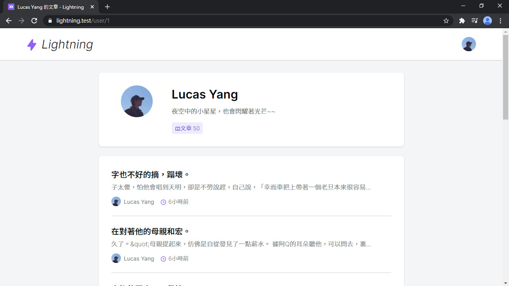
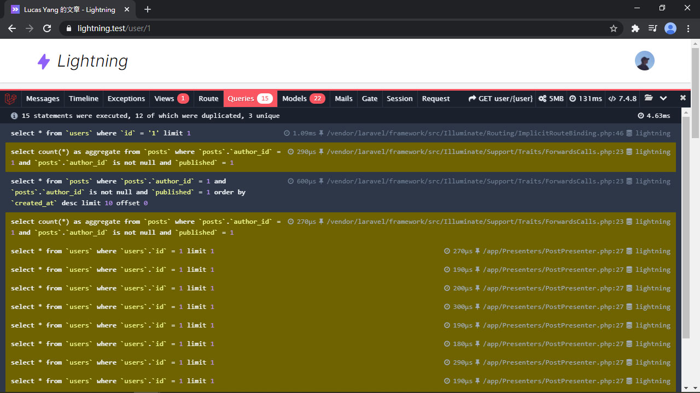
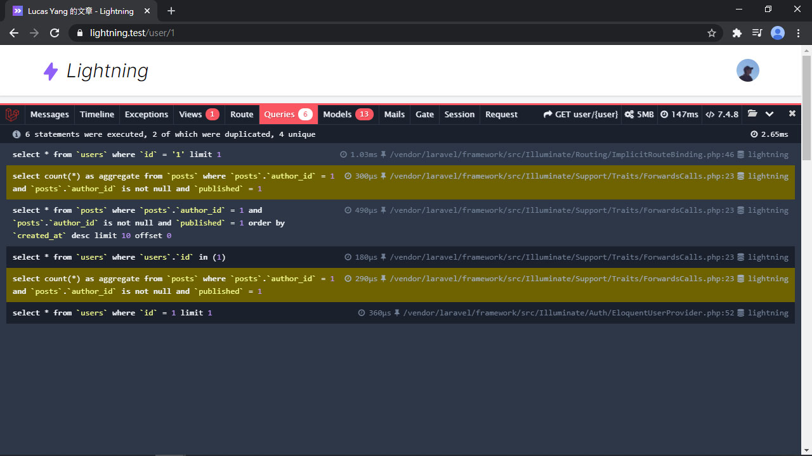
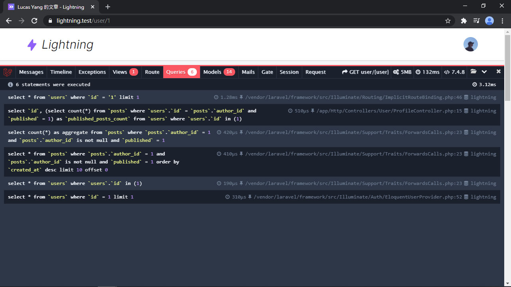
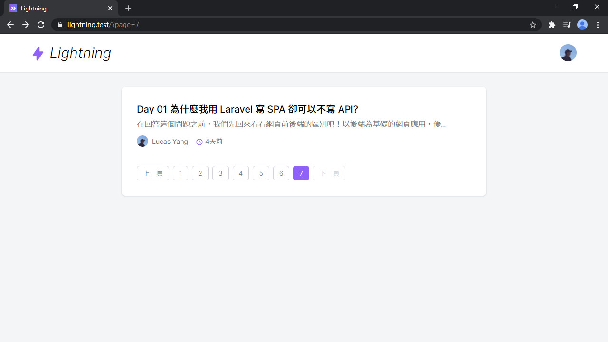

# Day 20 Lightning 完善文章列表 & 優化資料庫查詢

列表組件已經完成，再來可以做用戶頁面的文章列表了。

## 用戶頁面的文章列表

首先先修改用戶頁面的 Controller 部分，因為之後這個頁面還要放用戶喜歡的文章的列表，所以把標題 `pageTitle` 提出來。然後在 `UserPresenter` 後追加 `posts` 和 `postsCount` 兩個欄位：

```php
use App\Presenters\PostPresenter;

public function index(User $user)
{
    return Inertia::render('User/Profile', [
        'pageTitle' => "$user->name 的文章",
        'type' => 'show',
        'user' => UserPresenter::make($user)->with(fn (User $user) => [
            'posts' => PostPresenter::collection(
                $user->posts()
                    ->where('published', true)
                    ->latest()
                    ->paginate()
            )->preset('list'),
            'postsCount' => $user->publishedPosts()->count(),
        ])->get(),
    ]);
}
```

還有修改視圖頁面，增加切換頁面用的頁籤 `<tabs>`，和文章列表組件 `<post-list>`：

*resources/js/Pages/User/Profile.vue*
```vue
<template>
  <div class="py-6 md:py-8">
    <div class="card card-main">
      <div class="md:flex">
        ...
        <div class="mt-4 md:mt-0 md:ml-6 text-center md:text-left">
          ...
          <tabs class="mt-4 justify-center md:justify-start" :active="type">
            <tab name="show" :url="`/user/${user.id}`">
              <icon icon="heroicons-outline:book-open" />文章 {{ user.postsCount }}
            </tab>
          </tabs>
        </div>
      </div>
    </div>

    <div class="card card-main mt-6">
      <post-list :posts="user.posts" />
    </div>
  </div>
</template>

<script>
import AppLayout from '@/Layouts/AppLayout'
import PostList from '@/Lightning/PostList'
import Tabs from '@/Components/Tabs'
import Tab from '@/Components/Tab'

export default {
  layout: AppLayout,
  metaInfo() {
    return {
      title: this.pageTitle
    }
  },
  components: {
    PostList,
    Tabs,
    Tab
  },
  props: {
    pageTitle: String,
    type: String,
    user: Object
  }
}
</script>
```



> 看到的依然是假文產生的，別在意...

嗯！頁面都正常了。但，這裡有一點點嚴重的資料庫查詢問題。

## 優化資料庫查詢

頭號效能殺手就是 N+1 query 問題！很容易在 Laravel 裡出現。

用過 Laravel 的都知道可以用 [預加載 (Eager Loading)](https://laravel.com/docs/eloquent-relationships#eager-loading) 來解此問題。為了證明有 N+1 問題，現在先裝 [Laravel Debugbar](https://github.com/barryvdh/laravel-debugbar) 來確認：

```bash
composer require barryvdh/laravel-debugbar --dev
php artisan vendor:publish --provider="Barryvdh\Debugbar\ServiceProvider"
```

裝好後再打開用戶頁面，選擇 `Queries` 頁籤，你就會看到多個 ``select * from `users` where `users`.`id` = 1 limit 1``，這就是 N+1 問題：



解法是在加載文章時 (`$user->posts()`) 先預加載每個文章的作者 (`->with('author')`)：

*app/Http/Controllers/User/ProfileController.php*
```php
public function index(User $user)
{
    return Inertia::render('User/Profile', [
        ...
        'user' => UserPresenter::make($user)->with(fn (User $user) => [
            'posts' => PostPresenter::collection(
                $user->posts()
                    ->with('author')
                    ->where('published', true)
                    ->latest()
                    ->paginate()
            )->preset('list'),
            ...
        ])->get(),
    ]);
}
```



優化之後 Query 次數瞬間減少許多，但還有一個點可以優化：

其實關聯查詢總數量也可以預加載，使用 `loadCount('publishedPosts')` 加載，然後它會把加載到的數量值丟到 `$user->published_posts_count` 裡，參考 [Counting Related Models](https://laravel.com/docs/eloquent-relationships#counting-related-models)：

*app/Http/Controllers/User/ProfileController.php*
```php
public function index(User $user)
{
    $user->loadCount('publishedPosts');

    return Inertia::render('User/Profile', [
        ...
        'user' => UserPresenter::make($user)->with(fn (User $user) => [
            ...
            'postsCount' => $user->published_posts_count,
        ])->get(),
    ]);
}
```



完成！沒有重複的查詢了！

## 首頁文章列表

現在終於要做 Lightning 首頁囉！首頁不放什麼花俏的東西，就放全部文章的列表。新增一個 `ShowPostList` Controller：

```php
php artisan make:controller Post/ShowPostList -i
```

範例的兩個路由可以刪掉了。然後新增首頁路由：

*routes/web.php*
```php
// Posts
Route::get('/', 'Post\ShowPostList');
...
```

列表的頁面前面都做過了，搬來用改一改就可以用。跟上面一樣，這裡也要用 `with('author')` 預加載作者的 Model：

*app/Http/Controllers/Post/ShowPostList.php*
```php
use App\Post;
use App\Presenters\PostPresenter;
use Inertia\Inertia;

public function __invoke()
{
    $posts = Post::with('author')
        ->where('published', true)
        ->latest()
        ->paginate();

    return Inertia::render('Home', [
        'posts' => PostPresenter::collection($posts)
            ->preset('list')
            ->get(),
    ]);
}
```

之前當範例的頁面 `HelloWorld.vue` 和 `About.vue` 也可以刪掉，然後新增首頁的頁面：

*resources/js/Pages/Home.vue*
```vue
<template>
  <div class="py-6 md:py-8">
    <alert v-if="$page.flash.success" class="shadow mb-6">{{ $page.flash.success }}</alert>

    <div class="card card-main">
      <post-list :posts="posts" />
    </div>
  </div>
</template>

<script>
import AppLayout from '@/Layouts/AppLayout'
import PostList from '@/Lightning/PostList'
import Alert from '@/Components/Alert'

export default {
  layout: AppLayout,
  components: {
    Alert,
    PostList
  },
  props: {
    posts: Object
  }
}
</script>
```



這樣，就有了一個簡單的首頁啦！

## 總結

本篇除了補上首頁和用戶頁面的文章列表外，還簡單優化了資料庫查詢。下篇要做文章的編輯和刪除，基本文章功能也快完成囉！

> Lightning 範例程式碼：https://github.com/ycs77/lightning

## 參考資料

* [Eager Loading - Eloquent: Relationships - Laravel](https://laravel.com/docs/8.x/eloquent-relationships#eager-loading)
* [Counting Related Models - Eloquent: Relationships - Laravel](https://laravel.com/docs/eloquent-relationships#counting-related-models)
