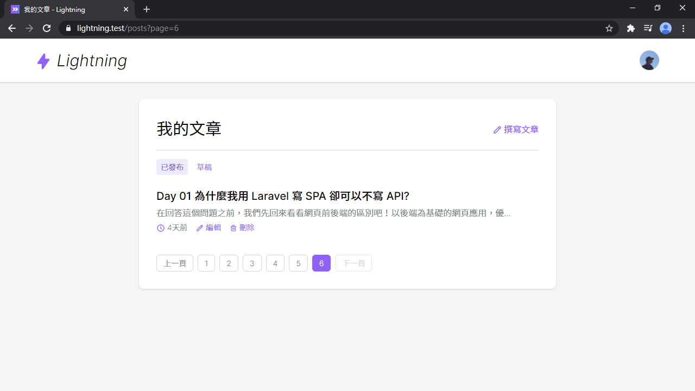

# Day 21 Lightning 編輯 & 刪除文章

文章的新增、顯示都有了，馬上來做剩下的修改和刪除吧！

## 編輯文章和刪除文章功能

*app/Http/Controllers/Post/PostController.php*
```php
public function edit(Post $post)
{
    $this->authorize('update', $post);

    return Inertia::render('Post/Form', [
        'post' => PostPresenter::make($post)->with(fn (Post $post) => [
            'content' => $post->content,
        ])->get(),
    ]);
}

public function update(PostRequest $request, Post $post)
{
    $this->authorize('update', $post);

    $post->update($request->validated());

    return redirect("/posts/{$post->id}")->with('success', '文章更新成功');
}

public function destroy(Post $post)
{
    $this->authorize('delete', $post);

    $post->delete();

    return redirect('/posts')->with('success', '文章刪除成功');
}
```

為了不要讓任何人都能隨便更新或刪除，授權的規則要確認當前用戶是否為文章作者：

*app/Policies/PostPolicy.php*
```php
public function update(User $user, Post $post)
{
    return $user->id === $post->author_id;
}

public function delete(User $user, Post $post)
{
    return $user->id === $post->author_id;
}
```

也要把當前文章是否可以更新或刪除的結果傳給全端，讓前端可以決定要不要渲染按鈕：

*app/Presenters/PostPresenter.php*
```php
class PostPresenter extends FlexiblePresenter
{
    use Concens\HasAuthUser;

    public function presetShow()
    {
        return $this->with(fn (Post $post) => [
            ...
            'can' => [
                'update' => $this->userCan('update', $post),
                'delete' => $this->userCan('delete', $post),
            ],
        ]);
    }
}
```

補上不存在的 `HasAuthUser` trait 和 `userCan()` 方法，實際上它是調用當前用戶的 `can()` 方法：

*app/Presenters/Concens/HasAuthUser.php*
```php
<?php

namespace App\Presenters\Concens;

use App\User;
use Illuminate\Support\Facades\Auth;

trait HasAuthUser
{
    protected function user(): ?User
    {
        return Auth::user();
    }

    protected function userCan($abilities, $arguments = []): bool
    {
        return (bool) optional($this->user())->can($abilities, $arguments);
    }
}
```

## 編輯文章頁面

後端好了換前端，表單頁面略微調整。這裡新增 `isEdit` 計算屬性取得是否為編輯模式，根據據當前文章的 ID 存不存在來判斷。

要修改的有頁面標題、送出按鈕文字、送出路徑等，還有更新的路由是 PUT 方法，FormData 要增加 `_method=put` 的值。最後在頁面標題下還增加一排導覽列，方便回到文章或列表：

*resources/js/Pages/Post/Form.vue*
```vue
<template>
  ...
  <h1 class="text-3xl text-center">{{ pageTitle }}</h1>
  <div class="w-12 mt-1 mx-auto border-b-4 border-purple-400"></div>

  <div class="flex justify-center space-x-4 mt-6">
    <inertia-link v-if="isEdit" :href="`/posts/${post.id}`" class="link">
      <icon class="text-purple-500" icon="heroicons-outline:book-open" />
      <span>檢視文章</span>
    </inertia-link>
    <inertia-link href="/posts" class="link">
      <icon class="text-purple-500" icon="heroicons-outline:view-list" />
      <span>文章列表</span>
    </inertia-link>
  </div>
  ...
</template>

<script>
export default {
  computed: {
    isEdit() {
      return Boolean(this.post.id)
    },
    pageTitle() {
      return this.isEdit ? '編輯文章' : '撰寫文章'
    },
    btnText() {
      return this.isEdit ? '更新文章' : '儲存文章'
    }
  },
  methods: {
    submit() {
      ...
      if (this.isEdit) data.append('_method', 'put')

      return this.$inertia.post(this.isEdit ? `/posts/${this.post.id}` : '/posts', data).then(() => {
        ...
      })
    }
  },
  mounted() {
    if (!this.isEdit) {
      this.$refs.titleInput.focus()
    }
  }
}
</script>
```

做是做好了，但還沒有編輯文章和刪除文章的按鈕，先從文章頁面開始。上面下面各一排，上面因為加了按鈕之後變長了，在手機板排版會跑掉，因為按鈕上層是用 Flex 排版，只要加上 `flex-wrap` 就解決了：

*resources/js/Pages/Post/Show.vue*
```vue
<template>
  ...
  <h1 class="text-3xl font-semibold leading-snug">{{ post.title }}</h1>
  <div class="flex flex-wrap space-x-4 mt-2 text-sm">
    ...
    <inertia-link v-if="post.can.update" :href="`/posts/${post.id}/edit`" class="link">
      <icon icon="heroicons-outline:pencil" />
      編輯
    </inertia-link>
    <a v-if="post.can.delete" :href="`/posts/${post.id}`" class="link" @click="destroy($event, post)">
      <icon icon="heroicons-outline:trash" />
      刪除
    </a>
  </div>

  <markdown class="mt-6" :value="post.content" />

  <div class="flex space-x-2 md:space-x-3 mt-6 font-light">
    <inertia-link v-if="post.can.update"
      :href="`/posts/${post.id}/edit`"
      class="btn btn-blue-light text-sm px-3 py-1"
    >
      <icon class="mr-1" icon="heroicons-outline:pencil" />
      編輯
    </inertia-link>
    <a v-if="post.can.delete"
      :href="`/posts/${post.id}`"
      class="btn btn-red-light text-sm px-3 py-1"
      @click="destroy($event, post)"
    >
      <icon class="mr-1" icon="heroicons-outline:trash" />
      刪除
    </a>
  </div>
  ...
</template>
```

這裡又多了新的藍色按鈕，再增加上去吧：

*resources/css/button.css*
```css
.btn-blue {
  @apply bg-blue-500 text-white;
  &:hover {
    @apply bg-blue-700;
  }
  &:disabled {
    @apply bg-blue-300 !important;
  }
}
.btn-blue-light {
  @apply bg-blue-100 text-blue-700;
  &:hover {
    @apply bg-blue-200;
  }
}
```

還有我的文章列表，也要加上兩個按鈕：

*resources/js/Pages/Post/List.vue*
```vue
<template>
  ...
  <post-list :posts="posts" hide-author :empty="emptyText">
    <template #info-after="{ post }">
      <div>
        <inertia-link :href="`/posts/${post.id}/edit`" class="link">
          <icon icon="heroicons-outline:pencil" />
          編輯
        </inertia-link>
      </div>
      <div>
        <a :href="`/posts/${post.id}`" class="link" @click="destroy($event, post)">
          <icon icon="heroicons-outline:trash" />
          刪除
        </a>
      </div>
    </template>
  </post-list>
  ...
</template>

<script>
export default {
  methods: {
    destroy(e, post) {
      e.preventDefault()
      if (confirm('確定要刪除此文章? 刪除後即無法回復!')) {
        this.$inertia.delete(`/posts/${post.id}`)
      }
    }
  }
}
</script>
```

## 結果

最後就來看看結果，我的文章列表有了編輯和刪除按鈕：



還有文章頁面，但僅限於登入用戶為文章作者，才會有按鈕：


來試試修改文章：


鏘鏘！「文章更新成功」：


刪除也試試：


刪除也成功！


## 總結

文章基本的 CRUD 操作均已備齊，即將前往下一個功能 - 點讚 (但在此系列我會叫 `喜歡`)，下篇將會實作這個社群網站必備的互動功能。

> Lightning 範例程式碼：https://github.com/ycs77/lightning
