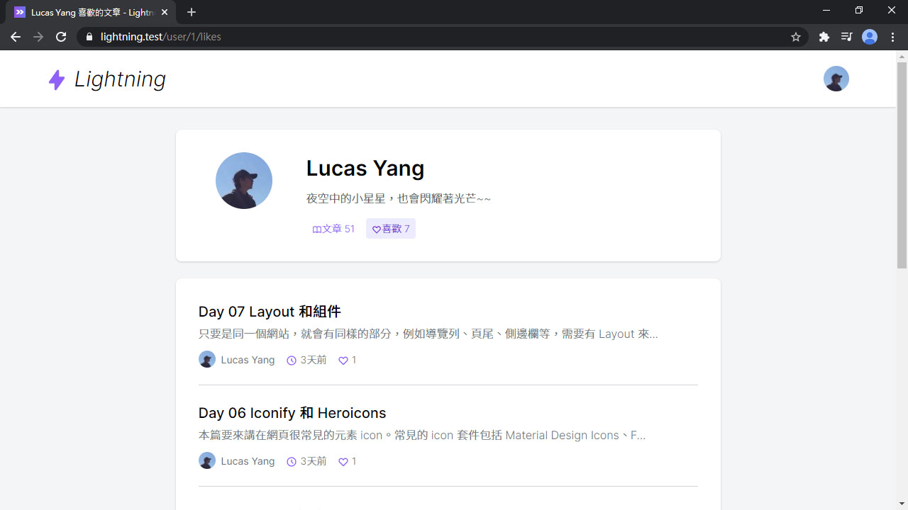

# Day 22 Lightning 喜歡文章功能

看到一篇優秀的文章，總是會給它按個讚，也可以從點讚次數來了解這篇文章的受歡迎程度。本篇就來實作這個功能，不過我會叫它「喜歡文章」嘻！

## 喜歡功能

不要重複造輪子，因此我們會用 [Laravel Acquaintances](https://github.com/multicaret/laravel-acquaintances) 這個套件來做這個功能。先安裝套件和發布資源：

```bash
composer require multicaret/laravel-acquaintances
php artisan vendor:publish --provider="Multicaret\Acquaintances\AcquaintancesServiceProvider"
```

然後跑 Migrate：

```bash
php artisan migrate
```

Acquaintances 這個套件包含了社群網站常見的功能，像發送好友請求、封鎖用戶、群組好友、評分、點讚、訂閱、收藏等，想要詳細了解請參考 [Laravel Acquaintances 文檔](https://github.com/multicaret/laravel-acquaintances)，不過我們只需要喜歡(點讚)功能而已。

首先在 User 加上 `CanLike` trait，讓用戶可以點喜歡。但用戶可以喜歡的東西可以有很多，這裡新增一個 `likedPosts()` 取得喜歡的文章，而且要是已發布狀態的：

*app/User.php*
```php
use Multicaret\Acquaintances\Traits\CanLike;

class User extends Authenticatable
{
    use Notifiable, CanLike;

    ...

    /**
    * @return \Illuminate\Database\Eloquent\Relations\BelongsToMany
    */
    public function likedPosts()
    {
        return $this->likes(Post::class)->published();
    }
}
```

Post 則是加上 `CanBeLiked` trait，讓文章可以被點喜歡：

```php
use Multicaret\Acquaintances\Traits\CanBeLiked;

class Post extends Model
{
    use CanBeLiked;
    ...
}
```

然後新增點喜歡文章的路由：

*routes/web.php*
```php
// Posts
...
Route::post('posts/{post}/like', 'Post\PostController@like');
```

和處理喜歡文章的邏輯：

*app/Http/Controllers/Post/PostController.php*
```php
use Illuminate\Validation\ValidationException;

public function like(Post $post)
{
    if (! $post->published) {
        throw ValidationException::withMessages([
            'like' => '未發布文章不可以點喜歡',
        ]);
    }

    if ($post->isLikedBy($this->user())) {
        $this->user()->unlike($post);
    } else {
        $this->user()->like($post);
    }

    return back();
}
```

然後在 `PostPresenter` 新增喜歡相關的欄位，`likes` 是喜歡的數量，用 `likersCountReadable()` 會返回易於閱讀的數字 (例：12萬)，`is_liked` 是得知文章是否被當前用戶點了喜歡：

*app/Presenters/PostPresenter.php*
```php
public function values(): array
{
    return [
        ...
        'likes' => $this->likersCountReadable(),
        ...
    ];
}

public function presetShow()
{
    return $this->with(fn (Post $post) => [
        ...
        'is_liked' => $this->user() ? $post->isLikedBy($this->user()) : false,
    ]);
}
```

和在 `UserPresenter` 新增 `likesCount`，這是當前用戶喜歡的文章數量：

*app/Presenters/UserPresenter.php*
```php
public function presetWithCount()
{
    return $this->with(fn (User $user) => [
        ...
        'likesCount' => $user->likedPosts()->count(),
    ]);
}
```

## 喜歡按鈕

換前端了，有了剛才後端的配置，前端就可以把按鈕和功能完成了。首先是在底部的編輯 & 刪除按鈕旁，加上喜歡文章的按紐，如果點了喜歡，會把空心愛心 icon 切換成實心。

但這裡手機版依然會有過長問題，解決方法是在按鈕上層 div 增加 `flex-wrap` class，然後在編輯刪除按鈕加上 `mb-2` class，增加斷行後的按鈕間距。還有文章還沒發布時，點喜歡回應的錯誤文字。作者卡片裡也可以多一個喜歡的文章的連結：

*resources/js/Pages/Post/Show.vue*
```vue
<template>
  ...

  <markdown class="mt-6" :value="post.content" />

  <div class="flex flex-wrap ...">
    <inertia-link
      :href="`/posts/${post.id}/like`"
      method="post"
      class="btn btn-purple-light text-sm px-3 py-1 mb-2"
    >
      <icon class="mr-1 text-purple-500" :icon="!post.is_liked
        ? 'heroicons-outline:heart'
        : 'heroicons-solid:heart'"
      />喜歡 | {{ post.likes }}
    </inertia-link>
    <inertia-link class="... mb-2">
      <!-- 編輯 -->
    </inertia-link>
    <a class="... mb-2">
      <!-- 刪除 -->
    </a>
  </div>
  <div v-if="$page.errors.like" class="form-error">{{ $page.errors.like }}</div>

  ...

  <!-- 作者卡片 -->
  <div class="flex justify-center items-center space-x-6 mt-3">
    <!-- 文章連結 -->
    <inertia-link :href="`/user/${post.author.id}/likes`" class="link font-light">
      <icon icon="heroicons-outline:heart" />
      喜歡 {{ post.author.likesCount }}
    </inertia-link>
  </div>
</template>
```

然後就可以點喜歡啦 (格式怪怪的，之後會調)：


## 用戶喜歡的文章

用戶點了喜歡後，還要有個列表把它全部列出來，先新增個路由：

*routes/web.php*
```php
// User
...
Route::get('user/{user}/likes', 'User\ProfileController@likes');
```

再來是 Controller 的部分，之前都是用 `latest()` 幫文章排序，但這裡應該是要根據點喜歡的時間做排序，要使用 `latest('pivot_created_at')` 排序。還有要新增用戶喜歡文章數 `likedPosts`：

*app/Http/Controllers/User/ProfileController.php*
```php
public function index(User $user)
{
    $user->loadCount('publishedPosts', 'likedPosts');

    return Inertia::render('User/Profile', [
        ...
        'user' => UserPresenter::make($user)->with(fn (User $user) => [
            ...
            'likesCount' => $user->liked_posts_count,
        ])->get(),
    ]);
}

public function likes(User $user)
{
    $user->loadCount('publishedPosts', 'likedPosts');

    return Inertia::render('User/Profile', [
        'pageTitle' => "$user->name 喜歡的文章",
        'type' => 'likes',
        'user' => UserPresenter::make($user)->with(fn (User $user) => [
            'posts' => PostPresenter::collection(
                $user->likedPosts()
                    ->with('author')
                    ->latest('pivot_created_at')
                    ->paginate()
            )->preset('list'),
            'postsCount' => $user->published_posts_count,
            'likesCount' => $user->liked_posts_count,
        ])->get(),
    ]);
}
```

然後新增導覽連結：

*resources/js/Pages/User/Profile.vue*
```vue
<template>
  ...
  <tabs class="mt-4 justify-center md:justify-start" :active="type">
    <!-- 文章 tab -->
    <tab name="likes" :url="`/user/${user.id}/likes`">
      <icon icon="heroicons-outline:heart" />喜歡 {{ user.likesCount }}
    </tab>
  </tabs>
  ...
</template>
```

最後在文章列表加上文章的喜歡數：

*resources/js/Lightning/PostList.vue*
```vue
<template>
  ...
  <div>
    <icon class="w-4 h-4 text-purple-500" icon="heroicons-outline:clock" />
    {{ post.created_ago }}
  </div>
  <div>
    <icon class="w-4 h-4 text-purple-500" icon="heroicons-outline:heart" />
    {{ post.likes }}
  </div>
  ...
</template>
```



這樣，用戶喜歡的文章的列表也完成了。

## 總結

喜歡功能雖然完成了，但有些許部分可以優化，下篇就來做這吧！

> Lightning 範例程式碼：https://github.com/ycs77/lightning

## 參考資料

* [Laravel Acquaintances 文檔](https://github.com/multicaret/laravel-acquaintances)
