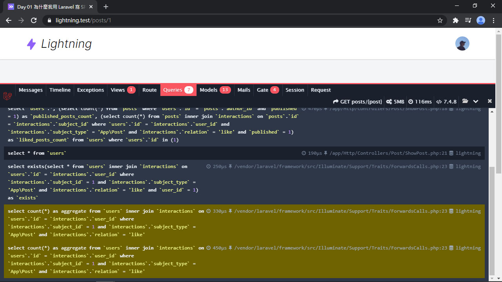
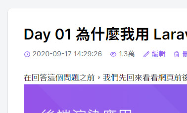
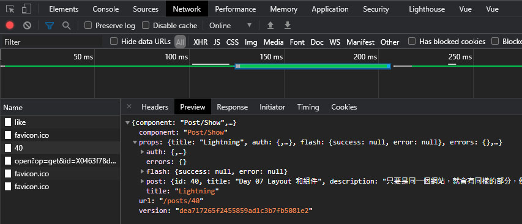
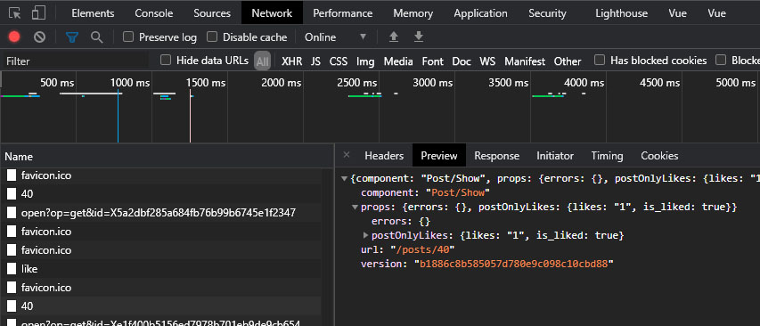

# Day 23 Lightning 喜歡功能的種種問題

在上篇中已經做完了喜歡文章的功能，但還存在一些問題，本篇就來看這些問題。

## 預加載 likersCount() 問題

首先看到的是重複的 Query，原因是 Post model 撈 likers (喜歡此文章的用戶) 數量撈 2 次：



禍源在這兒：

*app/Presenters/PostPresenter.php*
```php
public function values(): array
{
    return [
        ...
        'likes' => $this->likers_count_readable,
        ...
    ];
}
```

當然第一個就會想到用 `withCount()`/`loadCount()` 來解，但即使預加載了數量，也暫時回來用 `likers_count`，這兩個 Query 還是頑固地在原地不動。

我們都是~~成熟~~(誤)的開發者了，遇到問題要學會自己 Debug。爬了源碼後發現問題在這：

*vendor/multicaret/laravel-acquaintances/src/Traits/CanBeLiked.php*
```php
trait CanBeLiked
{
    public function likersCount()
    {
        return $this->likers()->count();
    }

    public function getLikersCountAttribute()
    {
        return $this->likersCount();
    }
}
```

這個套件加了 `getLikersCountAttribute()` 覆蓋掉了 `likers_count`，所以預加載的值讀不到。而 `likers_count_readable` 的數值來源是呼叫 `likersCount()`，當然也不能用預加載讀。

山不轉路轉，我們還可以自己新增自己的 trait 去繼承 (正確來說是 use) 原本的 trait，然後覆寫 `likersCount()`，讓他強制讀取 `likers_count` 的值：

> 不去發 PR 而是自己覆寫的原因則是，等下還要客製化一些東西。

*app/Acquaintances/CanBeLiked.php*
```php
<?php

namespace App\Acquaintances;

use Multicaret\Acquaintances\Traits\CanBeLiked as BaseCanBeLiked;

trait CanBeLiked
{
    use BaseCanBeLiked;

    public function likersCount()
    {
        return $this->attributes['likers_count'];
    }
}
```

接下來就可以替換掉 Post model 裡引用的 `CanBeLiked`，改成 `use App\Acquaintances\CanBeLiked`。既然要強制讀取，那也要讓 `likers_count` 隨時都可以讀取到值。這裡新增一個 Global Scope 來讓每個 Post 的 Query 都會自帶 `likers_count`：

*app/Post.php*
```php
use App\Acquaintances\CanBeLiked;
use Illuminate\Database\Eloquent\Builder;

class Post extends Model
{
    use CanBeLiked;

    protected static function booted()
    {
        static::addGlobalScope('likers', fn (Builder $builder) => $builder->withCount('likers'));
    }
}
```

## 本地化可讀數字

事情還沒完，回來看前端，如果我們先暫時把 `likersCount()` 改成一個稍大一點的數字會看到什麼結果：

*app/Acquaintances/CanBeLiked.php*
```php
public function likersCount()
{
    return 12877;
}
```


這個格式和語言都不合我們的使用習慣，必須改！追下去發現要改的是在 `Multicaret\Acquaintances\Interaction` 這個 class，先覆蓋 `Interaction` 的來源：

*app/Acquaintances/CanBeLiked.php*
```php
public function likersCountFormatted($precision = 1, $divisors = null)
{
    return Interaction::numberToReadable($this->likersCount, $precision, $divisors);
}
```

然後新增我們的 `Interaction`：

*app/Acquaintances/Interaction.php*
```php
<?php

namespace App\Acquaintances;

use Multicaret\Acquaintances\Interaction as BaseInteraction;

class Interaction extends BaseInteraction
{
    static public function numberToReadable($number, $precision = 1, $divisors = null, $base = 10000)
    {
        $shorthand = '';
        $divisor = pow($base, 0);

        if (! isset($divisors)) {
            $divisors = [
                $divisor => $shorthand,
                pow($base, 0) => '',
                pow($base, 1) => '萬',
                pow($base, 2) => '億',
                pow($base, 3) => '兆',
                pow($base, 4) => '京',
            ];
        }

        foreach ($divisors as $divisor => $shorthand) {
            if (abs($number) < ($divisor * $base)) {
                break;
            }
        }

        if ($divisor === 1) {
            $precision = 0;
        }

        return number_format($number / $divisor, $precision).$shorthand;
    }
}
```

然後文章喜歡的可讀數字正常了，從剛才的 `12.8K` 變成了 `1.3萬`：


還有一個要改的是文章的瀏覽次數，也一樣變成易於閱讀的數字：

*app/Presenters/PostPresenter.php*
```php
use App\Acquaintances\Interaction;

public function values(): array
{
    return [
        ...
        'visits' => Interaction::numberToReadable($this->visits),
        'likes' => $this->likers_count_readable,
        ...
    ];
}
```



終於告一段落了。記得把假的數字改回來 XD！

## 預加載用戶關聯數量

在 `UserPresenter` 還有沒有預加載的關聯數量，也一樣讀取預加載的數量：

*app/Presenters/UserPresenter.php*
```php
public function presetWithCount()
{
    return $this->with(fn (User $user) => [
        'postsCount' => $user->published_posts_count,
        'likesCount' => $user->liked_posts_count,
    ]);
}
```

然後在文章的 Controller 處進行預加載：

*app/Http/Controllers/Post/ShowPost.php*
```php
public function __invoke(Post $post)
{
    ...
    $this->incrementVisit($post);

    $post->load(['author' => fn ($query) => $query->withCount('publishedPosts', 'likedPosts')]);
    ...
}
```

回頭再去看 Debugbar， 會發現少了 2 個 Query，目的達成！

## 修復我的文章/草稿列表 N+1 問題

既然要修就一起修，這個算是我的失誤 (欸嘿~)。在我的文章/草稿列表裡本來就不需要載入文章作者，因為這全部都是當前登入用戶的文章。因此原本會引入作者的 `preset('list')` 就可以刪掉，同時也消除了 N+1 問題的根源：

*app/Http/Controllers/Post/PostController.php*
```php
public function index()
{
    ...
    return Inertia::render('Post/List', [
        ...
        'posts' => PostPresenter::collection($posts)->get(),
    ]);
}

public function drafts()
{
    ...
    return Inertia::render('Post/List', [
        ...
        'posts' => PostPresenter::collection($posts)->get(),
    ]);
}
```

## 部分重載 (Partial Reload) 和懶加載 (Lazy Evaluation)

再來就是本篇的重點，[部分重載 (**Partial Reload**)](https://inertiajs.com/the-protocol#partial-reloads) 和[懶加載 (**Lazy Evaluation**)](https://inertiajs.com/responses#lazy-evaluation)，這兩個部分在 Inertia 裡算是比較進階一點的東西，但也不是很難。

先說部分重載，為什麼要部分重載？先看看下圖：



在點完喜歡後更新頁面時，卻還是重新載入所有 Props，但絕大部分的 Props 都是不需要重新加載。這時候部分重載就可以用 `only` 指定只要載入哪些 Props，減輕回傳的資料量。

既然需要使用到部分重載，就拿這個來示範。首先先指定更新頁面只會加載 `postOnlyLikes` 和 `errors`，`postOnlyLikes` 只會裝更新頁面會更新的相關資料，等下會在後端設定。然後要把 `likes` 和 `is_liked` 改成從 `postOnlyLikes` 引入。還有在點完喜歡後葉面都會被拉回頂端，這個只要加上 `preserve-scroll`，就可以保留滾動位置了：

*resources/js/Pages/Post/Show.vue*
```vue
<template>
  <inertia-link
    ...
    preserve-scroll
    :only="['postOnlyLikes', 'errors']"
    ...
  >
    <icon class="mr-1 text-purple-500" :icon="!postOnlyLikes.is_liked
      ? 'heroicons-outline:heart'
      : 'heroicons-solid:heart'"
    />喜歡 | {{ postOnlyLikes.likes }}
  </inertia-link>
</template>

<script>
export default {
  props: {
    ...
    postOnlyLikes: Object
  }
}
```

新增 `postOnlyLikes`，裡面只裝點了喜歡後要更新的資料：

*app/Http/Controllers/Post/ShowPost.php*
```php
public function __invoke(Post $post)
{
    ...
    return Inertia::render('Post/Show', [
        ...
        'postOnlyLikes' => PostPresenter::make($post)
            ->only('likes')
            ->with(fn (Post $post) => [
                'is_liked' => $post->isLiked,
            ])
            ->get(),
    ]);
}
```

新增 `is_liked` Accessor，抽出來的目的是可以把讀取的值快取起來：

*app/Post.php*
```php
protected ?bool $isLikedCache = null;

public function getIsLikedAttribute()
{
    if (is_null($this->isLikedCache)) {
        $this->isLikedCache = Auth::user() ? $this->isLikedBy(Auth::user()) : false;
    }

    return $this->isLikedCache;
}
```

既然抽出來了，就可以改成直接讀 `isLiked` 了：

*app/Presenters/PostPresenter.php*
```php
public function presetShow()
{
    return $this->with(fn (Post $post) => [
        ...
        'is_liked' => $post->isLiked,
    ]);
}
```

看看結果，點了喜歡的資料載入就減少許多了：



### 原理

剛才實作完了，現在回來看原理，首先是熟悉的 HTTP 請求內容。這次不是照搬官網的，而是用剛才部分重載的 HTTP 請求：

請求：
```http
GET: https://lightning.test/posts/1
Accept: text/html, application/xhtml+xml
X-Requested-With: XMLHttpRequest
X-Inertia: true
X-Inertia-Partial-Data: postOnlyLikes,errors
X-Inertia-Partial-Component: Post/Show
X-Inertia-Version: 88ddfee9f5eae5bd7f534fa187e69da8
```

響應：
```http
HTTP/1.1 200 OK
Content-Type: application/json

{
  "component": "Post/Show",
  "props": {
    "post": {...},       // NOT included
    "postOnlyLikes": {   // included
      "likes": "6",
      "is_liked": false
    }
  },
  "url": "/posts/39",
  "version": "88ddfee9f5eae5bd7f534fa187e69da8"
}
```

這次終於要來講新的 Header 了，`X-Inertia-Partial-Data` 是剛才傳進去 `only` 的欄位，但要用 `,` 隔開；`X-Inertia-Partial-Component` 是要部分重載的組件名稱。部分重載這裡有個規定，只能在同一頁面發出部分重載的請求，否則不會起作用。

說完部分重載再來說 [懶加載 (**Lazy Evaluation**)](https://inertiajs.com/responses#lazy-evaluation)，懶加載一定要在用部分重載時才有作用。就拿剛才的範例，假設現在有個 `test_users` 欄位，裡面有個 `User::all()` 會跟資料庫發 ``select * from `users`;`` 這串 Query，即使用了部分重載，即 `only` 沒有包含 `test_users`，那串 SQL Query 仍會執行：

*app/Http/Controllers/Post/ShowPost.php*
```php
public function __invoke(Post $post)
{
    ...
    return Inertia::render('Post/Show', [
        'test_users' => \App\User::all(),
    ]);
}
```

其實這也沒有很奇怪，因為程式執行到這裡就一定會先發送 SQL Query 才會給 Inertia 做部分重載。要推遲執行時間就要使用**懶加載**，作法很簡單，只要套上 Closure 就行了。只有確定要使用到 `test_users` 時才會真正被加載：

*app/Http/Controllers/Post/ShowPost.php*
```php
public function __invoke(Post $post)
{
    ...
    return Inertia::render('Post/Show', [
        'test_users' => fn () => \App\User::all(),
    ]);
}
```

然後再回去看 Debugbar，只有在頁面剛載入時才會執行 ``select * from `users`;``，之後再點喜歡文章按鈕時都不會看到這行 Query 了。

## 總結

文章喜歡的功能終於處裡完成了，同時也了解了 Inertia 的 **部分重載**和**懶加載**功能。下篇要進入本系列 Lightning 的最後一個功能 **文章留言**，快要結束囉！

> Lightning 範例程式碼：https://github.com/ycs77/lightning

## 參考資料

* [Partial reloads - The protocol - Inertia.js](https://inertiajs.com/the-protocol#partial-reloads)
* [Lazy evaluation - Responses - Inertia.js](https://inertiajs.com/responses#lazy-evaluation)
