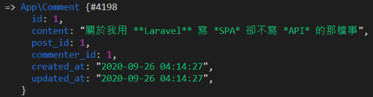

# Day 25 Lightning 新增留言

首先先新增一個輸入留言的組件，裡面會使用之前做的 Markdown 輸入框組件，`enabled` prop 為 `true` 時可正常輸入留言，為 `false` 時禁止輸入，同時按鈕會改成「登入即可留言」：

*resources/js/Lightning/CommentForm.vue*
```vue
<template>
  <form @submit.prevent="submit">
    <markdown-input
      v-model="form.content"
      :placeholder="enabled ? '請輸入留言...' : '登入後即可留言...'"
      :editable="enabled"
      short
      :toolbars-flag="enabled"
      :error="$page.errors.content"
    />
    <div class="text-right mt-4">
      <loading-button v-if="enabled" :loading="loading" class="btn btn-purple">留言</loading-button>
      <inertia-link v-else href="/login" class="btn btn-purple-light">
        登入即可留言
        <icon class="ml-1" icon="heroicons-outline:arrow-right" />
      </inertia-link>
    </div>
  </form>
</template>

<script>
import MarkdownInput from '@/Components/MarkdownInput'
import LoadingButton from '@/Components/LoadingButton'

export default {
  components: {
    MarkdownInput,
    LoadingButton
  },
  props: {
    post: Object,
    enabled: {
      type: Boolean,
      default: true
    }
  },
  data() {
    return {
      form: {
        content: ''
      },
      loading: false
    }
  },
  methods: {
    submit() {
      this.$inertia.post(`/posts/${this.post.id}/comments`, this.form, {
        preserveScroll: true,
        onStart: () => this.loading = true,
        onFinish: () => this.loading = false,
        onSuccess: () => {
          if (! Object.keys(this.$page.errors).length) {
            this.form.content = ''
          }
        }
      })
    }
  }
}
</script>
```

> ### Inertia.js v0.3 已棄用 Promise 調用方式
>
> 現在全系列已更新為 Inertia.js v0.3，增加了 [Event system (事件系統)](https://inertiajs.com/events)，Promise 調用的方式已棄用，若尚未更新至 v0.3 請更新版本：
> ```bash
> yarn add @inertiajs/inertia@^0.3 @inertiajs/inertia-vue@^0.2.4
> ```
>
> 並參考 [Day 09 Lightning 用戶登入](https://ithelp.ithome.com.tw/articles/10235589) 的「載入進度條」篇安裝進度條套件。
>
> 但如果你還是想要使用舊方法或者不想升級，請參考以下用法：
> ```js
> submit() {
>   this.loading = true
>   this.$inertia.post(`/posts/${this.post.id}/comments`, this.form, {
>     preserveScroll: true
>   }).then(() => {
>     this.loading = false
>     if (! Object.keys(this.$page.errors).length) {
>       this.form.content = ''
>     }
>   })
> }
> ```

然後在文章頁面引入輸入留言組件，而且設定成用戶要登入 `enabled` prop 才會是 `true`：

*resources/js/Pages/Post/Show.vue*
```vue
<template>
  <div class="grid gap-6 xl:grid-cols-4">
    ...

    <div class="min-w-0 xl:col-span-3">
      <div class="card p-6 md:p-8">
        <h3 class="text-2xl font-semibold">留言</h3>
        <comment-form :post="post" :enabled="Boolean($page.auth.user)" class="mt-6" />
      </div>
    </div>
  </div>
</template>


<script>
import CommentForm from '@/Lightning/CommentForm'

export default {
  components: {
    CommentForm
  }
}
</script>
```

新增 CommentRequest：

```bash
php artisan make:request CommentRequest
```

這邊還是差不多，先刪掉 `authorize()`，然後增加驗證規則，還要寫 `content` 欄位的翻譯：

*app/Http/Requests/CommentRequest.php*
```php
public function rules()
{
    return [
        'content' => 'required|max:1000',
    ];
}

public function attributes()
{
    return [
        'content' => '留言',
    ];
}
```

最後儲存留言：

*app/Http/Controllers/Post/CommentController.php*
```php
use App\Http\Requests\CommentRequest;
use App\Post;

public function store(CommentRequest $request, Post $post)
{
    $comment = Comment::make($request->validated());
    $comment->post()->associate($post);
    $comment->commenter()->associate($this->user());
    $comment->save();

    return back();
}
```

一樣還是開 Tinker 檢查：

```bash
php artisan tinker
>>> App\Comment::find(1)
```



## 總結

留言功能需要的 Markdown 需要的組件之前也都有了，現在都可以直接拿來用。下篇來做留言功能的最後部分，顯示文章留言 & 刪除留言。

> Lightning 範例程式碼：https://github.com/ycs77/lightning
