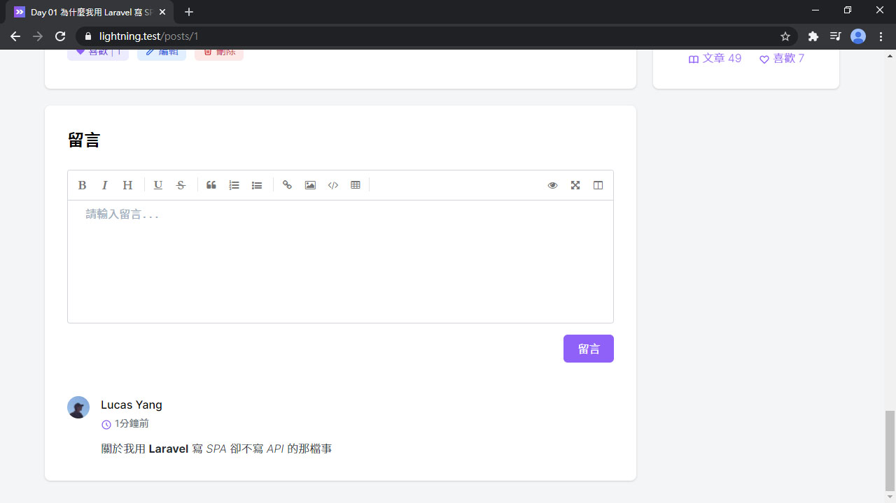
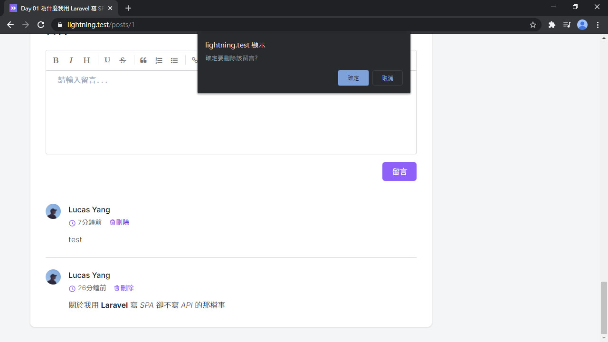
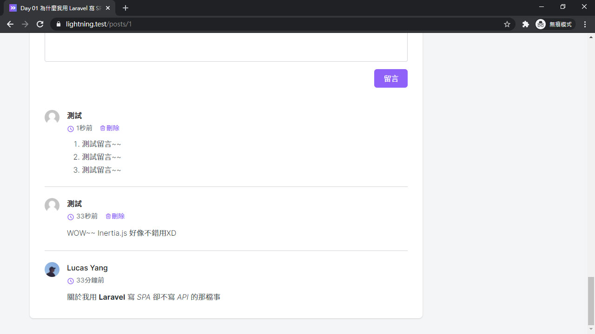
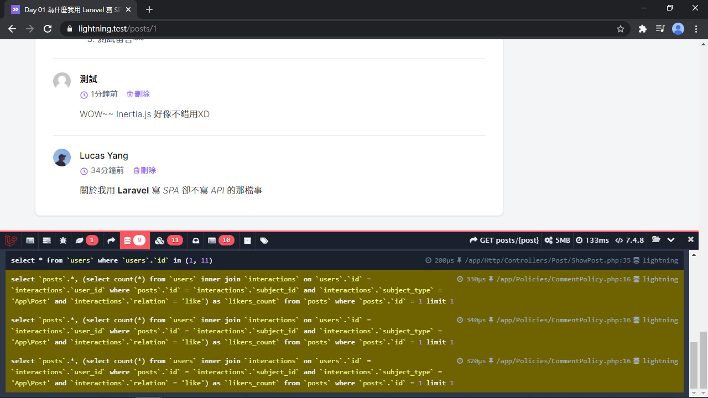
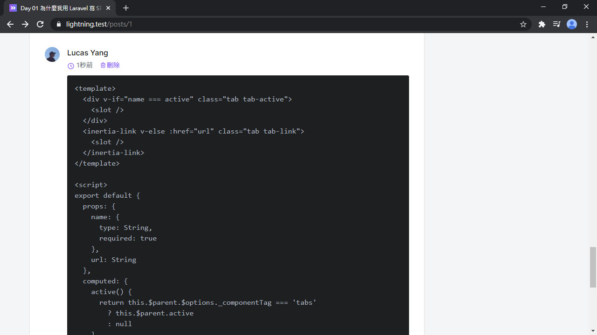
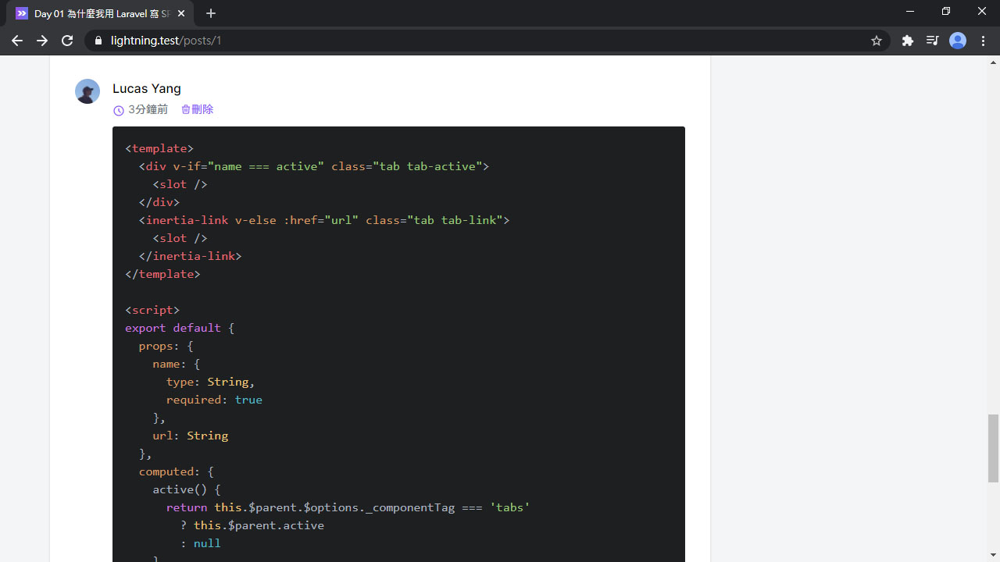

# Day 26 Lightning 顯示文章留言 & 刪除留言

文章留言功能的最後一步，來做留言列表和刪除留言，把上篇新增的留言秀出來！

# 文章留言列表

先來新增一個留言列表組件：

*resources/js/Lightning/CommentList.vue*
```vue
<template>
  <ul class="divide-y">
    <li class="flex py-6" v-for="comment in comments">
      <div>
        <inertia-link :href="`/user/${comment.commenter.id}`" class="inline-block">
          
        </inertia-link>
      </div>

      <div class="flex-1 ml-3 md:ml-4 min-w-0">
        <inertia-link :href="`/user/${comment.commenter.id}`" class="font-medium hover:text-purple-500">
          {{ comment.commenter.name }}
        </inertia-link>

        <div class="flex space-x-4 mt-1 text-sm text-gray-500">
          <div>
            <icon class="w-4 h-4 text-purple-500" icon="heroicons-outline:clock" />
            {{ comment.created_at }}
          </div>
        </div>

        <markdown class="mt-3" :value="comment.content" />
      </div>
    </li>
  </ul>
</template>

<script>
import Markdown from '@/Components/Markdown'

export default {
  components: {
    Markdown
  },
  props: {
    comments: Array
  }
}
</script>
```

引入留言列表：

*resources/js/Pages/Post/Show.vue*
```vue
<template>
  ...
  <div class="card p-6 md:p-8">
    <h3 class="text-2xl font-semibold">留言</h3>
    ...
    <comment-list :comments="comments" class="mt-6 -mb-6" />
  </div>
  ...
</template>

<script>
import CommentList from '@/Lightning/CommentList'

export default {
  components: {
    CommentList
  },
  props: {
    comments: Array
  }
}
</script>
```

然後在 `ShowPost` Controller 就可以傳留言列表給前端了。這次有學到教訓，事先預加載 `with('commenter')` 防止 N+1 問題：

*app/Http/Controllers/Post/ShowPost.php*
```php
use App\Presenters\CommentPresenter;

public function __invoke(Post $post)
{
    ...
    return Inertia::render('Post/Show', [
        ...
        'comments' => fn () => CommentPresenter::collection(
            $post->comments()
                ->with('commenter')
                ->latest()
                ->get()
        )->get(),
    ]);
}
```

留言列表就出來了：



## 刪除留言

刪除留言也是要授權通過的用戶才能執行的操作。來新增一個 `CommentPolicy`：

```bash
php artisan make:policy CommentPolicy --model=Comment
```

這裡我們要授權給兩種人可以刪除，一種是留言的用戶，另一種是該留言的文章的作者：

```php
public function delete(User $user, Comment $comment)
{
    return in_array($user->id, [
        $comment->post->author_id,
        $comment->commenter_id,
    ]);
}
```

然後在 `CommentPresenter` 加上 `can.delete` 的欄位：

*app/Presenters/CommentPresenter.php*
```php
public function values(): array
{
    return [
        ...
        'can' => [
            'delete' => $this->userCan('delete', $this->resource),
        ],
    ];
}
```

刪除留言的邏輯：

*app/Http/Controllers/Post/CommentController.php*
```php
public function destroy(Comment $comment)
{
    $this->authorize('delete', $comment);

    $comment->delete();

    return back();
}
```

在前端留言列表裡加上刪除按鈕：

*resources/js/Lightning/CommentList.vue*
```vue
<template>
  ...
  <div class="flex space-x-4 mt-1 text-sm text-gray-500">
    <div>
      <icon class="w-4 h-4 text-purple-500" icon="heroicons-outline:clock" />
      {{ comment.created_at }}
    </div>
    <a v-if="comment.can.delete"
      :href="`/comments/${comment.id}`"
      class="link inline-flex items-center"
      @click.prevent="destroy(comment)"
    >
      <icon icon="heroicons-outline:trash" />
      刪除
    </a>
  </div>
  ...
</template>

<script>
export default {
  methods: {
    destroy(comment) {
      if (confirm('確定要刪除該留言?')) {
        this.$inertia.delete(`/comments/${comment.id}`, {
          preserveScroll: true
        })
      }
    }
  }
}
</script>
```

現在可以刪除留言啦：



用另一個帳號登入測試留言，留完後只能刪除自己的留言：



## 循環關聯

但這時候...，又有重複 Query 的問題：



問題是出在剛才 `CommentPolicy` 裡的 `$comment->post->author_id`，在每筆留言都查詢一次文章。可是這個文章的 Model 明明已經有了，為什麼還要再去查詢呢？解決方法是用 `setRelation()`，把 Post Model 直接設定關聯給 Comment Model：

*app/Http/Controllers/Post/ShowPost.php*
```php
public function __invoke(Post $post)
{
    ...
    return Inertia::render('Post/Show', [
        ...
        'comments' => fn () => CommentPresenter::collection(
            $post->comments()
                ->with('commenter')
                ->latest()
                ->get()
                ->each->setRelation('post', $post)
        )->get(),
    ]);
}
```

這樣就解決了 Laravel 的循環關聯問題了！

## 新增留言後部分重載

在新增留言後也可以使用部分重載，加上 `only: ['comments', 'errors']` 就可以了：

*resources/js/Lightning/CommentForm.vue*
```vue
<script>
export default {
  methods: {
    submit() {
      ...
      this.$inertia.post(`/posts/${this.post.id}/comments`, this.form, {
        preserveScroll: true,
        only: ['comments', 'errors']
      }).then(() => {...})
    }
  }
}
</script>
```

## 安裝 Highlight.js 的 Vue 語法樣式

做了差不多後就來興沖沖的貼 Code，然後就看到我的 Vue 區塊是灰色的... (哭)



翻了原始碼才發現，Highlight.js 預設沒有包 Vue 的語法樣式。不過還是有套件可以用，把它裝起來吧：

```bash
yarn add highlightjs-vue
```

然後在 `Markdown` 組件裡引入 Vue 語法樣式：

*resources/js/Components/Markdown.vue*
```vue
<script>
import hljs from 'highlight.js'
import hljsDefineVue from 'highlightjs-vue'

hljsDefineVue(hljs)

...
</script>
```

現在，Vue 的程式碼區塊恢復了色彩~~：



## 總結

到目前為止，我們用 Laravel + Vue.js + Tailwind CSS + Inertia.js 做了 Lightning 這個簡單的部落格網站，完成了登入、註冊、用戶帳號編輯、發文、留言等功能，但現在只有我自己才能看這個網站。為了要把網站給其他人瀏覽，下篇我們將部署 Lightning 到 Heroku 上。 (想想就興奮啊！！)

> Lightning 範例程式碼：https://github.com/ycs77/lightning

## 參考資料

* [Optimizing circular relationships in Laravel](https://reinink.ca/articles/optimizing-circular-relationships-in-laravel)
