# Day 27 部署 Lightning 到 Heroku

網站做好了，本篇就來部署 Lightning 到 Heroku 吧！

## 前置作業

首先先做好前置作業，設定 `package.json` 的 `heroku-postbuild` script，因為 Heroku 在安裝完 Node.js 的依賴套件後，會執行這個腳本編譯前端資源：

*package.json*
```json
{
    "scripts": {
        "heroku-postbuild": "npm run prod"
    }
}
```

然後新增一個檔案 Procfile 來指定 Heroku 網站的根目錄：

*Procfile*
```
web: vendor/bin/heroku-php-apache2 public/
```

## 部署到 Heroku

再來需要先註冊好 [Heroku](https://www.heroku.com/) 帳號，和在本地安裝好 [Heroku CLI](https://devcenter.heroku.com/articles/heroku-cli)。然後現在可以開始部署網站囉！首先在 Heroku 後台右上角點「Create new app」：

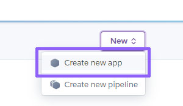

然後打上應用名稱和選地區：

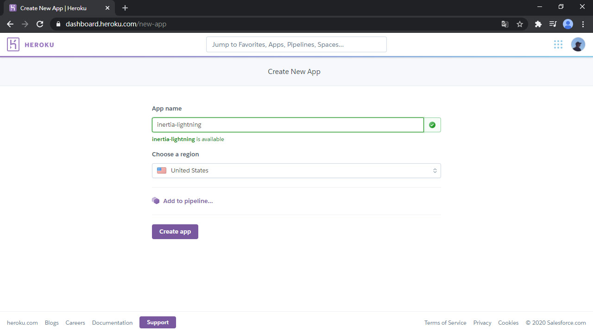

新增完應用後會看到這個畫面，選擇「Settings」頁籤，來做一些設定：

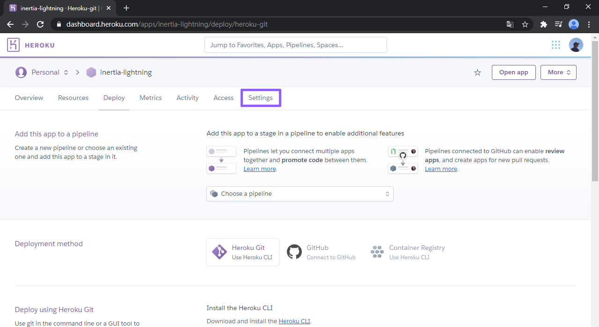

Buildpacks 可以安裝構建時需要使用的程式語言，我們要用 PHP 和 Node.js 兩個語言，按右邊「Add buildpack」選擇，注意 Buildpacks 一定要照這個順序！：

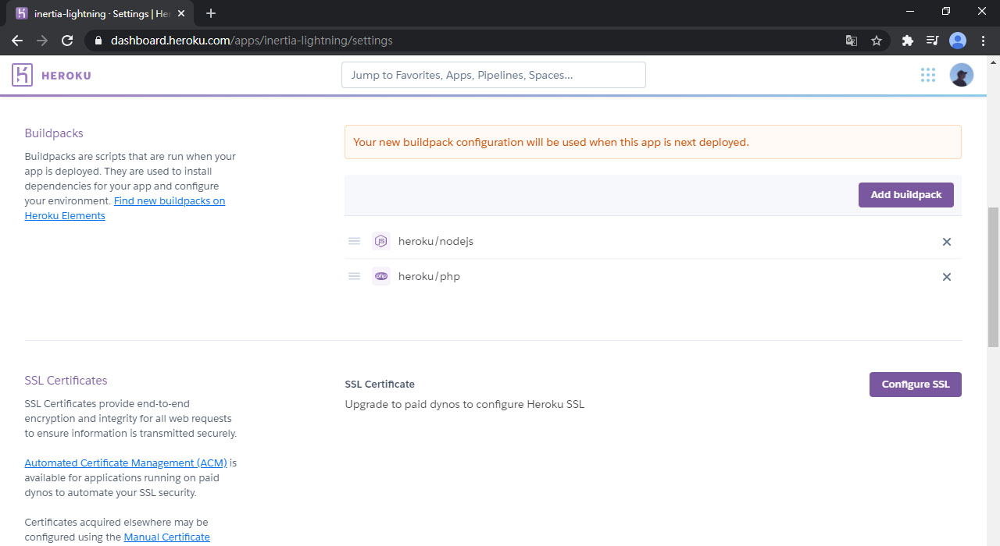

再來就要登入 Heroku 來上傳網站了：

```bash
heroku login
```

然後增加 Heroku 的 Git 倉庫路徑 (把 `YOUR_APP_NAME` 換成你剛才設定的 Heroku 應用名稱)：

```bash
heroku git:remote -a YOUR_APP_NAME
```

Commit 剛才的修改並推到 Heroku 的 Git 倉庫：

```bash
git add .
git commit -m "Add Procfile and build assets script"
git push heroku master
```

過了很久之後，看到這個畫面就是部署好了：

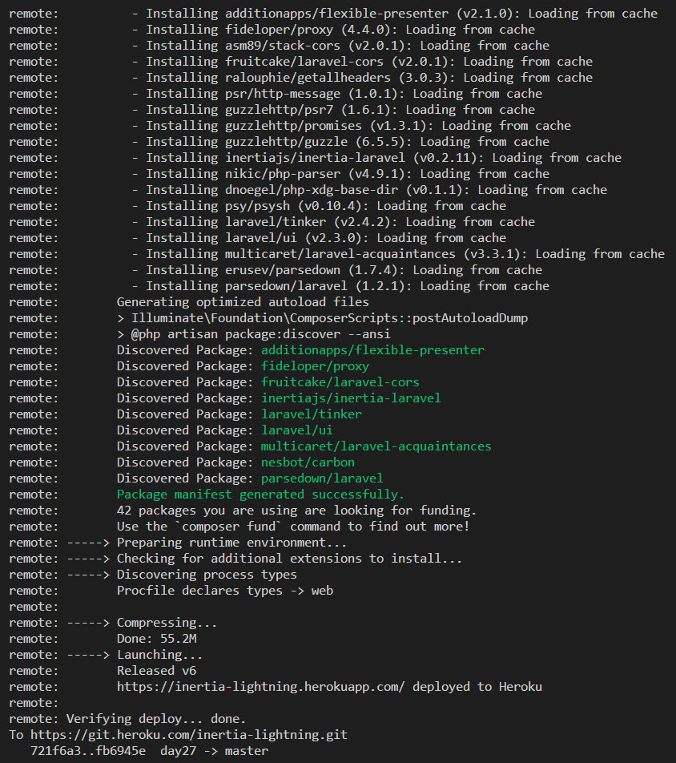

訊息告訴我們說，已經把網站部署到 https://inertia-lightning.herokuapp.com/ 了，打開後你會看到：


## 設定環境變數

其實這是因為沒配置環境變數。當然也可以用命令行操作，不過這裡我想要在網頁裡設定。點「Settings」>「Reveal Config Vars」按鈕：

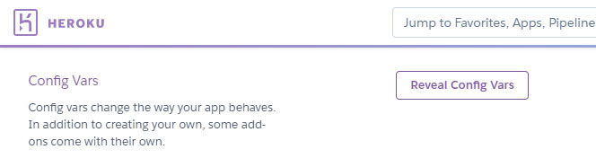

然後設定這些變數，APP_KEY 可以在本地執行 `php artisan key:generate --show` 產生：

```
APP_NAME=Lightning
APP_ENV=production
APP_KEY=YOUR_APP_KEY
APP_DEBUG=false
APP_URL=https://inertia-lightning.herokuapp.com
LOG_CHANNEL=stderr
```

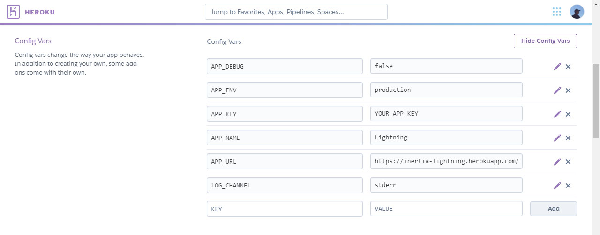

然後還沒完，還要連結資料庫。

## 使用 Heroku Postgres 資料庫

再來要安裝 Heroku Postgres，先開啟 [Heroku Postgres 的安裝頁面](https://elements.heroku.com/addons/heroku-postgresql)，然後點右邊的「Install Heroku Postgres」：

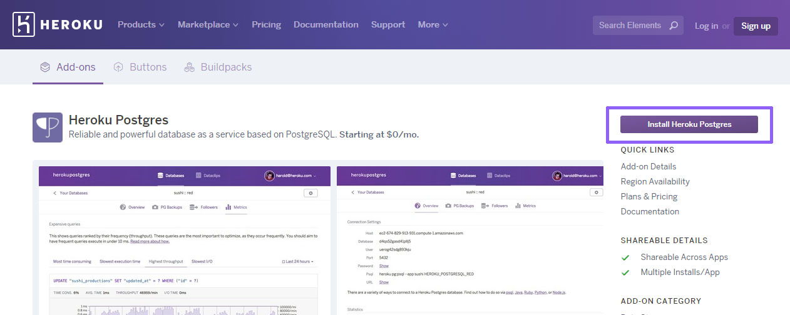

輸入網站的應用名稱，然後點「Submit Order Form」：

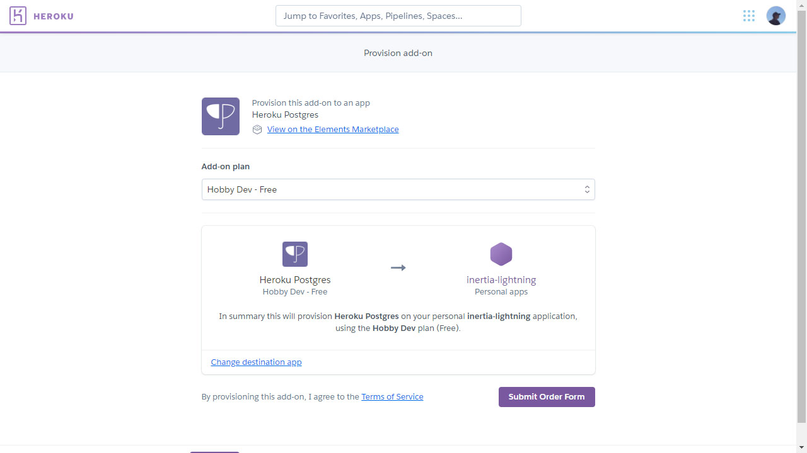

然後就裝好了。現在回去環境變數那裡，設定 `DB_CONNECTION` 為 `pgsql` (把資料庫連接方式改成 Postgres)。但這樣還沒完，Heroku 的文檔還有說要改一些東西，打開 `config/database.php` 修改成以下設定：

*config/database.php*
```php
$DATABASE_URL = parse_url(getenv('DATABASE_URL'));

return [
    ...
    'connections' => [
        ...
        'pgsql' => [
            'driver' => 'pgsql',
            'host' => $DATABASE_URL['host'] ?? '127.0.0.1',
            'port' => $DATABASE_URL['port'] ?? '5432',
            'database' => ltrim($DATABASE_URL['path'] ?? 'forge', '/'),
            'username' => $DATABASE_URL['user'] ?? 'forge',
            'password' => $DATABASE_URL['pass'] ?? '',
            'charset' => 'utf8',
            'prefix' => '',
            'schema' => 'public',
            'sslmode' => 'require',
        ],
        ...
    ],
];
```

推上去 Git 倉庫：

```bash
git commit -am "Update DB connection config for Heroku Postgres"
git push heroku master
```

最後執行 Migrate：

```
heroku run php artisan migrate
```

現在再打開 Lightning，終於可以看到頁面了：

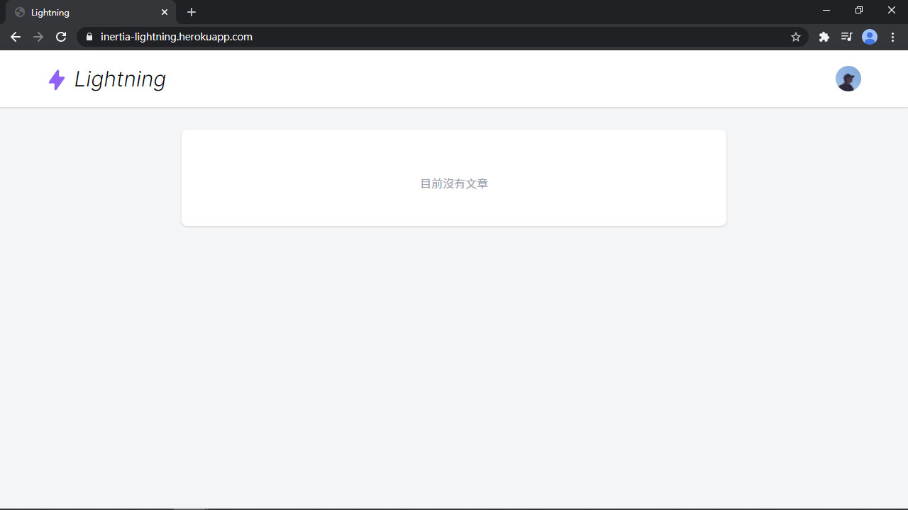

## 修復 Mixed Content 錯誤

再來就是來測試註冊用戶啦！打完帳號和密碼並送出，咦？怎麼沒反應？開 DevTools 看：

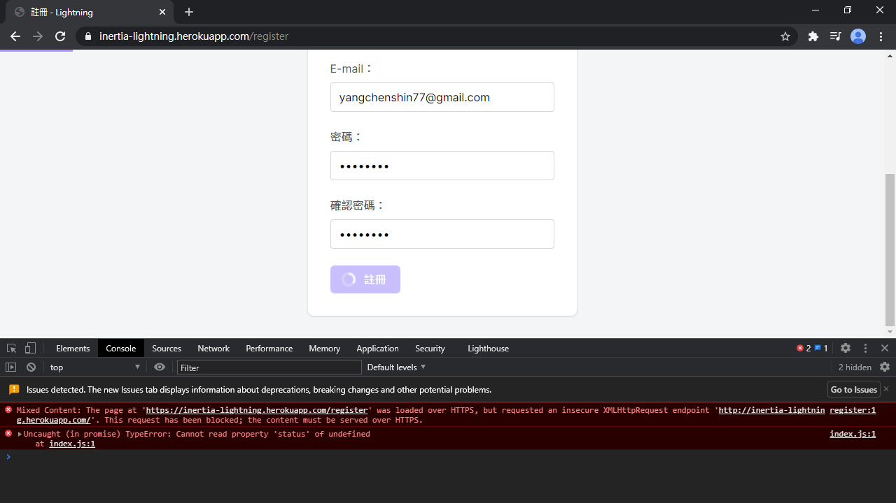

這個只要強制轉成 `https` 就可以了：

*app/Providers/AppServiceProvider.php*
```php
use Illuminate\Support\Facades\App;
use Illuminate\Support\Facades\URL;

class AppServiceProvider extends ServiceProvider
{
    public function boot()
    {
        if (App::isProduction()) {
            URL::forceScheme('https');
        }
    }
}
```

推上去 Git 倉庫：

```bash
git commit -am "Force HTTPS on production"
git push heroku master
```

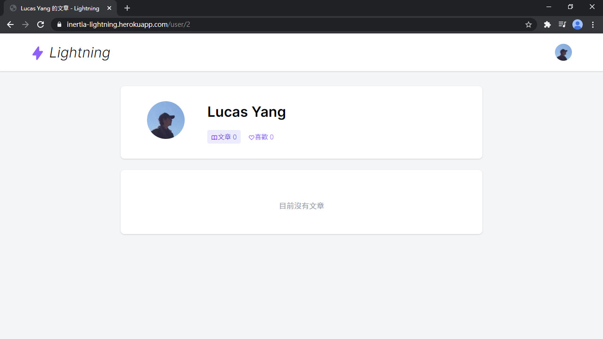

部署完成！可以開始寫文章囉！

## 總結

經歷了一番波折，終於成功地把 Lightning 部署到 Heroku 了。但要記住 Heroku 的免費版過 30 分鐘會自動休眠，叫醒花約半分鐘時間，只能用來自己玩玩而已。而且 Heroku 儲存檔案有問題，即使跑過 `heroku run php artisan storage:link`、`FILESYSTEM_DRIVER` 設成 `public` 也一樣，因此下篇要來串接 [Cloudinary](https://cloudinary.com/)，儲存上傳到 Lightning 的圖片。

> Lightning 範例程式碼：https://github.com/ycs77/lightning

## 參考資料

* [Getting Started with Laravel on Heroku](https://devcenter.heroku.com/articles/getting-started-with-laravel)
* [Connecting with Laravel - Heroku Postgres](https://devcenter.heroku.com/articles/heroku-postgresql#connecting-with-laravel)
* [Customizing the build process - Heroku Node.js Support](https://devcenter.heroku.com/articles/nodejs-support#customizing-the-build-process)
