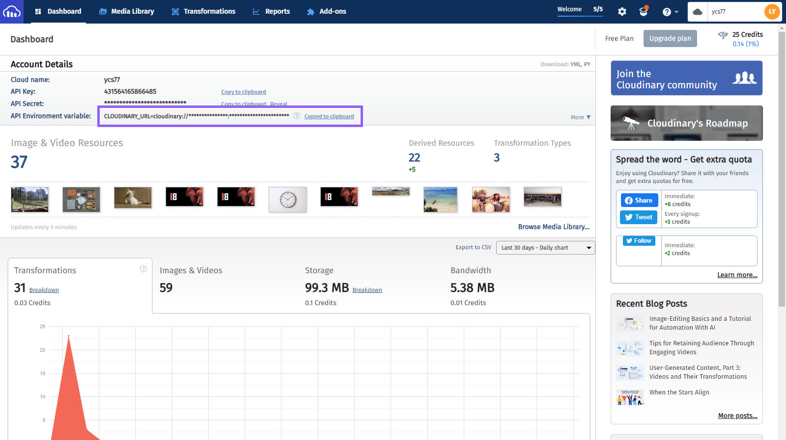
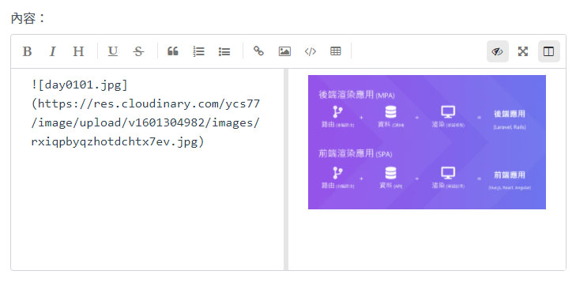

# Day 28 串接 Cloudinary (媒體存儲服務)

有用過 Heroku 都知道，無法正常儲存上傳的檔案，因此在本篇中要來串接 [Cloudinary](https://cloudinary.com/)，它是一個提供媒體存儲服務的平台，專門存放圖片、影片等媒體檔案。

## 安裝 Cloudinary 套件

首先先安裝 Cloudinary 套件的 Laravel 版：

```bash
composer require cloudinary-labs/cloudinary-laravel
```

再來就是使用方式，在 README 裡有寫到，儲存檔案的方式是使用 `storeOnCloudinary()`：

```php
$request->file('image')->storeOnCloudinary('images_folder')->getSecurePath();
```

可是我們原本用的 `local` driver 是用 `store()` 儲存檔案，為了適配兩種儲存方式，要在 `UploadedFile` 新增一個儲存檔案的方法 `storeFile()`，在 Laravel 裡可以用 macro 來擴充類別的方法：

*app/Providers/AppServiceProvider.php*
```php
use Illuminate\Http\UploadedFile;
use Illuminate\Support\Facades\Storage;

public function boot()
{
    ...
    $this->registerMacroMethods();
}

protected function registerMacroMethods()
{
    UploadedFile::macro('storeFile', function ($path, $options = []) {
        return config('filesystems.default') === 'cloudinary'
            ? $this->storeOnCloudinary($path)->getSecurePath()
            : Storage::url($this->store($path, $options));
    });
}
```

然後更新儲存檔案的幾個地方：

*app/User.php*
```php
public function setAvatarAttribute($avatar)
{
    $this->attributes['avatar'] = $avatar instanceof UploadedFile
        ? $avatar->storeFile('avatars')
        : $avatar;
}
```

*app/Post.php*
```php
public function setThumbnailAttribute($thumbnail)
{
    $this->attributes['thumbnail'] = $thumbnail instanceof UploadedFile
        ? $thumbnail->storeFile('posts')
        : $thumbnail;
}
```

*app/Http/Controllers/UploadController.php*
```php
public function mavonEditorImage(Request $request)
{
    ...
    return $request->file('image')->storeFile('images');
}
```

記得把更新推上去 Heroku。

## 取得 Cloudinary API 金鑰

再來就可以登入/註冊 [Cloudinary](https://cloudinary.com/) 的帳號。登入後會看到以下畫面：



然後複製 API Environment variable，這串就是 API 金鑰。

現在開啟 [Heroku](https://www.heroku.com/) 設定環境變數的地方，新增一個變數 `CLOUDINARY_URL`，值為剛才的 API Environment variable (注意開頭要是 `cloudinary://`)；還有把 `FILESYSTEM_DRIVER` 設成 `cloudinary`。

設定好之後，就可以來上傳圖片啦！



## 總結

串接 Cloudinary 後，解決了 Heroku 存方圖片的問題。同時本系列已進入尾聲，下篇會用 Depictr 來解決 Inertia.js 的 SEO 問題，讓我們的 Lightning 可以被爬蟲正常爬取資料。

> Lightning 範例程式碼：https://github.com/ycs77/lightning

## 參考資料

* [Cloudinary Laravel Package](https://github.com/cloudinary-labs/cloudinary-laravel)
