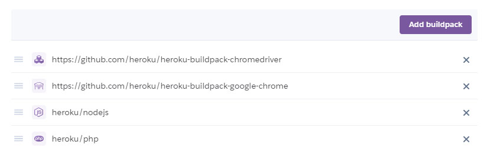
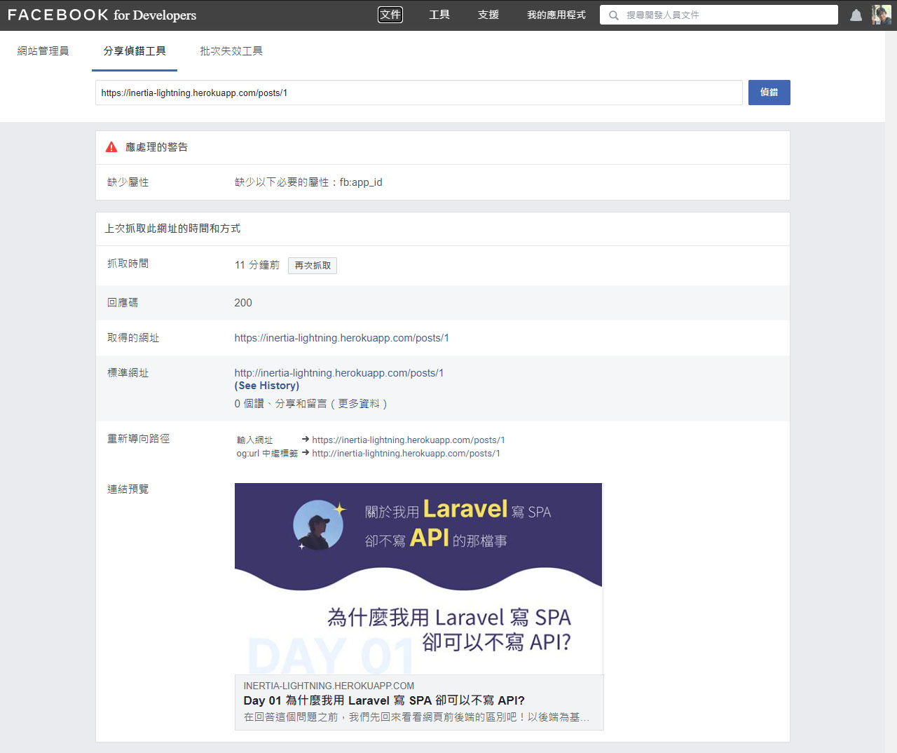
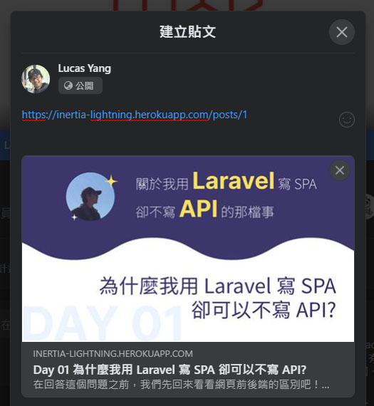
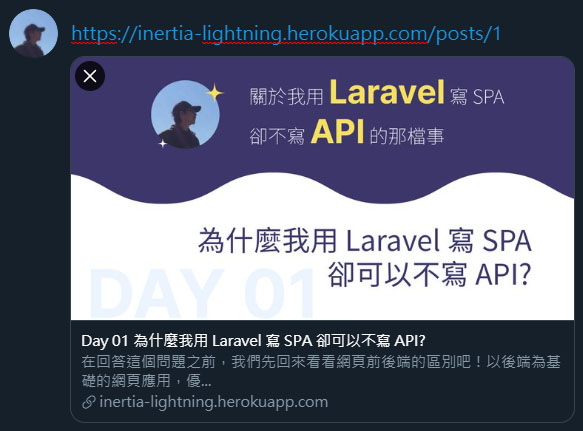

# Day 29 用 Depictr 做 SSR，解決 Inertia.js 的 SEO 問題

SEO 問題一直都是 SPA 的問題點，不過後來出現了 SSR (Server-Side Rendering) 的解決方案。本篇就是要介紹用在 Laravel + Inertia 的 SSR 套件 [Depictr](https://github.com/Juhlinus/depictr)，Depictr 使用 [Symfony Panther](https://github.com/symfony/panther) 和 [ChromeDriver](https://chromedriver.chromium.org/) 來渲染 HTML 並回傳，而且只會在爬蟲程式來敲門時才會渲染，完美地解決 SEO 問題。

## 安裝 Depictr

本地只要安裝套件和發布設定：

```bash
composer require juhlinus/depictr
php artisan vendor:publish --provider="Depictr\ServiceProvider"
```

> 小提醒，現在先不用上傳到 Heroku。

## Heroku 安裝 ChromeDriver

然後先回到 Heroku 的 Settings，現在要增加兩個 Buildpacks：ChromeDriver、Google Chrome，這兩個都是 Symfony Panther 背後運行需要程式：

* https://github.com/heroku/heroku-buildpack-chromedriver
* https://github.com/heroku/heroku-buildpack-google-chrome

而且順序不能亂掉，可以拖曳左測改變順序：



以及設定環境變數 `PANTHER_CHROME_DRIVER_BINARY` 為 `/app/.chromedriver/bin/chromedriver`。

最後把本地的更新上傳到 Heroku。

## FB 爬蟲測試

~~現在！見證奇蹟的時刻到了！！！~~

現在可以回去 Lightning 新增一篇文章，記得要上傳 **分享預覽圖片**。然後把文章網址貼到 [Facebook 分享偵錯工具](https://developers.facebook.com/tools/debug/?locale=zh_TW)：


然後點「擷取新資訊」，過了許久後就可以看到：



成功！！！！！我們的 SPA 網站可以被爬蟲爬取網頁內容了！

如果有出現問題，可以使用 curl 直接模擬 FB 的爬蟲發請求來 Debug (把 `$URL`  換成測試網址)：

```bash
curl -v --compressed -H "Range: bytes=0-524288" -H "Connection: close" -A "facebookexternalhit/1.1 (+http://www.facebook.com/externalhit_uatext.php)" "$URL"
```

現在在 Facebook 分享這篇文章時就可以看到標題和預覽圖片了。



還有 Twitter 也可以 (如果出問題可以用 [Twitter Card validator](https://cards-dev.twitter.com/validator) 來 Debug)：



> 有時候會抓取失敗，多試幾次試試看。還是有問題的話，可以嘗試查查看 Heroku 的 Log (在右上角「More」>「View logs」) 查看錯誤訊息。
>
> 目前我看到會發生的問題是，因為內存滿了無法成功渲染，解決方法是執行 `heroku restart` 來重新啟動 Heroku (同時清空內存) 就可以了。

## 總結

到此為止，我們完成了 Lightning 的 SSR 渲染功能。別看本篇很短，卻是整個系列中花最多時間研究的！除了本篇使用 ChromeDriver 來做 SSR，也有 [V8Js (PHP extension)](https://github.com/phpv8/v8js) 或 [Prerender (Node.js)](https://github.com/prerender/prerender) 等的選擇。

下篇將是系列的總結，來談 Inertia.js 相關的內容，不要錯過啊！

> Lightning 範例程式碼：https://github.com/ycs77/lightning

## 參考資料

* [Depictr](https://github.com/Juhlinus/depictr)
* [Symfony Panther](https://github.com/symfony/panther)
* [ChromeDriver](https://chromedriver.chromium.org/)
* [heroku-buildpack-chromedriver](https://github.com/heroku/heroku-buildpack-chromedriver)
* [heroku-buildpack-google-chrome](https://github.com/heroku/heroku-buildpack-google-chrome)
* [Facebook 網路爬蟲](https://developers.facebook.com/docs/sharing/webmasters/crawler/?translation)
