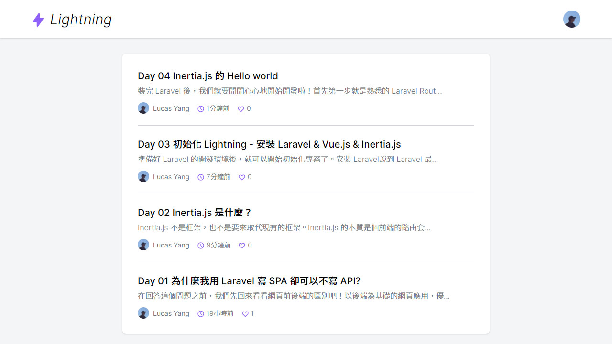

# Day 30 請問您今天要來點 Inertia.js 嗎？

總結篇就來談一下跟 Inertia.js 相關的事情吧！

## 系列總結

> *"Build single-page apps, without building an API."*
> 
> —— [Inertia.js 官網](https://inertiajs.com/)

這是一個「關於我用 Laravel 寫 SPA 卻不寫 API 的那檔事」，相信看到這裡的讀者們都已經知道答案了，在此系列介紹了 Inertia.js 這個新的網頁架構，確實拉近了前端與後端的距離。除了可以用 Laravel + Vue.js 的組合外，也可以套[其他的框架組合](https://inertiajs.com/installation)。讓全端開發者可以輕鬆構建現代 SPA 網站而不需要寫 API。

> 當然 Inertia.js 也不是萬能的，原本 Inertia.js 只是要設計給單純的前端 SPA + 後端使用，如果你想要串接第三方 (例：APP) 的話，還是得開發 API，這裡請注意。

這個系列不是完全針對 Inertia.js 講解，而是實作一個完整的專案的同時，順便解說 Inertia.js 的使用方式。原因是我認為 Inertia.js 在這整個專案中是如同膠水般的存在，旨在填補前端與後端的隙縫，讓前後端都可以發揮自己的專長，而且用專案的方式可以學到實際開發時的用法。如果想要完全了解 Inertia.js 的使用方式，建議看過 [Inertia.js 官方文檔](https://inertiajs.com/)。除了官方文檔外，還請務必要看過 Inertia.js 的老爸 Jonathan Reinink 寫的文章，內容是關於 Inertia.js 的發想到實現：

* [Server-side apps with client-side rendering](https://reinink.ca/articles/server-side-apps-with-client-side-rendering)
* [Introducing Inertia.js](https://reinink.ca/articles/introducing-inertia-js)

官方也有提供一個 Inertia 的範例 [Ping CRM](https://demo.inertiajs.com/)，看完本系列還不過癮的話，可以研究這個範例。Ping CRM 也是使用 Laravel + Vue.js (畢竟這對是官配 XD)，附上 [GitHub 傳送門](https://github.com/inertiajs/pingcrm)，如果你想要使用其他框架這裡也有 [第三方 Ping CRM](https://inertiajs.com/demo-application#third-party)。

從開發 Lightning 中，我們了解了 Inertia.js + Laravel + Vue.js + Tailwind CSS 組合的開發方式。這個組合又名 VILT Stack，取 **V**ue.js、**I**nertia.js、**L**aravel、**T**ailwind CSS 的首字母。Vue.js 和 Laravel 都是知名的前/後端框架大家都知道，Inertia.js 則是本系列介紹的，而 Tailwind CSS 憑藉者可高度客製化的特性，在 CSS 界漸漸知名了起來。VILT Stack 可以說是在 2020 年建構現代網站最佳的選擇之一。

> 如果你想深度了解和學習使用 Tailwind CSS 刻板，可以看六角學院校長的鐵人賽影片教學 [CSS 優良部份](https://ithelp.ithome.com.tw/users/20040221/ironman/3567)，有詳細介紹 Tailwind CSS 的使用方式。

### Inertia.js & Livewire

跟 Inertia.js 有關聯的莫過於 **Livewire**，**Livewire** 和 Inertia.js 都是現代全端開發的解決方案，但實作上卻完全不同：

* **Inertia.js**：Inertia.js 的視圖是以前端組件為主，有自訂的協議，只要照規則實作，任何框架均可使用 Inertia.js 開發全端。SEO 天生不優，需要自行配置 SSR 解決方案。
* **Livewire**：Livewire 的視圖是使用 Laravel Blade，用 PHP 就可以和前端互動，而且 Livewire 也是專門為 Laravel 開發。用一句話形容 Livewire：「模糊了前後端的界線」。

簡單來說，比較習慣用前端刻頁面就用 Inertia.js，習慣用後端 (Laravel Blade) 刻頁面就用 Livewire。

[Livewire 官網](https://laravel-livewire.com/) 了解更多。

### Jetstream

Laravel 8 發布之際，官方也推出了一個全新的 Laravel 專案腳首架 **Jetstream**，提供登入、註冊、E-mail 驗證、雙因素身分驗證、登入 Session 管理、由 [Laravel Sanctum](https://laravel.com/docs/sanctum) 提供的 API 支援、以及選擇性的團隊管理。重點是 Jetstream 也提供 Inertia.js 和 Livewire 兩種架構選擇，讓你可以輕鬆使用優秀的 Laravel 全端開發方式來開發你的專案。而且只要使用 Laravel Inetaller 就可以建立帶有 Jetstream 腳首架的新專案。

[Jetstream 官網](https://jetstream.laravel.com/) 了解更多。

## 心得

30天轉瞬即逝，感覺第一次參加鐵人賽還真是超有挑戰性，以前都沒有寫過這麼長的系列文，每天都在想今天的文發了沒，過程中也學到許多東西。當然也有許多不足的地方，下次有待加強。(還有我的文筆不大好 XD)

會選 Inertia.js 當主題是因為，當初發現用 Inertia.js 可以讓我的 Laravel + Vue.js 專案有著如此完美的結合，馬上就看完官方文檔，然後加到我的新專案中開始研究。研究著就萌生出一個想法，如果更多人知道這個東西該有多好，以後一個人開發 SPA 就不用再架 API 和花時間學架前端應用了。基於這個想法，就報了鐵人賽，寫出了這個系列，期待更多全端開發者可以認識到這個有趣的新技術。而且這個東西是在去年 2019 年才出現，趁早寫不會有人和我搶主題 XD。

我是 Lucas Yang (楊晨信)，感謝你的閱讀，希望本系列可以幫到那個還在寫 API 開發 SPA 的你。

* GitHub：[@ycs77](https://github.com/ycs77)
* 部落格：[星星的筆記．Lucas](https://lucas-yang.vercel.app/)

---

如果你有跟著本系列做出一個部落格網站，歡迎在下方留下你的作品的 GitHub 地址，分享你的作品，也可以放截圖喔！

Lightning 範例程式碼：https://github.com/ycs77/lightning

---

## 參考資料

* [Inertia.js 官網](https://inertiajs.com/)
* [Livewire 官網](https://laravel-livewire.com/)
* [Jetstream 官網](https://jetstream.laravel.com/)
* [VILT Stack - A future-proof way to build with Laravel in 2020](https://raison.co/vilt-stack-vue-inertia-laravel-tailwind/)
* [Server-side apps with client-side rendering](https://reinink.ca/articles/server-side-apps-with-client-side-rendering)
* [Introducing Inertia.js](https://reinink.ca/articles/introducing-inertia-js)
